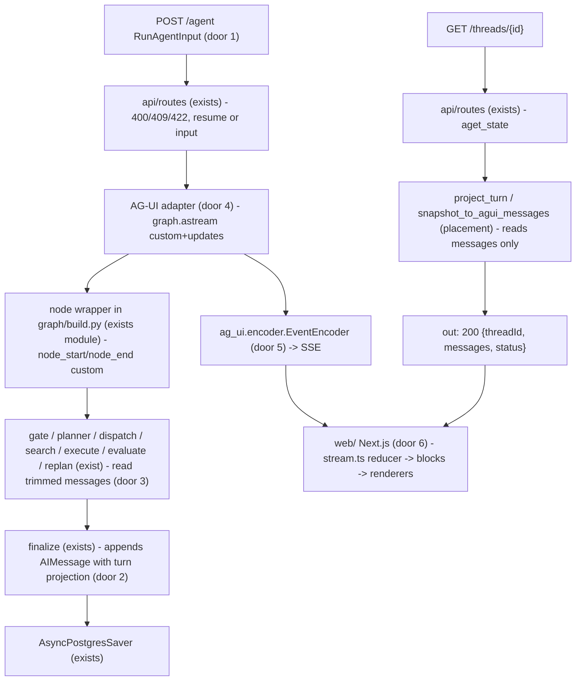
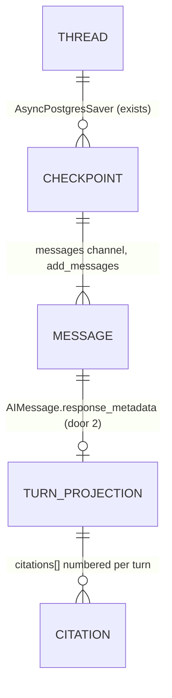

# AG-UI transport + Next.js research desk

Sources:

- conversation 2026-09-16 (user brief "Frontend Next.js com AG-UI") - product shape, routes, design tokens, file layout, citation behaviour; **binding for the interface**: sections 6, 7, 9 of the brief (layout, palette, typography, activity blocks, citation, motion, empty/error states)
- grill-me 2026-09-16 rounds 1–2 (this conversation) - transcript persistence in `messages`, history-aware prompts, `graph.astream` consume path, `custom`+`updates` stream modes, `SOURCES` after the stream, per-turn renumbering, resume kept, English marginalia, Chainlit removal, single feature
- https://docs.ag-ui.com/sdk/python/core/types and https://docs.ag-ui.com/sdk/python/core/events - `RunAgentInput`, `Message` union, `ActivityMessage`, `RunStartedEvent`, `RunFinishedEvent.result`, `RunErrorEvent`, `StepStartedEvent`, `ActivitySnapshotEvent`, `ActivityDeltaEvent`, `TextMessage*`, `BaseEvent.metadata`
- `.specs/project/STATE.md` AD-008 (SSE + Chainlit), AD-019 (English internals), AD-020 (astream_events consume path), AD-022 (`answer_delta` / `citations`), AD-025 (`halt_before_writer` eval-only) - constraints this feature revokes or keeps

## Problem

A student who refreshes the page loses the conversation. Chainlit mints a new `thread_id` on every `on_chat_start` (`ui/app.py:21-23`), so the Postgres checkpointer holds state nobody can read back, and there is no HTTP route that returns it. The graph itself forgets too: `messages` receives only the user dict from `initial_graph_state` (`research_graph.py:30-33`), no node writes the Writer answer, and gate, planner and writer read the raw `query` of the current turn (`gate.py:33`, `planner.py:220,252`, `writer.py:348`). A follow-up such as "and section 3?" is planned as a cold question.

The transport is private: `POST /research` speaks ten project-specific SSE names (`api/sse.py:8-21`) that only `ui/sse_map.py` understands, so no standard agent client can drive it, and citations arrive as a separate list the UI renders as a side block rather than at the `[n]` the student is reading.

Evidence in the source: none quantified; the brief states the outcome ("Preciso que o Gate, o plano e as fontes sobrevivam ao refresh da página").

When this ships, the student opens `/c/{threadId}` after a refresh and sees every turn with its gate line, plan, step rail, answer and sources; a follow-up is planned against the conversation; `[1]` in the prose is a focusable button that shows the source; and the wire is AG-UI, readable by any AG-UI client.

## Out of scope

| Excluded | Why |
| --- | --- |
| Authentication, per-user thread ownership, server-side recents | brief: "sem autenticação por enquanto"; recents live in `localStorage` until auth exists |
| SSE resumption (`Last-Event-ID`, run detached from the request, pubsub) | brief section 5: disconnect and cancel are the same server event; checkpoint + resume run covers both |
| Concurrent runs on one thread (lock, 409) | user: "não se preocupe com isso agora" |
| `RunAgentInput.resume` / AG-UI interrupts, HITL plan approval | no `interrupt()` in the graph; AGENTS.md "Out of v1" |
| `stream_mode="messages"` | tokens already arrive as `answer_delta` in `custom`; a second token source would duplicate every Writer token and leak gate/planner/judge tokens |
| Server-generated `runId` persisted in Postgres | user: "esqueça essa ideia de runId"; `run_id` follows the protocol default (client-generated) |
| Conversation summarisation by LLM | trim is a fixed window; summarisation is the next slice if windows prove too short |
| Reusing checkpointed `evidence_chunks` across turns | the field is last-write; a Writer-only turn draws from persisted citations instead, and a new retrieve is a pgvector cache hit |
| Dockerised API/UI, CopilotKit/`@ag-ui/client` runtime on the front | AGENTS.md out of v1; brief pins hand-written `lib/stream.ts` and `lib/types.ts` |
| Writer answer language change | AD-019 keeps the answer in the student's language; "everything in English" is read as UI chrome and marginalia (see Assumptions) |

## Assumptions

| Assumption | Chosen default | Rationale | Confirmed? |
| --- | --- | --- | --- |
| Where the answer is persisted | `finalize` (exists between `evaluate` and `END`) appends one `AIMessage` per run to `messages`; no new graph node | user asked for "a final node between Writer and END"; `finalize` is that node and runs on every terminal outcome | y |
| Runs with no answer (`refused`, `insufficient`, `error`) | `finalize` still appends an `AIMessage` whose `content` is the reason and whose `response_metadata.outcome` names the terminal | user delegated ("o que achar melhor"); a `UserMessage` with no reply reads as ignored on replay | y |
| Token source on the wire | `custom` `answer_delta` only; `stream_mode=["custom","updates"]` | user delegated; avoids duplicate tokens and node filtering | y |
| `STEP_STARTED` for nodes that do not stream today | a node wrapper applied at compile time emits `node_start` / `node_end` custom events for every node including `dispatch`; nodes are not edited | user delegated; one site, no per-node edits, covers `Send` tasks | y |
| Differentiating parallel `search` steps | `STEP_STARTED.metadata` carries `step_index`, `agent`, `task`; `STEP_FINISHED.metadata` adds `query_used` from the existing `step_end` | the formulated query does not exist until the node runs; the label upgrades on finish | y |
| Grounding across turns | invariant 6 becomes "every `[n]` resolves to a chunk packed in this thread"; a Writer step with empty `evidence_chunks` builds its evidence from the `citations` persisted on the last 2 `AIMessage`s, renumbered from 1 for the turn | user accepted the relaxed reading (round 2, D); `SOURCES` is per assistant message | y |
| "Reuse" in the planner | reuse = skip `search` (papers already admitted), never skip the Writer's evidence; retrieve on an admitted paper is a pgvector cache hit | user delegated (round 2, E) | y |
| Which prompts see history | gate, planner, writer see the trimmed transcript; search and retrieve formulate keep the English `task` only | user delegated; the planner already resolves a follow-up into a self-contained English `task` (AD-013) | y |
| Trim window | gate and planner: last 6 exchanges (12 messages); Writer: last 2 exchanges plus evidence | user delegated (round 2, F); numbers live in `policy.py` | y |
| Resume after cancel or disconnect | kept, via `forwardedProps.resume: true` → `astream(None, config)`; no `parentRunId` | user: "preserva" (round 1, 11) and "sim" (13); `runId` dropped (4) | y |
| New message on an interrupted thread | allowed; LangGraph discards the pending tasks of the checkpoint and starts from `START` with the new input; the cut run leaves no `AIMessage` | user: "o usuário pode voltar naquele estado e mandar uma mensagem" | y |
| Language | UI copy, plan, feedback, step names in English; Writer answer and gate `reason` keep the student's language (AD-019) | user said "tudo deve ser em inglês" to a question about marginalia; changing the answer language would revoke AD-019 and `tests/test_internal_english.py` without being asked | n |
| `run_id` | client generates a uuid v4 per run and the backend echoes it in `RUN_STARTED` / `RUN_FINISHED` | protocol default once server-side generation is dropped | n |
| Replay of earlier turns' gate/plan/steps | `finalize` stores the turn projection (`gate`, final plan with per-step status and feedback, step count, elapsed ms, `citations`, `message_id`) in `AIMessage.response_metadata`; replay reads only `messages` | `plan`, `gate`, `evidence_chunks` are last-write, so only `messages` survives across turns | n |
| Live plan status and `ACTIVITY_DELTA` | one `project_turn(state)` function; the adapter folds `updates` into a running state, projects after each update, emits JSON Patch of the difference | same function serves `finalize` metadata and live stream; no second status derivation | n |
| `[n]` with no source | rendered as plain text, not a button | Writer may emit an index absent from the list (`test_writer_stream.py:171-188`) | n |
| `GET /threads/{id}` on a thread mid-run | returns what is checkpointed; the front does not call it on the same-tab first send | brief section 5 | n |
| CORS | `CORSMiddleware`, origins from `WEB_ORIGIN` env, default `http://localhost:3000` | user: "CORS" (round 1, 15) | y |
| Timeout | `Settings.research_timeout_seconds` kept; adapter emits `RUN_FINISHED` `result.outcome="insufficient"`, `reason="timeout"`; the thread then reads `interrupted` and the front offers resume | user: "sim" (round 1, 13) | y |
| AG-UI Python package | `ag-ui-protocol` (`ag_ui.core`, `ag_ui.encoder.EventEncoder`) added to `pyproject.toml` | brief section 1 | y |
| Front test runner | `vitest` inside `web/` for `blocks.ts`, `stream.ts` parser and the citation markdown transform; not part of the `uv` unittest gate | AGENTS.md gate is stdlib unittest for Python; a TS reducer needs a TS runner | n |
| Tailwind | tokens are CSS custom properties in `lib/tokens.css`; Tailwind reads them (v4 `@theme` or v3 `theme.extend`, settled in the diff) | brief section 9 | n |
| `/research`, `api/sse.py`, `StreamDispatcher`, `ResearchExecutor`, `ui/` | removed; their test modules are replaced one-for-one by tests of the new adapter and routes, so discover does not shrink silently | user: "Chainlit sai"; one transport | y |
| Profile | `light` (no declaration in AGENTS.md) | skill default; flagged below as thin for a wire contract | n |

**Open questions:** none - all resolved or logged above.

## Criteria

### S1: The thread remembers (P1)

**Acceptance Criteria**

1. WHEN `finalize` runs with `outcome="done"` THEN the system SHALL append to `messages` one `AIMessage` whose `content` equals `writer_markdown` and whose `id` equals the `writer_message_id` in state
2. WHEN `finalize` runs with `outcome` in `refused`, `insufficient`, `error` THEN the system SHALL append to `messages` one `AIMessage` whose `content` is the terminal reason and whose `response_metadata.outcome` equals that outcome
3. WHEN `finalize` appends an `AIMessage` THEN its `response_metadata` SHALL contain `outcome`, `gate`, `plan` (each item with `agent`, `task`, `status`, `feedback`), `steps` (`count`, `elapsed_ms`), `citations`, in that key set
4. WHEN the Writer starts streaming THEN the system SHALL emit a custom event `answer_start` with a fresh uuid `message_id` before the first `answer_delta` and SHALL return that id as `writer_message_id`
5. WHEN a second run executes on the same `thread_id` THEN `messages` in the checkpoint SHALL contain the first turn's `HumanMessage`-shaped dict and `AIMessage` before the second turn's
6. WHEN gate or planner build their prompt THEN the human payload SHALL contain the last `Policy.history_window_exchanges=6` exchanges of `messages` in order and SHALL NOT contain older ones
7. WHEN the Writer builds its prompt THEN it SHALL contain the last `Policy.writer_history_exchanges=2` exchanges and the numbered evidence
8. WHEN the planner prompt is built on a thread with admitted `papers` THEN it SHALL list those papers (arxiv id, title) and SHALL state that a plan may omit `search` for an already admitted paper
9. WHEN a `writer` step executes with empty `evidence_chunks` and at least one prior `AIMessage` carries `citations` THEN the Writer evidence SHALL be those citations renumbered from `[1]` in message order, deduplicated by `chunk_id`
10. IF a `writer` step executes with empty `evidence_chunks` and no prior `AIMessage` carries `citations` THEN the system SHALL set `outcome="insufficient"` and SHALL NOT call the Writer model
11. The Writer `citations` output SHALL be numbered per turn starting at 1 and each item SHALL carry `chunk_id`, `arxiv_id`, `title`, `year`, `url`, `excerpt`
12. WHEN a run is invoked with input on a thread whose checkpoint has non-empty `next` THEN the system SHALL start from `START` with the new input and the previously pending tasks SHALL NOT execute

**Independent test:** tiny graph with `MemorySaver`: two turns on one thread; assert `messages` order and `AIMessage` metadata; prompt assembly with 8 exchanges asserts the 6-window; Writer stub with empty evidence and prior citations asserts renumbering; second invoke on a thread with pending `next` asserts the pending node did not run. No live OpenAI.

### S2: One AG-UI run over SSE (P1)

**Acceptance Criteria**

13. WHEN `POST /agent` receives a valid `RunAgentInput` with one `UserMessage` THEN the system SHALL respond `200` `text/event-stream` and the first frame SHALL be `RUN_STARTED` with the request's `threadId` and `runId`
14. IF `POST /agent` body is not a valid `RunAgentInput` THEN the system SHALL respond `422` with the validation detail
15. IF `messages` is empty and `forwardedProps.resume` is not `true` THEN the system SHALL respond `400` `{"detail":"one user message or resume is required"}`
16. IF `forwardedProps.resume` is `true` and the thread checkpoint has empty `next` THEN the system SHALL respond `409` `{"detail":"nothing to resume"}`
17. WHEN `forwardedProps.resume` is `true` and `next` is non-empty THEN the system SHALL stream the graph from the checkpoint with input `None` on the same `thread_id`
18. The system SHALL consume the graph with `graph.astream(input, config, stream_mode=["custom","updates"])` and SHALL NOT call `astream_events`
19. WHEN any node task starts THEN the system SHALL emit `STEP_STARTED` with `step_name` = node name and `metadata` `{step_index, agent, task}` when the node is `search` or `execute`
20. WHEN any node task ends THEN the system SHALL emit `STEP_FINISHED` with the same `step_name`, and for `search`/`execute` `metadata.query_used` from the node's `step_end`
21. WHEN two `search` tasks run in one `Send` wave THEN the system SHALL emit two `STEP_STARTED` events whose `metadata.step_index` differ
22. WHEN the gate custom event arrives THEN the system SHALL emit `ACTIVITY_SNAPSHOT` `activity_type="GATE"` with `content` `{in_domain, language, reason}`
23. WHEN the planner `plan` event arrives THEN the system SHALL emit `ACTIVITY_SNAPSHOT` `activity_type="PLAN"` with `content.items[]` each `{index, agent, task, status:"pending", feedback:null}`
24. WHEN an `updates` chunk changes the projected plan (status or feedback of any item, or a replan suffix) THEN the system SHALL emit `ACTIVITY_DELTA` `activity_type="PLAN"` with a JSON Patch limited to the changed paths, on the same `message_id` as the snapshot
25. WHEN an `eval` custom event arrives THEN the projected plan item at its `step_index` SHALL carry `feedback` = its English `feedback` and `status` in `passed`, `retry`, `replan`
26. WHEN `answer_start` arrives THEN the system SHALL emit `TEXT_MESSAGE_START` with `message_id` = the event's id and `role="assistant"`
27. WHEN `answer_delta` arrives THEN the system SHALL emit `TEXT_MESSAGE_CONTENT` with `delta` = its `text`, on that `message_id`
28. WHEN the `citations` custom event arrives THEN the system SHALL emit `TEXT_MESSAGE_END` then `ACTIVITY_SNAPSHOT` `activity_type="SOURCES"` with `content.items[]` `{n, arxiv_id, title, year, url, excerpt, chunk_id}` in `n` order
29. WHEN `finalize` finishes THEN the system SHALL emit `RUN_FINISHED` with `result` `{outcome, reason}` where `reason` is `null` for `done`
30. IF the graph iterator raises THEN the system SHALL emit `RUN_ERROR` with `message` = `str(exc)` and SHALL close the stream
31. IF the run exceeds `Settings.research_timeout_seconds` THEN the system SHALL emit `RUN_FINISHED` with `result` `{outcome:"insufficient", reason:"timeout"}` and SHALL close the stream
32. The system SHALL encode every frame by with `ag_ui.encoder.EventEncoder` and the response SHALL carry `Cache-Control: no-cache` and `X-Accel-Buffering: no`
33. WHEN a request arrives with `Origin` equal to `WEB_ORIGIN` THEN the response SHALL carry `Access-Control-Allow-Origin` for that origin, and `OPTIONS /agent` SHALL respond `200`
34. The route `POST /research` SHALL NOT exist

**Independent test:** `TestClient` against a tiny two-node graph with `get_stream_writer` and `MemorySaver`; parse frames; assert order `RUN_STARTED`, `STEP_STARTED`, `ACTIVITY_SNAPSHOT`, `TEXT_MESSAGE_*`, `SOURCES`, `RUN_FINISHED`; 400/409/422; timeout via a sleeping node and a 0.05 s setting.

### S3: Replay from the checkpoint (P1)

**Acceptance Criteria**

35. WHEN `GET /threads/{thread_id}` is called and the checkpoint has at least one message THEN the system SHALL respond `200` `{threadId, messages, status}`
36. IF the checkpoint has no messages THEN `GET /threads/{thread_id}` SHALL respond `404` `{"detail":"thread not found"}`
37. WHEN replaying THEN each user dict or `HumanMessage` SHALL map to a `UserMessage` with the same `id` and `content`
38. WHEN replaying an `AIMessage` with `response_metadata.outcome="done"` THEN the system SHALL emit, in order: `ActivityMessage` `GATE`, `ActivityMessage` `PLAN`, `ActivityMessage` `STEPS` `{count, elapsed_ms}`, `AssistantMessage` with `id` = the `AIMessage.id` and `content` = its content, `ActivityMessage` `SOURCES`
39. WHEN replaying an `AIMessage` with `response_metadata.outcome` in `refused`, `insufficient`, `error` THEN the system SHALL emit `ActivityMessage` `GATE` (when present), then an `ActivityMessage` `OUTCOME` `{outcome, reason}` and SHALL NOT emit an `AssistantMessage`
40. WHEN the snapshot `next` is non-empty THEN `status` SHALL be `"interrupted"`, otherwise `"idle"`
41. The `PLAN` and `SOURCES` activity contents in replay SHALL be produced by the same projection function the live adapter uses

**Independent test:** build a checkpoint with `MemorySaver` through two runs (one done, one refused), call the route, assert the flat `messages` array and `status`; interrupted status via a graph halted with `interrupt_before` in the test only.

### S4: Screen `/` and `/c/{threadId}` lifecycle (P1)

**Acceptance Criteria**

42. WHEN the student opens `/` THEN the screen SHALL show only the input centred vertically with one line describing the app and SHALL make no request to the API
43. WHEN the student sends the first message on `/` THEN the client SHALL generate a uuid v4 `threadId`, `POST /agent`, and replace the URL with `/c/{threadId}` via `history.replaceState`
44. WHILE the same tab continues after the first send the client SHALL NOT call `GET /threads/{threadId}`
45. WHEN the student opens `/c/{threadId}` directly THEN the client SHALL call `GET /threads/{threadId}` and render the returned messages before enabling the input
46. IF `GET /threads/{threadId}` responds `404` THEN the client SHALL navigate to `/`
47. WHEN the first user message of a thread is sent THEN the client SHALL upsert `{threadId, title, updatedAt}` in `localStorage` with `title` = the first 80 characters of that message
48. WHILE a run streams the input SHALL remain enabled and a Stop control SHALL abort the fetch via `AbortController`
49. WHEN the stream ends without `RUN_FINISHED` or `RUN_ERROR` THEN the client SHALL call `GET /threads/{threadId}` and re-render from the response
50. IF the re-rendered `status` is `"interrupted"` THEN the client SHALL send one automatic resume run after 1 s and, IF that stream also ends without `RUN_FINISHED`, SHALL show a manual Resume control
51. WHILE `status` is `"interrupted"` the client SHALL show a strip in `--warn` above the input with the Resume action and SHALL NOT block typing
52. WHEN `RUN_FINISHED` carries `result.outcome` in `refused`, `insufficient` THEN the client SHALL render the reason as a marginalia line and no assistant text
53. WHEN `RUN_ERROR` arrives THEN the client SHALL render `message` as a marginalia line in `--warn`
54. The client SHALL send `RunAgentInput.messages` with exactly one `UserMessage` on a normal run and an empty array with `forwardedProps.resume=true` on a resume

**Independent test:** `vitest` on `stream.ts` (SSE parser, reducer) and `recents.ts`; browser walk: send, refresh, sidebar click, stop mid-run, resume.

### S5: Reading column, marginalia and citations (P1)

**Acceptance Criteria**

55. WHILE a run streams the StepRail SHALL show the current node name in mono in `--accent` and previous nodes as dots in `--ok`
56. WHEN `RUN_FINISHED` arrives THEN the StepRail SHALL collapse to one line `"{count} steps · {seconds}s"` that expands on click to the full list
57. WHEN a `search` step finishes THEN its rail entry SHALL show `metadata.query_used`
58. WHEN `GATE` is rendered THEN it SHALL be a single marginalia line with verdict and reason, no card
59. WHILE a run streams the `PLAN` block SHALL show a numbered list with per-item status and SHALL apply `ACTIVITY_DELTA` without remounting the list; WHEN `RUN_FINISHED` arrives it SHALL collapse to one line
60. WHEN `SOURCES` is present THEN every `[n]` in the assistant markdown that matches an item SHALL render as a `<button>` with `aria-label` `"Source n"`, and `[text](url)` links SHALL remain links
61. IF `[n]` matches no item THEN it SHALL render as plain text
62. WHEN a citation button is hovered for 150 ms or receives focus THEN a popover in `--surface` SHALL show title, `arXiv:{id} · {year}` and a 2–3 line excerpt, and SHALL stay 300 ms after pointer leave
63. WHEN a citation button is clicked THEN the source panel SHALL open from the right over the sidebar with the full excerpt and url, without changing the reading column width
64. The client SHALL render no separate sources list after the assistant text
65. The user message SHALL render full-width with a 2 px `--accent` left rule and 16 px inset; the assistant text SHALL render with no container, border or background
66. The reading column SHALL use a serif at 17 px / 1.65 with max width 68ch; UI copy Inter 13–15 px; node names, ids and timings mono 12 px
67. The client SHALL take every colour from the tokens in `lib/tokens.css` (light and dark sets as in the brief) and components SHALL NOT contain hex colour literals
68. WHEN `prefers-reduced-motion` is set THEN all transitions and the streaming cursor SHALL be disabled
69. The client SHALL NOT render gradients, robot avatars, chat bubbles, skeleton shimmer or a generic spinner

**Independent test:** `vitest` on the markdown `[n]` transform (button vs plain vs link); browser walk with keyboard-only citation focus and a dark-mode screenshot.

### S6: Chainlit and the old transport leave (P1)

**Acceptance Criteria**

70. The repository SHALL NOT contain `src/plan_based_researcher/ui/`, `api/sse.py`, `api/stream_dispatcher.py`, `api/executor.py`
71. The project SHALL NOT depend on `chainlit` in `pyproject.toml` and SHALL depend on `ag-ui-protocol`
72. The test suite SHALL contain no module importing the removed paths, and the unittest discover count SHALL NOT be lower than before the removal
73. The repository SHALL describe in `AGENTS.md` the `/agent` + `/threads` routes, the `web/` commands, and the revised invariants 1, 6, 8, 9

**Independent test:** `uv run python -m unittest discover -s tests` green; `rg chainlit` empty outside `.specs/`.

## Traceability

| ID | Slice | Criteria | Status |
| --- | --- | --- | --- |
| AGUI-01 | S1 | 1–12 | Pending |
| AGUI-02 | S2 | 13–34 | Pending |
| AGUI-03 | S3 | 35–41 | Pending |
| AGUI-04 | S4 | 42–54 | Pending |
| AGUI-05 | S5 | 55–69 | Pending |
| AGUI-06 | S6 | 70–73 | Pending |

## Observable

| Surface | Decision | Landing |
| --- | --- | --- |
| screen `/` | empty state | AC 42 |
| screen `/` | loading state | n/a - no request is made until the first send |
| screen `/` | error state | AC 53 (run error after first send) |
| screen `/` | unauthorised state | n/a - no auth in v1 |
| screen `/c/{threadId}` | empty / not found | AC 46 |
| screen `/c/{threadId}` | loading state | AC 45 - input disabled until the replay renders; no skeleton (AC 69) |
| screen `/c/{threadId}` | error state | AC 49, 50, 51, 52, 53 |
| screen `/c/{threadId}` | unauthorised state | n/a - any holder of the id reads the thread (brief section 4) |
| screen `/c/{threadId}` | density and ordering | AC 55, 56, 59, 65, 66 - flat message order, marginalia subordinate |
| screen `/c/{threadId}` | destructive action confirms | n/a - Stop keeps the checkpoint (AC 48); nothing is deleted |
| screen sidebar recents | ordering / duplicates / naming | AC 47 - by `updatedAt` desc, upsert by `threadId`, title from first message |
| screen source panel | open / close / overlap | AC 63 |
| API `POST /agent` | response shape | AC 13, 19–32 |
| API `POST /agent` | error shape and codes | AC 14, 15, 16, 30, 31 |
| API `POST /agent` | who may call it | AC 33 - CORS origin; no auth |
| API `POST /agent` | versioning | n/a - AG-UI event types are the version; single unversioned route |
| API `POST /agent` | rate limit | n/a - no throttling in v1; timeout AC 31 |
| API `GET /threads/{thread_id}` | response shape | AC 35, 37–41 |
| API `GET /threads/{thread_id}` | error shape and codes | AC 36 |
| API `GET /threads/{thread_id}` | who may call it | AC 33 - CORS origin; no auth |
| API `GET /threads/{thread_id}` | versioning / rate limit | n/a - same as `/agent` |
| document `AGENTS.md` | structure and what the reader does next | AC 73 |
| document prompts (gate, planner, writer) | structure with history | AC 6, 7, 8 |
| command `uv run python -m plan_based_researcher` | flags / output | existing - unchanged; `WEB_ORIGIN` env added (AC 33) |
| command `npm run dev` in `web/` | output | n/a - Next.js default |

## Flow

Reuses the compiled graph, its nodes, `get_stream_writer` custom events (`gate`, `plan`, `step_start`, `step_end`, `eval`, `answer_delta`, `citations`, `done`/`insufficient`/`error`), `AsyncPostgresSaver`, `Settings`, `Policy`, and the lifespan compile-once. The AG-UI adapter replaces `StreamDispatcher` + `ResearchExecutor` + `api/sse.py`; no second iterator remains.

Live path, in order: request validated → adapter opens `astream` (input or `None` on resume) → each `custom` chunk maps to one AG-UI event; each `updates` chunk folds into a running state and, when `project_turn` changes, emits `ACTIVITY_DELTA PLAN` → `finalize` writes the `AIMessage` → adapter emits `RUN_FINISHED` from the `done`/`insufficient`/`error` custom event.

Replay path: `aget_state` → `messages` only → per `AIMessage` the stored projection becomes the activity messages → flat `Message[]`.

Front: `stream.ts` and the `GET` response both reduce into the same `blocks.ts` state; `renderers.tsx` is the single consumer.

## Relations

One-way constraints: an `AIMessage` per terminal run, with `id` = `writer_message_id` when the Writer ran (door 2); `citations` inside the projection are numbered from 1 per turn (door 2). No new tables; pgvector unchanged.

## Surface

| Route | In | Out | Status |
| --- | --- | --- | --- |
| `POST /agent` | `RunAgentInput` JSON (`threadId`, `runId`, `messages[0..1]`, `forwardedProps.resume?`) | `text/event-stream` of AG-UI events encoded by `EventEncoder` | `200`, `400`, `409`, `422` |
| `OPTIONS /agent` | CORS preflight | `Access-Control-Allow-*` | `200` |
| `GET /threads/{thread_id}` | path id | `{threadId, messages: Message[], status}` with `status` one of `idle`, `interrupted` | `200`, `404` |
| `GET /health` | none | `{status}` | `200`, `503` (exists, unchanged) |

## Landing

| One-way door | Literal shape | Alternative rejected |
| --- | --- | --- |
| 1. Wire contract is AG-UI | `POST /agent` body `RunAgentInput`; events `RUN_STARTED`, `STEP_STARTED`/`STEP_FINISHED` (`step_name` = node, `metadata {step_index, agent, task, query_used}`), `ACTIVITY_SNAPSHOT`/`ACTIVITY_DELTA` with `activity_type` in `GATE`, `PLAN`, `STEPS`, `SOURCES`, `OUTCOME`, `TEXT_MESSAGE_START/CONTENT/END`, `RUN_FINISHED {result:{outcome, reason}}`, `RUN_ERROR {message}`; `forwardedProps.resume: true` resumes | Keep the ten project SSE names (`api/sse.py`) - readable by no external client, and the front would need a second vocabulary for replay. `CUSTOM` events for gate/plan/sources - AG-UI clients drop them from message history |
| 2. Transcript persisted in `messages` | `finalize` appends `AIMessage(id=writer_message_id, content=writer_markdown \| reason, response_metadata={outcome, gate, plan:[{index, agent, task, status, feedback}], steps:{count, elapsed_ms}, citations:[{n, chunk_id, arxiv_id, title, year, url, excerpt}]})` on every terminal outcome | New `transcript` state key with a reducer - duplicates `messages`, which already has `add_messages`. `get_state_history` walk on replay - cost per request and `[n]` collisions across turns |
| 3. Prompts read history, not `query` | gate and planner human payload = last `Policy.history_window_exchanges=6` exchanges; Writer = last `Policy.writer_history_exchanges=2` + evidence; search/retrieve formulate keep `task` only; Writer with empty `evidence_chunks` uses citations of the last 2 `AIMessage`s renumbered from 1 | Full `messages` unbounded - context and cost grow per turn. `query` only (today) - follow-ups plan cold |
| 4. Consume path is `graph.astream(stream_mode=["custom","updates"])` | one adapter module under `api/`; `astream_events` and `include_types` are gone; node boundaries come from a compile-time wrapper emitting `node_start`/`node_end` custom events | `astream_events` v2 (AD-020, invariant 9) - user revoked; `"messages"` mode - duplicates `answer_delta` and leaks non-Writer tokens; per-node `step_start` edits - 6 files for one concern |
| 5. Dependency `ag-ui-protocol` | `pyproject.toml` `ag-ui-protocol`; imports `ag_ui.core`, `ag_ui.encoder` | Hand-written DTOs - brief forbids; drift from the protocol's camelCase and event set |
| 6. Second workspace `web/` | Next.js App Router + TypeScript + Tailwind; hand-written `lib/types.ts` mirror of AG-UI; no component library; tokens in `lib/tokens.css`; `vitest` for `lib/` | `@ag-ui/client` `HttpAgent` - brief pins a hand-written `stream.ts`; Chainlit - removed by decision |
| 7. Grounding scope widens to the thread | invariant 6 reads "every `[n]` resolves to a chunk packed in this thread"; the mechanism is door 2 `citations` + door 3 renumbering | Per-run only (today) - a follow-up must re-retrieve to cite anything, even when the planner judges the prior evidence sufficient |

- Everything else (adapter class layout, `blocks.ts` shape, Tailwind version, font loading, popover implementation, `WEB_ORIGIN` parsing) is placement.

## Impact

| Front | What changes |
| --- | --- |
| domain | new term: `turn projection` - the `response_metadata` of a finalized `AIMessage`; produced by `project_turn(state)`; consumed by the live adapter and replay |
| domain | new term: `node_start` / `node_end` - wrapper-level custom events for every node; distinct from the agent-level `step_start` / `step_end` that `search` and `execute` keep emitting |
| domain | existing term: `messages` in `GraphState` meant "seed of the user query" (read only by `eval/ragas_map.py:83-90`); now means the conversation transcript. Callers: `research_graph.initial_graph_state`, `ragas_map` (still reads the last human message), gate/planner/writer prompt builders (new) |
| domain | existing term: `citations` `n` meant "index into this run's `evidence_chunks`"; now means "index into this turn's `SOURCES`", which may be built from prior turns' citations. Callers: `writer.py` parse, `retrieve.py` numbering, RAGAS `retrieved_contexts` |
| domain | existing invariant 9 (astream_events + StreamDispatcher) revoked; invariant 1 (UI isolation) becomes "`web/` is HTTP-only"; invariant 8 keeps `halt_before_writer` eval-only (unchanged); invariant 6 widens per door 7 |
| stored data | existing checkpoints hold `messages` with user dicts only; replay of a thread created before this feature yields `UserMessage`s with no `AIMessage` - rendered as a turn with no reply, no migration |
| stored data | `Policy` gains `history_window_exchanges=6`, `writer_history_exchanges=2` |
| code removed | `ui/` (Chainlit), `api/sse.py`, `api/stream_dispatcher.py`, `api/executor.py`, `POST /research`; tests `test_sse_frame`, `test_stream_dispatcher`, `test_research_executor`, `test_research_route`, `test_chainlit_writer` replaced by adapter/route/replay tests of equal or greater count |
| decisions | after plan approval, append AD-029 in `.specs/project/STATE.md`: AG-UI wire + `graph.astream` consume path + transcript in `messages` + thread-scoped grounding; supersedes AD-008 (Chainlit, `/research`), AD-020, and AD-022's SSE names; amends AD-007/AD-019 scope statements |
| docs | `AGENTS.md` product line, commands (`web/`), table rows for `api/` and `web/`, invariants 1, 6, 8, 9; `README.md` product narrative |
