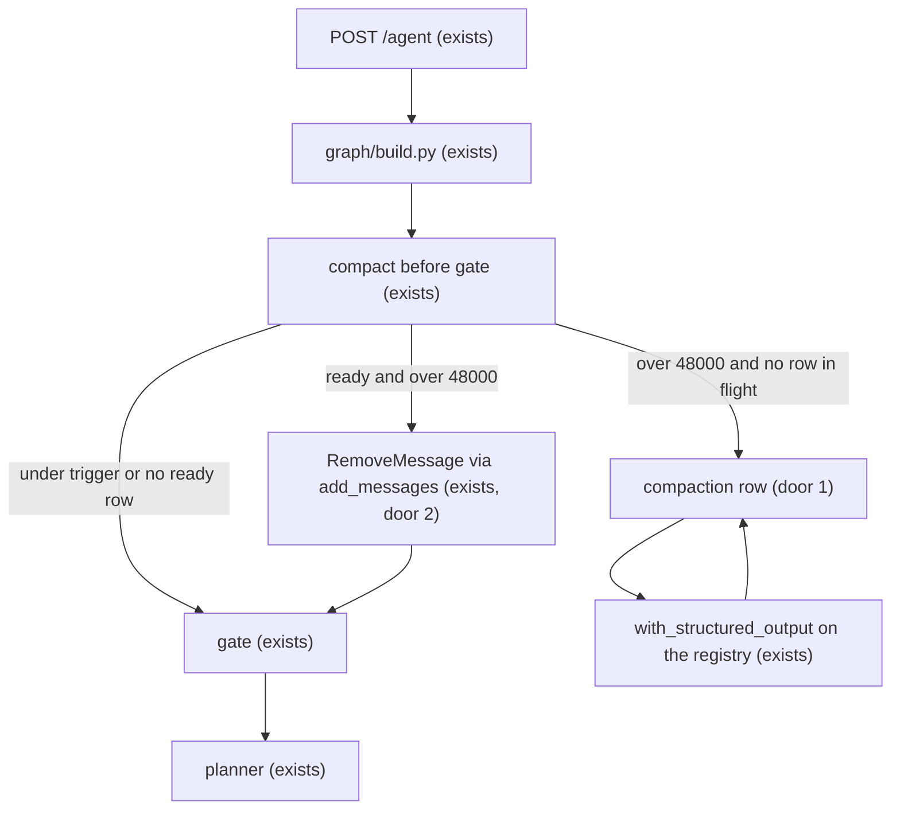
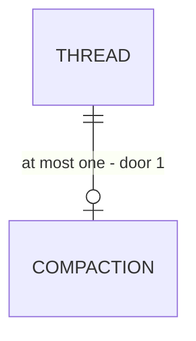

# Chat messages trimming and summarization

Sources:

- conversation 2026-09-21 (grill-me) - **binding**: transcript stays append-only; compaction is a graph projection; async job; apply on a later turn; token budgets; planner-only summary; gate 3 exchanges; no synchronous trim
- `.specs/project/STATE.md` AD-031 - desk reads `transcript_items`; checkpoint `messages` are the prompt channel; this feature is the summary slice AD-031 deferred
- `.specs/project/STATE.md` AD-019 - planner internals stay English; the summary is an internal artifact and is English
- `.specs/project/STATE.md` AD-010 - new model call binds through the registry; it does not enter `PLAN_AGENTS`
- `src/plan_based_researcher/policy.py` - `history_window_exchanges = 6` is shared by gate and planner today; `chunk_encoding` stays `cl100k_base` for ingest
- `src/plan_based_researcher/api/routes.py` - the only `409` today is `{"detail":"nothing to resume"}`

## Problem

Follow-up turns plan from checkpoint `messages`, and that list only grows. Gate and planner each keep a fixed tail (`Policy.history_window_exchanges = 6`). The planner therefore either rereads full Writer answers until the model window fails, or drops the earlier turns that still hold the student's goal, paper ids, and constraints. The desk hydrates from `transcript_items`. If the trim that makes the planner fit also rewrote that table, the student would lose turns.

Evidence in the source: none quantified. The grill fixed the outcome and the budgets below. `gpt-5.6-luna` advertises a 1,050,000-token window; input price doubles above 272,000 tokens (OpenAI model page, read 2026-09-21). This slice starts work far below both.

When this ships, a long thread still shows every turn on the desk. The planner sees an English summary plus the recent verbatim tail. Until that summary is ready, the turn runs on the full message list.

## Out of scope

| Excluded                                                                              | Why                                                                            |
| ------------------------------------------------------------------------------------- | ------------------------------------------------------------------------------ |
| Writer prompt reads `conversation_summary`                                            | grill: writer stays on 2 exchanges of the messages still in state              |
| `replan_remaining` reads `conversation_summary`                                       | grill: summary is for `PlannerRunner.run` only                                 |
| Synchronous trim when the summary is not ready                                        | grill: the turn continues; a context-window error stays a turn error           |
| Summary history, a second compaction row, linking the watermark to `transcript_items` | grill: one row, overwritten on success; watermark is the checkpoint message id |
| Per-thread turn lock and a new `409`                                                  | the desk swaps Send for Stop while `streaming`; a second tab stays the existing race |
| Rolling summary every turn                                                            | grill: the block changes only when a cut is applied                            |
| Auth, transcript delete, checkpoint rewind                                            | unchanged v1 rules                                                             |

## Assumptions

| Assumption                          | Chosen default                                     | Rationale                                                                                                                 | Confirmed? |
| ----------------------------------- | -------------------------------------------------- | ------------------------------------------------------------------------------------------------------------------------- | ---------- |
| Where the 90s stuck job is noticed  | the next compact pass on a new turn                | no worker process; a dead process cannot time itself out                                                                  | n          |
| Token-count cache                   | stored on the message that was counted             | recounts only new messages and checkpoints with them                                                                      | n          |
| Eval graph with no compaction store | compact is a no-op and the graph still enters gate | `scripts/retrieve_writer_recall.py` compiles this graph with `checkpointer=None`                                          | n          |
| tlc-spec-lean profile               | `light`                                            | no pin in `AGENTS.md`; `light` will not catch a test that passes under a double apply or a job that writes the checkpoint | n          |

**Open questions:** none - all resolved or logged above.

Profile note: raise to `standard` before checks if a green test that never applies twice, or never proves the job stays off the checkpointer, is unacceptable.

## Criteria

### S1: A ready summary lands in its own row (P1)

**Acceptance Criteria**

1. WHEN the FastAPI lifespan starts THEN the system SHALL create the compaction table with CREATE-only DDL when it is missing.
2. The system SHALL NOT DROP the compaction table or `transcript_items` during lifespan startup.
3. The system SHALL store at most one compaction row for each `thread_id`.
4. The system SHALL reject a compaction status outside `running`, `ready`, `applied`, `failed`, and `discarded`.
5. WHEN counted tokens are above 48000, the row is not `running` or `ready`, the prefix to summarize is at least 8000 tokens, and any `failed` finish is at least 30 seconds old THEN the system SHALL set that row to `running` and store the watermark message id.
6. WHEN a job moves to `running` THEN the system SHALL leave `state.messages` and `conversation_summary` unchanged on that turn.
7. WHEN the summarizer succeeds THEN the system SHALL overwrite the summary and the watermark on that same row, set status `ready`, and clear the stored error.
8. WHEN the summarizer succeeds THEN the row SHALL store the token count before, the estimated token count after, the summary token count, and the summarizer input and output token counts.
9. The summarizer call SHALL pass `reasoning_effort` `medium` and `max_completion_tokens` 2500.
10. The summarizer SHALL use `ChatOpenAI.with_structured_output` with English fields `current_user_goal`, `decisions_made`, `constraints_and_preferences`, `important_entities_and_values`, `what_has_been_done`, and `open_items`, and the stored summary SHALL render those fields under the headings `## Current user goal`, `## Decisions made (with the reason, when it matters)`, `## Stated constraints and preferences`, `## Important entities and values`, `## What has already been done`, and `## Open items and unanswered questions`.
11. WHEN the summarizer runs THEN its input SHALL be the summary that was applied when the job started, plus messages at and before the watermark, excluding messages after the watermark.
12. IF the summarizer raises or does not finish within 90 seconds THEN the system SHALL set status `failed` with the error and leave the previous summary text unchanged.
13. The system SHALL NOT insert, update, or delete `transcript_items` during compaction.
14. The summarizer agent SHALL use model `gpt-5.6-luna` with no tools, and SHALL stay out of `PLAN_AGENTS` and `planner_prompt_abilities()`.

**Independent test:** unittest with a fake summarizer and an in-memory compaction row. No live OpenAI, Postgres, or arXiv. Assert CREATE-only DDL text, one row per thread, ready overwrite, failed leaves the previous summary, and that the call is `with_structured_output` on those six fields.

### S2: A later turn applies the cut and the planner reads it (P1)

**Acceptance Criteria**

1. WHEN a new turn finds status `ready`, counted tokens above 48000, the watermark message still in `state.messages`, and the row's base watermark equal to the state's applied watermark THEN the system SHALL remove every message up through that watermark id and set `conversation_summary` to the stored summary.
2. WHEN that removal is checkpointed THEN the system SHALL set the row status to `applied` and store that same watermark id as the applied watermark on graph state.
3. WHEN messages were appended after the watermark was fixed THEN those messages SHALL remain in `state.messages` after the removal.
4. IF counted tokens are 48000 or fewer THEN the system SHALL NOT remove messages even when status is `ready`.
5. IF the watermark message is absent from `state.messages` or the base watermark differs from the state's applied watermark THEN the system SHALL set status `discarded` without changing `state.messages` or `conversation_summary`.
6. WHEN status is `ready` and the state's applied watermark already equals that watermark THEN the system SHALL mark the row `applied` without removing messages.
7. WHEN a non-resume run starts THEN the system SHALL run compact before gate.
8. WHEN `POST /agent` resumes an interrupted run THEN the system SHALL NOT run compact.
9. WHEN `conversation_summary` is non-empty THEN the planner prompt SHALL contain `<conversation_summary>` with that text after the stable instruction prefix and before `Query:`.
10. WHEN `conversation_summary` is empty THEN the planner prompt SHALL NOT contain `<conversation_summary>`.
11. The planner prompt SHALL include every remaining message in `state.messages` and SHALL NOT apply `last_exchanges`.
12. WHEN the gate builds its human prompt THEN the system SHALL format only the last 6 messages and SHALL NOT include `conversation_summary`.
13. WHEN the writer builds its user prompt THEN the system SHALL format only the last 2 exchanges and SHALL NOT include `conversation_summary`.
14. WHEN `replan_remaining` builds its prompt THEN the system SHALL NOT include `conversation_summary`.
15. WHEN a watermark is chosen THEN the kept suffix SHALL be at least 16000 tokens, its first message SHALL be a user message, and the watermark SHALL be the message immediately before that suffix.
16. WHEN aligning to a user message would keep fewer than 16000 tokens THEN the system SHALL extend the kept suffix until it starts on a user message.
17. IF the prefix before the watermark is under 8000 tokens or no user-message boundary exists THEN the system SHALL NOT start a job and SHALL NOT remove messages.
18. The system SHALL count tokens with tiktoken encoding `o200k_base` over the applied summary plus `state.messages`, omitting system text and the papers list.
19. WHEN a message already has a stored token count THEN the system SHALL reuse that count.
20. WHERE the graph has no compaction store THEN the system SHALL skip compaction and enter gate.
21. WHEN a cut is applied THEN the system SHALL emit `RemoveMessage` for each removed checkpoint message id and SHALL let the existing `add_messages` reducer apply them.

**Independent test:** unittest on the compact decision and on gate, planner, writer, and `replan_remaining` prompt builders with fixture messages. A ready row over 48000 tokens removes through the watermark id; a ready row at or under 48000 does not. Planner fixture includes `<conversation_summary>` only when the summary is non-empty. Gate fixture shows 6 messages and no summary tag.

### S3: A failed job stays off the chat (P1)

**Acceptance Criteria**

1. WHEN compact sees status `running` with a start older than 90 seconds THEN the system SHALL mark that row `failed` and refuse a new `running` row until 30 seconds after that failure time.
2. WHEN the summarizer finishes after the graph turn that started it has returned THEN the system SHALL still store status `ready` or `failed` on the compaction row.
3. IF the summarizer fails THEN the system SHALL NOT set graph `outcome` to `error` because of that failure.

**Independent test:** unittest where a summarizer fails or resolves after the turn returns: `outcome` is unchanged and the row is `ready` or `failed`. A `running` row older than 90 seconds becomes `failed` and is not replaced until 30 seconds after that failure time.

## Traceability

| ID     | Slice | Criteria | Status  |
| ------ | ----- | -------- | ------- |
| CMP-01 | S1    | 1–14     | Built   |
| CMP-02 | S2    | 1–21     | Built   |
| CMP-03 | S3    | 1–3      | Built   |

## Observable

| Surface                    | Decision                    | Landing                                                                        |
| -------------------------- | --------------------------- | ------------------------------------------------------------------------------ |
| API `POST /agent`          | response shape              | existing - SSE AG-UI, unchanged                                                |
| API `POST /agent`          | error shape and codes       | existing - `400`, `409` `nothing to resume`, `422`; this feature adds no status |
| API `POST /agent`          | who may call it             | existing - CORS `WEB_ORIGIN`; no auth in v1                                    |
| API `POST /agent`          | versioning                  | n/a - single unversioned route, same as today                                  |
| API `POST /agent`          | rate limit                  | n/a - no HTTP throttle in v1                                                   |
| screen desk                | empty state                 | n/a - no new screen; hydrate stays on the transcript                           |
| screen desk                | loading state               | n/a - compaction does not add a desk wait                                      |
| screen desk                | error state                 | existing - the client already surfaces HTTP errors                             |
| screen desk                | unauthorised state          | n/a - no auth in v1                                                            |
| screen desk                | destructive confirm         | n/a - compaction does not delete transcript turns                              |
| document summarizer prompt | structure and tone          | AC 9, 10 - English, six headings, cap 2500                                     |
| document summarizer prompt | what the reader does next   | n/a - the planner consumes the block; no human action                          |
| collection compaction rows | grouping and duplicates     | AC 3, 7 - one row per thread; success overwrites that row                      |
| collection compaction rows | naming and ordering         | n/a - the row is not shown; a single row has no order                          |
| collection compaction rows | exception that does not fit | AC 12 - a failure does not replace the last good summary                       |
| command eval CLI           | flags and failure           | S2 criterion 20 - no store means skip compact and enter gate                   |

## Flow

Reuses `POST /agent`, `graph/build.py` (`START` currently enters `gate`), `Policy`, `AsyncPostgresSaver`, `add_messages`, the registry, and `PgTranscriptStore` as a store this feature does not write. The cut is `RemoveMessage` through that reducer. The summarizer is `ChatOpenAI.with_structured_output`, the same call shape gate and planner already use. No summarization middleware and no second message reducer. Adds one compaction row on the same pool. The job writes that row; the graph is the only writer of checkpoint messages.

A new turn enters compact before gate. When the row is `ready` and the count is over 48000, compact emits `RemoveMessage` through the watermark and sets `conversation_summary`, then gate runs. Otherwise the turn keeps the full list. The job may finish after this turn returns and only then marks the row `ready`. Resume does not run compact. A graph compiled with no compaction store goes to gate.

## Relations

One-way constraints: one compaction row per thread (door 1); status is `running`, `ready`, `applied`, `failed`, or `discarded` (door 1). Checkpoint state holds at most one conversation summary and one applied watermark message id (door 2). No columns and no types here.

## Surface

`None - nothing consumed outside`. `POST /agent` keeps its current statuses. The desk does not gain a route or a payload key.

## Landing

| One-way door                          | Literal shape                                                                                                                                                                 | Alternative rejected                                                                                                                         |
| ------------------------------------- | ----------------------------------------------------------------------------------------------------------------------------------------------------------------------------- | -------------------------------------------------------------------------------------------------------------------------------------------- |
| One compaction row per thread         | primary key `thread_id`; status in `running`, `ready`, `applied`, `failed`, `discarded`; a successful summary overwrites that row; a failure leaves the previous summary text | an append-only job history with a partial unique index on `running` — a failed attempt would need a second row to keep the last good summary |
| Summary lives beside the message list | graph state fields `conversation_summary` and the applied watermark message id; absent or empty means nothing applied yet; removal uses that checkpoint message id            | putting the summary inside `state.messages` — the next append and the cut itself would move the prefix the planner caches                    |

- Nothing else in this change is hard to reverse

## Impact

| Front       | What changes                                                                                                                                                                                                                        |
| ----------- | ----------------------------------------------------------------------------------------------------------------------------------------------------------------------------------------------------------------------------------- |
| domain      | new term: `conversation_summary` — English planner block, not a transcript item and not a `state.messages` entry                                                                                                                    |
| domain      | new term: compaction watermark — the checkpoint message id of the last message included in the summary                                                                                                                              |
| domain      | existing term: `history_window_exchanges` meant the shared gate and planner tail of 6 — callers `agents/gate.py` and `agents/planner.py` via `last_exchanges`. Gate becomes 3 exchanges (6 messages). Planner stops using that tail |
| stored data | new compaction table, empty; no backfill. Existing checkpoints omit the new fields and read as no summary and no applied watermark. `transcript_items` rows are not updated or deleted. `chunk_encoding` stays `cl100k_base`        |
| decision    | amends AD-031 "Summary/trim is a later slice" and "prompt windows stay". Does not change `GET /threads` replay or `finalize` appending `AIMessage`                                                                                  |

