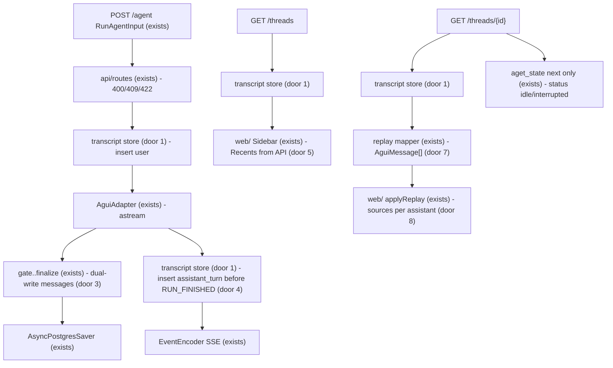
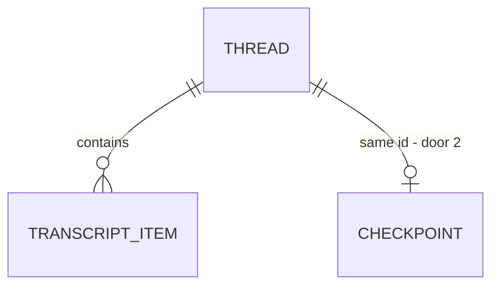

# Chat state transcript

Sources:

- conversation 2026-09-19 (this chat) - checkpointer vs product transcript, grill-me rounds on recents, GET vs POST, replay JSON, write timing, backfill; **binding for the interface**: sidebar Recents, `/` and `/c/{threadId}` hydrate, `[n]` SourcePanel per turn
- `.specs/project/STATE.md` AD-029 (AG-UI wire, `GET /threads/{id}` from checkpoint `messages`, recents in `localStorage`) - this feature amends the replay and recents lines; `POST /agent` consume path and `finalize` `AIMessage` stay
- `.specs/features/agui-frontend/plan.md` - current replay mapper, desk hydrate, `applyReplay` last-write `SOURCES`
- AGENTS.md - `web/` HTTP-only; same Postgres for pgvector and `AsyncPostgresSaver`; threads not deleted in v1; auth out of v1

## Problem

The desk treats the LangGraph checkpointer as the chat. `GET /threads/{thread_id}` reads `snapshot.values["messages"]` (`api/routes.py`). Recents live in `localStorage` (`web/lib/recents.ts`) on one browser. `applyReplay` assigns `SOURCES` to a single thread-global list, so after two Writer turns a `[1]` on the first answer opens the second turn's excerpt. Replaying `STEPS` stores `{count, elapsed_ms}` with `nodes: []`, so the collapsed rail has nothing to expand.

A later summary slice will trim `GraphState.messages` so the LLM window fits. If the desk still hydrates from that channel, the student loses real turns. The checkpointer is already a lossy view for UI (last-write plan, last-write sources, empty step nodes) even before that trim.

Evidence in the source: none quantified. The grill stated the outcome: persist a product transcript for the desk, keep the checkpoint for the agent, summarise later, drop old checkpoint-only threads.

When this ships, F5 and opening `/c/{threadId}` paint every persisted turn from the transcript (gate, plan, step names, markdown, that turn's citations). The sidebar lists threads from the API. `POST /agent` still runs the graph from the checkpoint. Summary is not in this slice; `messages` still appends.

## Out of scope

| Excluded | Why |
| --- | --- |
| LLM summarisation, `RemoveMessage`, token-window trim of `messages` | user: summary is the next slice; this slice dual-writes |
| Auth, `owner_id`, per-user ACL on list/get | AGENTS.md out of v1; list is every thread on this Postgres until auth filters by id |
| Share, fork, edit, regenerate, checkpoint rewind | grill: not on the desk |
| `tool_call` transcript kinds | search/retrieve are graph nodes; UI projects GATE/PLAN/STEPS from the turn |
| Backfill from existing checkpoints | user: product still in development; empty transcript is 404 |
| SSE resumption (`Last-Event-ID`), concurrent runs on one thread | unchanged from agui-frontend |
| Changing gate/planner/writer prompt windows | `Policy.history_window_exchanges` / `writer_history_exchanges` stay; they still read `messages` |
| Papers / `evidence_chunks` / search artifacts in the transcript | agent state, not desk chrome |
| Dockerised API/UI | AGENTS.md out of v1 |

## Assumptions

| Assumption | Chosen default | Rationale | Confirmed? |
| --- | --- | --- | --- |
| Product transcript vs checkpointer | Two stores; desk reads transcript; graph still uses checkpoint | grill: summary later must not erase the chat | y |
| `threads.id` | Client `threadId` uuid = `configurable.thread_id` | grill: no second id | y |
| HTTP surfaces | `GET /threads` list, `GET /threads/{id}` chat, `POST /agent` run | grill: rest-pair | y |
| `GET /threads/{id}` body | `{threadId, messages: AguiMessage[], status}` via mapper from items, not from checkpoint `messages` | grill: keep `applyReplay` | y |
| Recents | Server list; remove `localStorage` / `web/lib/recents.ts` | grill: auth later; list-all leak accepted until then | y |
| Write timing | Non-resume `POST /agent` inserts `user` before `astream`; adapter inserts `assistant_turn` on every SSE terminal before `RUN_FINISHED` / `RUN_ERROR` | grill: timeout never reaches `finalize` | y |
| Dual-write `messages` | `initial_graph_state` still appends the user dict; `finalize` still appends `AIMessage` | grill: prompts stay on `last_exchanges` until summary | y |
| Old checkpoint threads | No fallback; `GET /threads/{id}` 404 when transcript is empty | user: "Pode excluir. produto está em desenvolvimento ainda" | y |
| `assistant_turn` id | `writer_message_id` when Writer ran; else request `runId` | Writer may not run (refuse, timeout, `RUN_ERROR`) | n |
| `user` id | `RunAgentInput.messages[-1].id` | already on the wire (`web/lib/stream.ts` `normalRunInput`) | n |
| Thread title | First 80 characters of the first `user` content; later humans do not rename | matches today's `upsertRecent` | n |
| List order | `updatedAt` descending | matches `loadRecents` sort | n |
| `GET /threads/{id}` `status` | Still `interrupted` if checkpoint `next` is non-empty, else `idle` | Resume strip is agent state, not a transcript field | n |
| Same-tab first send | Still skips `GET /threads/{id}` | agui-frontend AC 44; live React state already has the user bubble | n |
| Schema lifecycle | `CREATE IF NOT EXISTS` on API lifespan, same pool as chunks; no DROP | AD-021 CREATE-only; operator wipe is unrelated | n |
| Graph isolation | Nodes and `finalize` do not import the transcript store; adapter/route write it | hexagonal ports; grill: graph does not know the table | n |
| CORS | Existing `WEB_ORIGIN` middleware covers `GET /threads` | already global on the app | n |
| Profile | `light` (no declaration in AGENTS.md) | skill default; flagged below as thin for a desk hydrate contract | n |

**Open questions:** none - all resolved or logged above.

Profile note: this feature has screens (`/`, `/c/{threadId}`, sidebar) and a wire contract. `light` will not catch a sources-per-turn test that would pass under a global last-write. Raise to `ui` (or `standard`) before checks if that gap is unacceptable.

## Criteria

### S1: Transcript is the desk document (P1)

**Acceptance Criteria**

1. WHEN the FastAPI lifespan starts THEN the system SHALL ensure `threads` and `transcript_items` exist with CREATE-only DDL and SHALL NOT DROP them
2. The system SHALL use the client `threadId` as `threads.id` and as LangGraph `configurable.thread_id`
3. The system SHALL persist only transcript kinds `user` and `assistant_turn`
4. WHEN an `assistant_turn` is persisted THEN its JSON SHALL include `outcome`, `content`, `gate` with `in_domain` and `reason`, `plan[]` each with `index`, `agent`, `task`, `status`, `feedback`, `steps` with `count`, `elapsed_ms`, `nodes[]` each with `name` and `query_used`, and `citations[]` each with `n`, `chunk_id`, `arxiv_id`, `title`, `year`, `url`, `excerpt`

**Independent test:** repo `ensure_schema` against a throwaway connection (or the unittest fake store) inserts one `user` and one `assistant_turn` and reads the JSON keys back. No live OpenAI.

### S2: HTTP read does not run the graph (P1)

**Acceptance Criteria**

5. WHEN `GET /threads` is called THEN the system SHALL respond `200` with a JSON array of objects each `{threadId, title, updatedAt}` sorted by `updatedAt` descending
6. WHEN no threads exist THEN `GET /threads` SHALL respond `200` `[]`
7. WHEN `GET /threads/{thread_id}` is called and the thread has at least one transcript item THEN the system SHALL respond `200` `{threadId, messages, status}` and SHALL NOT use checkpoint `messages` as the `messages` source
8. IF `GET /threads/{thread_id}` finds no transcript items THEN the system SHALL respond `404` `{"detail":"thread not found"}` even when a checkpointer snapshot exists for that id
9. WHEN replaying a `user` item THEN the `messages` array SHALL contain a `UserMessage` with that item's `id` and `content`
10. WHEN replaying an `assistant_turn` with `outcome="done"` THEN the system SHALL emit, in order, `ActivityMessage` `GATE`, `ActivityMessage` `PLAN`, `ActivityMessage` `STEPS`, `AssistantMessage` with `id` equal to the item id and `content` equal to the stored markdown, `ActivityMessage` `SOURCES`
11. WHEN replaying an `assistant_turn` with `outcome` in `refused`, `insufficient`, `error` THEN the system SHALL emit `ActivityMessage` `GATE` when `gate` is present, then `ActivityMessage` `OUTCOME` `{outcome, reason}` and SHALL NOT emit an `AssistantMessage`
12. WHEN the checkpoint snapshot `next` is non-empty THEN `GET /threads/{thread_id}` `status` SHALL be `"interrupted"`, otherwise `"idle"`
13. WHEN replaying `STEPS` THEN `content` SHALL include `count`, `elapsed_ms`, and `nodes` from the stored turn (not an empty list)
14. WHEN two `done` turns are replayed THEN the `SOURCES` activity after the first `AssistantMessage` SHALL carry that turn's `citations`, and the second `SOURCES` SHALL carry the second turn's `citations`

**Independent test:** `TestClient` against a fake transcript store (no Postgres, no compiled research graph for the list/member body); seed two done turns with distinct citations and step nodes; assert JSON order and 404 despite a `MemorySaver` snapshot with messages.

### S3: Dual-write on a run (P1)

**Acceptance Criteria**

15. WHEN `POST /agent` is not a resume and the body has a `UserMessage` THEN the system SHALL insert a `user` transcript item with that message's `id` and `content` before `graph.astream` starts
16. WHEN that `user` insert is the first item on the thread THEN the system SHALL create `threads` with `title` equal to the first 80 characters of the content
17. WHEN `POST /agent` has `forwardedProps.resume=true` THEN the system SHALL NOT insert a `user` item
18. WHEN the adapter is about to emit `RUN_FINISHED` or `RUN_ERROR` THEN a matching `assistant_turn` SHALL already exist for that run
19. WHEN the Writer ran (`writer_message_id` set) THEN the `assistant_turn` `id` SHALL equal that `writer_message_id`
20. WHEN the Writer did not run THEN the `assistant_turn` `id` SHALL equal the request `runId`
21. WHEN `finalize` runs THEN it SHALL still append one `AIMessage` to `GraphState.messages` with the existing projection contract (agui-frontend AC 1–3)
22. WHEN a non-resume run starts THEN `initial_graph_state` SHALL still put `{"role":"user","content": query}` on `messages`
23. The system SHALL NOT import the transcript repository from any module under `graph/nodes/`
24. IF an insert repeats an existing transcript item `id` THEN the system SHALL leave a single row for that `id`

**Independent test:** route test with a recording transcript store and a tiny graph; non-resume inserts user then assistant_turn; resume does not insert user; timeout path on the adapter inserts `assistant_turn` with `id=runId` and `outcome` from the terminal frame; second insert same id does not add a row; `finalize` unit test still asserts `AIMessage` on `messages`.

### S4: Desk reads the transcript (P1)

**Acceptance Criteria**

25. WHEN the desk mounts THEN it SHALL call `GET /threads` and render the returned rows in the sidebar Recents list
26. The repository SHALL NOT contain `web/lib/recents.ts`
27. WHEN the student opens `/c/{threadId}` THEN the client SHALL call `GET /threads/{threadId}` and render `messages` before enabling the input (agui-frontend AC 45)
28. IF `GET /threads/{threadId}` responds `404` THEN the client SHALL navigate to `/`
29. WHEN `applyReplay` processes two `SOURCES` activities each after its `AssistantMessage` THEN a citation `[n]` on the first assistant block SHALL resolve against the first turn's items, not the second
30. WHEN `applyReplay` processes `STEPS` with `nodes` THEN the collapsed StepRail expand list SHALL contain those `name` values

**Independent test:** `vitest` on sidebar fetch of `GET /threads`, hydrate 404, `applyReplay` two-turn sources, and step nodes; no `localStorage` recents helper.

## Traceability

| ID | Slice | Criteria | Status |
| --- | --- | --- | --- |
| TRN-01 | S1 | 1–4 | Pending |
| TRN-02 | S2 | 5–14 | Pending |
| TRN-03 | S3 | 15–24 | Pending |
| TRN-04 | S4 | 25–30 | Pending |

## Observable

| Surface | Decision | Landing |
| --- | --- | --- |
| screen `/` | empty state | existing - agui-frontend AC 42, unchanged (centred composer, no API until send) |
| screen `/` | loading state | n/a - no request until first send |
| screen `/` | error state | existing - run error after first send (agui-frontend AC 53) |
| screen `/` | unauthorised state | n/a - no auth in v1 |
| screen `/` | sidebar Recents empty | AC 25, 6 - empty `GET /threads` renders the existing empty copy |
| screen `/c/{threadId}` | empty / not found | AC 28 |
| screen `/c/{threadId}` | loading state | AC 27 - input disabled until replay |
| screen `/c/{threadId}` | error state | existing - dropped stream still `GET /threads/{id}` (agui-frontend AC 49) |
| screen `/c/{threadId}` | unauthorised state | n/a - holder of the id reads the thread; list-all is the auth gap until `owner_id` |
| screen `/c/{threadId}` | density and ordering | AC 10, 13, 14, 29, 30 - flat AG-UI order; sources per assistant; step nodes on expand |
| screen `/c/{threadId}` | destructive action confirms | n/a - Stop still keeps checkpoint; nothing is deleted |
| screen sidebar Recents | grouping / naming / ordering / duplicates | AC 5, 16, 25 - one row per `threadId`, title 80 chars, `updatedAt` desc |
| API `GET /threads` | response shape | AC 5, 6 |
| API `GET /threads` | error shape and codes | n/a - empty is `200 []`; no 404 on the collection |
| API `GET /threads` | who may call it | existing - CORS `WEB_ORIGIN`; no auth (list is every thread on this Postgres) |
| API `GET /threads` | versioning | n/a - single unversioned route |
| API `GET /threads` | rate limit | n/a - no throttling in v1 |
| API `GET /threads/{thread_id}` | response shape | AC 7, 9–14 |
| API `GET /threads/{thread_id}` | error shape and codes | AC 8 |
| API `GET /threads/{thread_id}` | who may call it | existing - CORS; no auth |
| API `GET /threads/{thread_id}` | versioning / rate limit | n/a - same as `/agent` |
| API `POST /agent` | response shape | existing - SSE AG-UI; this feature adds writes, not new event names |
| API `POST /agent` | error shape and codes | existing - 400 / 409 / 422 unchanged (AC 15–17 are side effects of a valid run) |
| API `POST /agent` | who may call it / versioning / rate limit | existing - CORS; unversioned; timeout still `RUN_FINISHED` insufficient |
| document `AGENTS.md` | structure | n/a - product line still `POST /agent` and `GET /threads`; amend replay to transcript in Impact, not a new reader action |
| command `uv run python -m plan_based_researcher` | flags / output | existing - unchanged; schema CREATE-only on lifespan (AC 1) |

## Flow

Reuses `POST /agent` validation, `AguiAdapter` `astream` `custom`+`updates`, `finalize` `AIMessage`, `snapshot_to_agui_messages` / `project_turn`, `snapshot_status` from checkpoint `next`, FastAPI lifespan pool, and the Next.js desk hydrate path. Adds a transcript store on that pool. Does not add a second graph iterator.

Live path: valid non-resume POST → insert `user` → `astream` as today → `finalize` appends `AIMessage` → adapter inserts `assistant_turn` → `RUN_FINISHED`. Resume skips the user insert. Timeout/`RUN_ERROR` still insert `assistant_turn` in the adapter.

Replay path: `GET /threads/{id}` → items by seq → mapper → same `Message[]` the desk already consumes. Checkpoint is consulted only for `status`.

## Relations

One-way constraints: `TRANSCRIPT_ITEM` identity unique (door 8), kind in `user` | `assistant_turn` (door 9), `THREAD` identity equals checkpointer `thread_id` (door 2). No columns and no types here.

## Surface

| Route | In | Out | Status |
| --- | --- | --- | --- |
| `GET /threads` | none | `[{threadId, title, updatedAt}]` | `200` |
| `GET /threads/{thread_id}` | path id | `{threadId, messages, status}` | `200`, `404` |
| `POST /agent` | `RunAgentInput` | `text/event-stream` AG-UI events | `200`, `400`, `409`, `422` |

## Landing

| One-way door | Literal shape | Alternative rejected |
| --- | --- | --- |
| 1. Product transcript on the app pool | Tables `threads` and `transcript_items`; lifespan `CREATE IF NOT EXISTS`; `GET /threads/{id}` `messages` come from items | Keep hydrating from checkpoint `messages` until summary - the trim would erase the desk; dual-write with no UI consumer |
| 2. One id | `threads.id` == client `threadId` == `configurable.thread_id` | A second graph thread id - fork/share would need a mapping table this slice does not have |
| 3. Dual-write until summary | `GraphState.messages` still `add_messages` (user dict + `finalize` `AIMessage`) | Stop appending `messages` now - prompts would read the UI table this slice |
| 4. Adapter owns terminal transcript writes | Insert `assistant_turn` before `RUN_FINISHED` and before `RUN_ERROR`, including timeout | `finalize`-only writes - adapter timeout never enters `finalize` |
| 5. Server Recents without auth | `GET /threads` returns every thread; `web/lib/recents.ts` removed | Keep `localStorage` until `owner_id` - user asked the list on the server so auth can filter by id later |
| 6. No backfill | Empty items → `404` even if `aget_state` has `messages` | Lazy fallback to checkpoint - user dropped old UAT threads |
| 7. Replay wire unchanged | `{threadId, messages: AguiMessage[], status}` | Desk `blocks` DTO - would delete `applyReplay` this slice |
| 8. Item identity | Unique item id: user = `UserMessage.id`; assistant = `writer_message_id` or `runId` | Seq-only identity - a retried POST would duplicate the turn |
| 9. Two kinds | `user` \| `assistant_turn`; GATE/PLAN/STEPS/SOURCES stay mapper output | Persist `tool_call` rows - those are graph nodes, not desk messages |

- Nothing else in this change is hard to reverse

## Impact

| Front | What changes |
| --- | --- |
| domain | new term: `transcript item` - one desk-visible event (`user` or `assistant_turn`) stored outside the checkpointer |
| domain | new term: `assistant_turn` - the JSON document for one terminal run (gate, plan, steps.nodes, markdown/reason, citations of that turn) |
| domain | existing term: `GET /threads/{id}` meant checkpoint `messages` replay (AD-029, `api/routes.py` `get_thread`, `tests/test_threads_route.py`, desk hydrate). It now means transcript replay; `status` still comes from checkpoint `next` |
| domain | existing term: Recents meant `localStorage` `pbr.recents` (`web/lib/recents.ts`, `Sidebar.tsx`, `Chat.tsx`, `web/lib/desk.test.tsx`). It now means `GET /threads` |
| stored data | nothing to migrate; checkpoint-only threads become `404` on GET (door 6). Dual-write new runs into both stores (door 3) |
