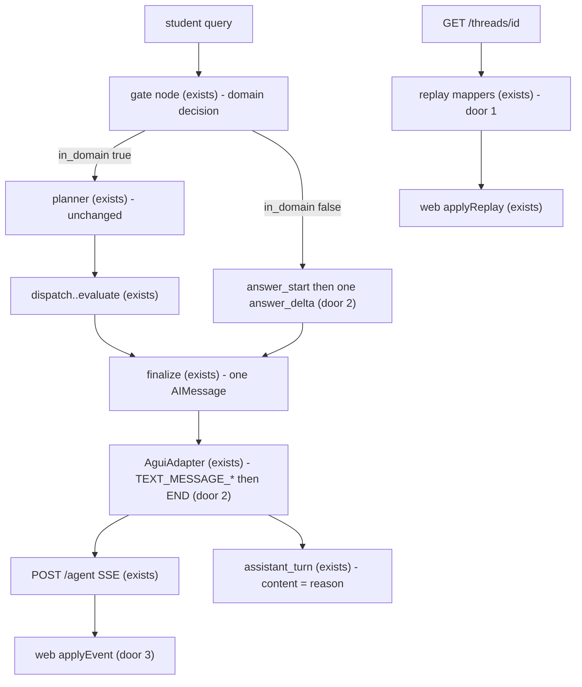

# Out-of-domain question response

Sources:

- conversation 2026-09-20 (this chat) - hide in-domain gate evaluation; refused text uses the Writer `TEXT_MESSAGE_*` channel; persist via existing `finalize` `AIMessage`; one delta is enough; do not invoke Writer; do not route to `END`; **binding for the interface**: live desk and `GET /threads/{id}` replay
- `.specs/project/STATE.md` AD-019 (gate `reason` matches query language), AD-029 (AG-UI wire, `finalize` `AIMessage`, `TEXT_MESSAGE_*`), AD-031 (transcript replay, not checkpoint `messages`)
- `.specs/features/agui-frontend/plan.md` AC 22, 26–29, 39, 52, 58 - GATE snapshot, Writer text events, refused as marginalia
- `.specs/features/chat-state-transcript/plan.md` AC 10–11, 19–20 - replay GATE+OUTCOME on refuse; `assistant_turn` id

## Problem

The student sees the domain gate as a product turn. In-domain, the desk paints a GATE activity (`in domain` plus `reason`) before the plan. Out of domain, the same GATE line is the “answer”, then `RUN_FINISHED` `outcome=refused` replaces any assistant text with an `outcome` chip. Replay (`GET /threads/{id}` and checkpoint leftover mapping) repeats GATE then OUTCOME and never an `AssistantMessage`.

The student asked a question and got a classifier verdict, not a reply. A follow-up in the same thread already has the refusal as `finalize` `AIMessage.content` (agui-frontend AC 2); only the live and replay surfaces treat that content as chrome.

Evidence in the source: none quantified. The conversation stated the outcome: do not show the gate evaluation when it passes; when it fails, speak on the Writer text channel, still one `AIMessage` from `finalize`.

When this ships, an in-domain run never shows GATE. An out-of-domain run streams `gate.reason` as assistant markdown (same bubble as Writer), persists that text once on `messages`, and F5 shows the same bubble.

## Out of scope

| Excluded | Why |
| --- | --- |
| Invoking the Writer runner on refuse | extra LLM; Writer requires an evidence pack; `reason` is already student-facing |
| Routing refused `gate` to `END` | `finalize` is the persist + terminal custom-event hop (AD-029) |
| Tokenising `reason` into many `answer_delta`s | gate returns the full string; one delta uses the Writer channel |
| Hiding `STEP_STARTED` / StepRail `gate` | progress, not the evaluation line; conversation left the rail |
| Changing `insufficient` / `error` / timeout to assistant text | conversation scoped the bubble to gate refuse; those stays are chips |
| Gate allowlist, prompts, or `GateDecision` fields | AD-019 and GATE-01/02 stay; only the product surface of `reason` changes |
| Auth, HITL, Dockerised API/UI | AGENTS.md out of v1 |

## Assumptions

| Assumption | Chosen default | Rationale | Confirmed? |
| --- | --- | --- | --- |
| In-domain surface | No custom `gate` event; no `ACTIVITY_SNAPSHOT` `GATE`; replay omits `ActivityMessage` `GATE` on every outcome including `done` | user: do not show the evaluation when it passes; F5 must not bring it back | y |
| Out-of-domain surface | Same `answer_start` / `answer_delta` custom events as Writer; adapter already maps them to `TEXT_MESSAGE_*` | user: least verbose; look like the agent answering | y |
| Persist | `finalize` still appends the one `AIMessage`; gate node does not write `messages` | user confirmed this is the ideal; `add_messages` would duplicate if both wrote | y |
| Stream id | Refuse sets `writer_message_id` to the `answer_start` `message_id` so `finalize` `AIMessage.id`, live `TEXT_MESSAGE_*`, and `assistant_turn` id match | Writer path already uses that field; a second state key is more verbose | n |
| Close the text | Adapter emits `TEXT_MESSAGE_END` before `RUN_FINISHED` when a start had no `citations` end | Writer closes on `citations`; refuse has none | n |
| Desk `RUN_FINISHED` | `refused` keeps the assistant block and does not add `kind: "outcome"`; `insufficient` still becomes the outcome chip | user: only gate fail is a reply; existing test treats both the same and must split | n |
| Step rail | `wrap_node` still emits `node_start`/`node_end` for `gate` | evaluation is GATE activity, not the node name | n |
| Empty `reason` | Still one `answer_delta` with `""`; no template fallback | structured `GateDecision.reason` is required; inventing copy revokes AD-019 | n |
| Follow-up after refuse | Unchanged: gate judges the new user query from `last_exchanges` (K4) | already true because `finalize` already stores the reason on `messages` | n |
| Profile | `light` (AGENTS.md has no `tlc-spec-lean` profile) | skill default; this is a desk + wire slice, so `light` will not catch arrangement or a test that would pass under a wrong chip | n |

**Open questions:** none - all resolved or logged above.

Profile note: screens (`/` live, `/c/{threadId}` replay) and a wire contract. `light` will not catch a reducer that still swaps refused to an outcome chip if a weak assertion only checks “some block exists”. Raise to `ui` (or `standard`) before checks if that gap is unacceptable.

## Criteria

### S1: In-domain gate is not a product turn (P1)

**Acceptance Criteria**

1. WHEN the gate runner returns `in_domain=true` THEN the gate node SHALL NOT emit a custom event whose `event` is `"gate"`
2. WHEN `POST /agent` streams an in-domain run THEN the SSE SHALL NOT contain `ACTIVITY_SNAPSHOT` with `activity_type` `"GATE"`
3. WHEN replaying a `done` turn THEN the `messages` array SHALL NOT contain `ActivityMessage` `activity_type="GATE"` and SHALL still contain `PLAN`, `STEPS`, `AssistantMessage`, `SOURCES` in that order after the user message
4. The adapter SHALL NOT emit `ACTIVITY_SNAPSHOT` `GATE` for any custom chunk, including a leftover `event: "gate"`

**Independent test:** gate-node unit with a stub runner (`in_domain=true`) records custom writer payloads and asserts no `"gate"` event; adapter unit fed that stream (and a leftover `gate` chunk) asserts no GATE snapshot; replay unit on a `done` `assistant_turn` / `AIMessage` asserts the order `PLAN`, `STEPS`, `assistant`, `SOURCES`.

### S2: Refuse speaks on the Writer text channel (P1)

**Acceptance Criteria**

5. WHEN the gate runner returns `in_domain=false` THEN the gate node SHALL emit custom `answer_start` with a uuid `message_id` then exactly one `answer_delta` whose `text` equals `gate.reason`, and SHALL NOT emit custom `event: "gate"`
6. WHEN that `answer_start` is emitted THEN the gate node update SHALL include `writer_message_id` equal to that `message_id` and SHALL NOT include a `messages` key
7. WHEN `finalize` runs with `outcome="refused"` THEN it SHALL append exactly one `AIMessage` whose `content` equals `gate.reason`, whose `id` equals `writer_message_id`, and whose `response_metadata.outcome` is `"refused"`
8. WHEN the adapter has emitted `TEXT_MESSAGE_START` for the run and no `citations` event closed it THEN, before `RUN_FINISHED`, the adapter SHALL emit `TEXT_MESSAGE_END` on that `message_id`
9. WHEN `finalize` emits `done` with `outcome="refused"` THEN the adapter SHALL emit `RUN_FINISHED` with `result.outcome="refused"` and `result.reason` equal to `gate.reason`
10. WHEN `_after_gate` sees `outcome="refused"` THEN the compiled graph SHALL route to `finalize` and SHALL NOT invoke the planner or the writer runner
11. The streamed refuse `text` SHALL equal the persisted `AIMessage.content` and SHALL equal `gate.reason` (student-facing language unchanged from AD-019)

**Independent test:** gate-node unit with `in_domain=false` / `reason="out of scope"` asserts event order `answer_start`, `answer_delta` and `writer_message_id`; adapter unit on that stream plus `done` `{outcome: refused, reason}` asserts `TEXT_MESSAGE_START`, one `CONTENT` delta `"out of scope"`, `TEXT_MESSAGE_END`, `RUN_FINISHED` `refused`; `finalize` unit already covering `AIMessage` stays and adds `id=writer_message_id`; graph compile test still lists `gate` then conditional `finalize`. No live OpenAI.

### S3: Desk and replay show a reply, not a verdict (P1)

**Acceptance Criteria**

12. WHEN `applyEvent` receives `RUN_FINISHED` with `result.outcome="refused"` after `TEXT_MESSAGE_*` THEN the desk state SHALL contain an `assistant` block whose `content` is the streamed text, `streaming=false`, and SHALL NOT contain a block `kind="outcome"` for that run
13. WHEN `applyEvent` receives `RUN_FINISHED` with `result.outcome="insufficient"` THEN the desk state SHALL contain a block `kind="outcome"` with that `reason` and SHALL NOT contain an `assistant` block from that run
14. WHEN replaying an `assistant_turn` or checkpoint `AIMessage` with `outcome="refused"` THEN the mapper SHALL emit `AssistantMessage` with `id` equal to the turn id and `content` equal to the stored content, and SHALL NOT emit `GATE` or `OUTCOME`
15. WHEN replaying an `assistant_turn` or checkpoint `AIMessage` with `outcome` in `insufficient`, `error` THEN the mapper SHALL emit `OUTCOME` `{outcome, reason}` and SHALL NOT emit `GATE` or `AssistantMessage`
16. WHEN `applyReplay` is given that refused `AssistantMessage` THEN the desk SHALL render an `assistant` block with that `content` (existing Markdown path)

**Independent test:** `vitest` on `applyEvent`: seed `TEXT_MESSAGE_START/CONTENT`, then `RUN_FINISHED` refused → assistant kept, no outcome; `RUN_FINISHED` insufficient → outcome chip, no assistant. Unittest both replay mappers (`items_to_agui_messages` and `snapshot_to_agui_messages`) for refused vs insufficient. No browser required for the unit gate; live Session K T1 remains UAT.

## Traceability

| ID | Slice | Criteria | Status |
| --- | --- | --- | --- |
| OOD-01 | S1 | 1–4 | Pending |
| OOD-02 | S2 | 5–11 | Pending |
| OOD-03 | S3 | 12–16 | Pending |

## Observable

| Surface | Decision | Landing |
| --- | --- | --- |
| screen `/` live run | empty state | existing - agui-frontend AC 42, unchanged |
| screen `/` live run | loading / streaming | AC 12 - refuse grows an `assistant` block; in-domain has no GATE line |
| screen `/` live run | error state | existing - `RUN_ERROR` marginalia (agui-frontend AC 53) |
| screen `/` live run | unauthorised | n/a - no auth in v1 |
| screen `/` live run | destructive confirm | n/a - no destructive action |
| screen `/c/{threadId}` replay | empty / not found | existing - 404 navigates to `/` (chat-state-transcript AC 28) |
| screen `/c/{threadId}` replay | loading | existing - input disabled until replay (agui-frontend AC 45) |
| screen `/c/{threadId}` replay | error | existing - hydrate 404 / run error |
| screen `/c/{threadId}` replay | unauthorised | n/a - no auth in v1 |
| screen `/c/{threadId}` replay | refused turn arrangement | AC 14, 16 - assistant markdown, no GATE, no outcome chip |
| screen `/c/{threadId}` replay | insufficient/error arrangement | AC 15 - outcome chip, no GATE |
| API `POST /agent` | error shape and codes | existing - 400/409/422 unchanged |
| API `POST /agent` | versioning | n/a - no new protocol version; event mix on the same AG-UI stream |
| API `POST /agent` | who may call | n/a - no auth in v1 |
| API `POST /agent` | rate limit | n/a - unchanged |
| API `GET /threads/{thread_id}` | error shape and codes | existing - 200/404 unchanged |
| API `GET /threads/{thread_id}` | versioning | n/a - same `{threadId, messages, status}` envelope |
| API `GET /threads/{thread_id}` | who may call | n/a - no auth in v1 |
| API `GET /threads/{thread_id}` | rate limit | n/a - unchanged |

## Flow

Reuses the compiled graph `START → gate → (planner \| finalize)`, Writer custom events `answer_start` / `answer_delta`, adapter `TEXT_MESSAGE_*` mapping, `finalize` `AIMessage`, transcript `assistant_turn`, and desk `applyEvent` / `applyReplay`. Does not add a node, event name, or LLM call.

1. query -> `gate node` (exists) - runner still returns `gate` + `outcome`; in-domain emits nothing student-facing
2. refused -> custom `answer_start`/`answer_delta` (door 2) then `_after_gate` -> `finalize` (exists)
3. `finalize` (exists) - `AIMessage(id=writer_message_id, content=reason)` as today
4. `AguiAdapter` (exists) - maps those customs to `TEXT_MESSAGE_*`, closes on `done` if needed, `RUN_FINISHED` still `refused` (door 2)
5. out: desk `applyEvent` keeps assistant on `refused` (door 3); replay omits GATE (door 1)

## Relations

None - no stored-data shape change. `assistant_turn.gate` JSON and `AIMessage.response_metadata.gate` stay; only the mapper stops projecting them as `GATE`.

## Surface

| Route | In | Out | Status |
| --- | --- | --- | --- |
| `POST /agent` | `RunAgentInput` | SSE: no `GATE`; refused adds `TEXT_MESSAGE_START` / `CONTENT` / `END` then `RUN_FINISHED` `{outcome: refused, reason}` | `200`, `400`, `409`, `422` |
| `GET /threads/{thread_id}` | path id | `{threadId, messages, status}`; refused turn is `AssistantMessage`; `done` has no `GATE`; insufficient/error is `OUTCOME` without `GATE` | `200`, `404` |

## Landing

| One-way door | Literal shape | Alternative rejected |
| --- | --- | --- |
| 1. GATE is not a product surface | No custom `event: "gate"`; adapter never emits `ACTIVITY_SNAPSHOT` `GATE`; both replay mappers omit `ActivityMessage` `GATE` for every outcome | Hide GATE only in `renderers.tsx` - live SSE and `GET /threads/{id}` still deliver the evaluation, so F5 and any AG-UI client still show it |
| 2. Refuse uses Writer text events | `in_domain=false` → `answer_start {message_id}` then one `answer_delta {text: gate.reason}` → `writer_message_id=message_id` → `finalize` `AIMessage(id=writer_message_id, content=reason)` → adapter `TEXT_MESSAGE_*` then `TEXT_MESSAGE_END` then `RUN_FINISHED {outcome: refused, reason}` | Adapter synthesizes `TEXT_MESSAGE_*` from `done`/`refused` only - two mapping paths, text starts after `finalize`, gate stays silent. Invoke Writer - extra LLM and empty evidence pack. `RUN_FINISHED` `outcome: done` - transcript and eval would record a successful answer |
| 3. Desk `refused` is assistant text | `applyEvent` `RUN_FINISHED` `refused` does not drop `assistant` and does not append `kind: "outcome"`; `insufficient` stays on the chip branch | Keep `refused` in the same reducer branch as `insufficient` - the bubble is deleted when the run ends |

- Nothing else in this change is hard to reverse (`wrap_node` still names `gate` on the rail; `GateDecision` unchanged)

## Impact

| Front | What changes |
| --- | --- |
| domain | existing term: `GATE` activity meant the student-visible domain verdict (agui-frontend AC 22, 38–39, 52, 58; chat-state-transcript AC 10–11; `api/agui.py`, `api/replay.py`, `web/lib/blocks.ts`, `web/components/renderers.tsx`). It is no longer emitted. Callers of those ACs and tests must follow this plan, not the old lines |
| domain | existing term: `writer_message_id` meant “Writer streamed”. It now also means “gate refuse streamed on the Writer text channel”. Callers: `finalize` `AIMessage.id`, adapter `assistant_turn` id (chat-state-transcript AC 19), `WriterRunner.run` |
| domain | existing term: `RUN_FINISHED` `refused` meant “render outcome chip, no assistant” (agui-frontend AC 52, `web/lib/blocks.ts`, `web/lib/desk.test.tsx`). It now means “end the run; keep the assistant text” |
| stored data | nothing to migrate; old `assistant_turn.content` / `AIMessage.content` on refuse is already `reason`. Mapper change paints those rows as assistant on next GET |
| decisions | after plan approval, append AD-032 in `.specs/project/STATE.md`: GATE is not a desk surface; refuse uses Writer `TEXT_MESSAGE_*` and `finalize` `AIMessage`; amends AD-029 GATE/OUTCOME replay and AD-031 refused replay |
| docs | AGENTS.md loop line stays `gate → planner → …`; invariant 5 (`reason` language) unchanged |
