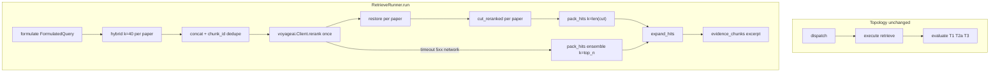
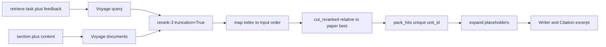

# Retrieve Cross-Encoder Rerank Design

**Spec**: `.specs/features/retrieve-cross-encoder-rerank/spec.md` (Voyage amendment 2026-09-04)  
**Context**: `.specs/features/retrieve-cross-encoder-rerank/context.md` (approved 2026-09-04)  
**Parent designs**: `.specs/features/structured-aware-chunking/design.md` (`pack_hits`, `expand_hits`) · `.specs/features/admission-retrieve-per-topic/design.md` (ranking walk, per-paper hybrid, T1/T2a/T3)  
**Architecture constraints**: `.specs/features/arxiv-grounded-research/context.md` (PAT-01–PAT-12 still apply)  
**Status**: Approved 2026-09-04 (Voyage). Supersedes the Qwen/HF design executed 2026-09-03. That path SHALL NOT ship.

This feature does **not** add graph nodes, SSE event names, Citation fields, or a second retriever. LangGraph stays `gate → planner → dispatch → search|execute → evaluate → replan|finalize`. What changes is **how many hybrid candidates** enter the pool, **how they are ordered** (Voyage `rerank-3` `relevance_score` vs the retrieve **task**), and **which prefix** is packed for the Writer.

Locked in specify + discuss (not reopened here): model id `rerank-3`, Voyage `relevance_score` as returned, query = task (+ this-step feedback), document = section + `content`, first-stage `k=40`, one score pass, per-paper `cut_reranked` (`top_n=12`, `margin=0.20`, `floor=0.30`), no Voyage `top_k` as the Writer cut, no `CrossEncoderReranker` / `ContextualCompressionRetriever`, no new node, no torch, missing `VOYAGE_API_KEY` is a boot error, runtime Voyage failure is RRF pack.

---

## Architecture Overview

Retrieve still walks rankings, ingests HTML on miss, and formulates an English **hybrid** query. Each usable paper still gets one EnsembleRetriever call (weights 0.7/0.3) with `Policy.retrieve_first_stage_k` (**40**). The runner concatenates those per-paper lists, **dedupes `chunk_id`**, and scores the unique documents **once** with `voyageai.Client.rerank` off the event loop. Scores are mapped back to input order via Voyage `index`, then restored per paper. Each paper is sorted by `relevance_score` descending (ties keep ensemble order), cut with `cut_reranked`, then `pack_hits` / `expand_hits` as today. Continuous `[n]` across papers in admission order is unchanged.





**Research notes (verification chain):**

- **Codebase:** `RetrieveRunner.run` already does first-stage `k=40`, `chunk_id` unique concat, `asyncio.to_thread(score_chunks, …)`, per-paper `cut_reranked`, pack/expand, and `except Exception` → ensemble `pack_hits(k=top_n)`. `ingest/rerank.py` still scores with `HuggingFaceCrossEncoder` (Qwen logits, Instruct template, 2048-token local truncate). `Policy.retrieve_rerank_margin=4.0` and `floor=None` are logit leftovers. `Settings` has `openai_api_key` + `database_url` only; lifespan constructs `Settings()` then the factory. Registry abilities still say “CrossEncoder”. `pack_hits(k=len(cut))` unique-ifies without pulling the RRF tail. No `CONCERNS.md`. Fragile spots unchanged: `dict_row`, Windows event loop, `ChatOpenAI` `api_key`, `eval_next` on `GraphState`.
- **Project docs:** AD-017 is the Qwen lock and is **superseded** by this amendment (new AD after design approval). RETR-10 / RERANK-01–06 / POL-11 / DEP-01, PAT-01 (no `rerank` node), PAT-02 (abilities, no model ids / logits / `margin`), PAT-08 (outbound ports are arXiv / pgvector / embeddings — Voyage scoring stays in `ingest/rerank.py`, not a new port), PAT-10 (named Policy knobs), PAT-12 (key via Settings → factory). STATE lesson: installing `sentence-transformers` makes `langchain_text_splitters` import torch at lifespan. **Removing** those packages is the fix; do **not** also defer `EnsembleRetriever` / splitter imports for this slice.
- **Voyage (official docs, 2026-09-04):** `voyageai.Client()` reads `VOYAGE_API_KEY` (or `Client(api_key=…)`). `Client.rerank(query, documents, model=…, top_k=None, truncation=True)` returns `RerankingObject.results`: each item has `index` (into the **input** list), `relevance_score` (~0–1; docs examples ~0.94 on-query vs ~0.25–0.28 off-query), optional `document`. Results are **sorted by score descending**. Omitting `top_k` returns every input document. Max **1000** documents per call. `rerank-3` is Preview, 32k context, “highest accuracy.” Do not use `rerank-3-lite` / `rerank-2.5` as a silent substitute. REST equivalent: `POST https://api.voyageai.com/v1/rerank`.
- **voyageai-python (GitHub):** `AsyncClient.rerank` exists with the same parameters. Official rerank page documents **sync** `Client.rerank` only. This design uses the documented Client + `asyncio.to_thread` (already the retrieve ingest pattern). `max_retries` defaults to **0**.
- **Uncertain:** Official Python API bullets still list query/doc token caps for `rerank-2.5`, not Preview `rerank-3`. The model table gives `rerank-3` **32,000** context. `truncation=True` is how overflow is handled. Total-token cap (query tokens × n_docs + sum of doc tokens; **600K** on the 2.5 family) is **not** confirmed for `rerank-3` in the same bullets — if Preview returns 400 for oversize tables, that is RRF fallback, not a local tokenizer cut. Voyage wall-clock vs the ~2 min research timeout is not measured here.

---

## Code Reuse Analysis

### Existing Components to Leverage

| Component | Location | How to Use |
| --------- | -------- | ---------- |
| Retrieve walk / T1 T2a T3 / formulate / unique concat / fallback shape | `agents/retrieve.py` | **Keep.** Swap scorer to Voyage; pass `voyage_api_key` into `score_chunks`; Policy cut knobs already passed. Change the fallback log line. |
| Hybrid adapter | `adapters/hybrid.py` | **Reuse as-is.** `k=Policy.retrieve_first_stage_k`. Weights, mixed index, `HybridResult` unchanged. |
| Packer / expander | `ingest/pack.py`, `ingest/expand.py` | **Reuse.** After cut: `pack_hits(cut, k=len(cut))`. Fallback: `pack_hits(ensemble, k=top_n)`. Placeholders still in `content` at score time. |
| Query + document helpers | `ingest/rerank.py` | **Keep** `build_rerank_query`, `document_text`, `cut_reranked`. **Delete** Qwen template, `get_cross_encoder`, local tokenizer truncate. |
| Policy | `policy.py` | **Keep** named first-stage + cut fields. Change `margin` / `floor` defaults. Walk already ignores `overfetch_factor * k`. |
| Registry | `agents/registry.py` | Drop “CrossEncoder”; keep overfetch + task rerank + adaptive cut (RERANK-03). |
| `step_eval_feedback` | `agents/query_schema.py` | Rerank query uses the same per-step feedback as formulate; Voyage still must not see `FormulatedQuery`. |
| Settings / lifespan / factory | `config.py`, `main.py`, `agents/factory.py` | Add required `voyage_api_key`. Pass it into `RetrieveRunner` the same way OpenAI `api_key` is passed. Do **not** construct a Voyage client in lifespan. |
| Writer / Citation / SSE / graph | `agents/writer.py`, `api/schemas.py`, `graph/` | **Unchanged types.** No score field. No new node or event. |
| `asyncio.to_thread` | retrieve ingest + current score call | Same pattern for sync `Client.rerank`. |

### Integration Points

| System | Integration Method |
| ------ | ------------------ |
| LangGraph | No new keys or nodes. `evidence_chunks[].excerpt` still expanded text. T1 empty papers skip formulate **and** Voyage. |
| Hybrid / pgvector | First-stage `LIMIT` / BM25 `k` = 40. Vector on `embedding_text`; BM25 on `content`. |
| Voyage AI | One `rerank` per retrieve execute. Model `rerank-3`. Key from Settings. OpenAI remains LLM + embeddings. |
| FastAPI boot | `Settings()` fails if `VOYAGE_API_KEY` is missing/blank. No Voyage HTTP at startup. |
| SSE / Chainlit | Same event names; side panel still expanded `Citation.excerpt`. |

No `CONCERNS.md`. Mitigations: catch Voyage runtime errors so they never become graph exceptions; never put `relevance_score` on `EvidenceChunk`; do not add torch back as a retrieve dependency.

---

## Components

### Settings — DEP-01

- **Purpose**: Fail the API process at boot when the Voyage key is absent. Supply the key to retrieve via DI (PAT-12).
- **Location**: `src/plan_based_researcher/config.py`
- **Interfaces**:
  - `Settings.voyage_api_key: str` — required, non-empty (`Field(min_length=1)`). Env name **`VOYAGE_API_KEY`** (pydantic-settings default alias).
- **Lifespan** (`main.py`): existing `Settings()` call is the boot gate. Pass `voyage_api_key=settings.voyage_api_key` into `AgentFactory`. Do **not** ping Voyage at startup.
- **Dependencies**: pydantic-settings (already)
- **Reuses**: same `Settings` class as OpenAI / database URL

### Policy (PAT-10) — POL-11, RETR-10, RERANK-04, RERANK-06

- **Purpose**: Single copy of first-stage `k` and adaptive-cut knobs passed into `cut_reranked`.
- **Location**: `src/plan_based_researcher/policy.py`
- **Interfaces**:
  - `Policy.retrieve_first_stage_k: int = 40` — already present; per-leg hybrid `k`.
  - `Policy.retrieve_rerank_top_n: int = 12` — already present; cut + fallback pack `k`.
  - `Policy.retrieve_rerank_margin: float = 0.20` — **change from 4.0**. Voyage ~0–1 scale.
  - `Policy.retrieve_rerank_floor: float | None = 0.30` — **change from `None`**. Absolute check vs that paper’s best score.
- **Leave in place, unused by retrieve:** `retrieve_k_per_paper`, `retrieve_overfetch_factor`. Do not delete (parent specs still name them).
- **Not Policy (locked constants in `ingest/rerank.py`):** `RERANK_MODEL_ID = "rerank-3"`. UAT may retune **only** `margin` and `floor`. Changing the model id requires a spec amendment.
- **Dependencies**: none
- **Reuses**: existing allowlist, recency, hybrid weights, caps

### Rerank module — RERANK-01, RERANK-02, RERANK-04, RERANK-06, DEP-01

- **Purpose**: Task query + document string + Voyage score (input order) + adaptive cut. Pure cut and score mapping are testable without the network or torch.
- **Location**: `src/plan_based_researcher/ingest/rerank.py` (**replace** Qwen contents)
- **Constants**:

```python
RERANK_MODEL_ID = "rerank-3"
RERANK_TIMEOUT_SECONDS = 30.0
```

- **Remove:** `RERANK_INSTRUCTION`, `_PREFIX` / `_SUFFIX`, `format_queries`, `format_document`, `get_cross_encoder`, `RERANK_MAX_LENGTH`, `RERANK_BODY_TOKENS`, any `torch` / HuggingFace import.

- **Interfaces**:

```python
def build_rerank_query(task: str, feedback: str) -> str:
    """Task, plus this step's eval feedback on retry. Not FormulatedQuery."""

def document_text(chunk: ChunkRecord) -> str:
    """metadata.section + newline + content, or content if section is empty."""

def scores_from_rerank_results(
    n_docs: int,
    results: Sequence[Any],
) -> list[float]:
    """Map Voyage results (sorted by score; each has .index and .relevance_score)
    back to the input document order. Raise if a slot is missing or duplicated."""

def cut_reranked(
    ranked: list[tuple[ChunkRecord, float]],
    *,
    top_n: int = 12,
    margin: float = 0.20,
    floor: float | None = 0.30,
) -> list[ChunkRecord]:
    """Keep a prefix of *ranked* (already sorted by Voyage relevance_score descending).

    Scores are Voyage relevance scores (~0–1), not logits. The cut is relative
    to the best score of this query's candidate list, except the optional
    absolute floor on that list's best.
    """

def score_chunks(
    chunks: list[ChunkRecord],
    query: str,
    *,
    api_key: str,
) -> list[float]:
    """One Client.rerank call. Returns one relevance_score per chunk, same order.

    Raises on HTTP/SDK failure or incomplete index coverage.
    """
```

- **`build_rerank_query`:** `task.strip()`; if `feedback.strip()` is non-empty, `f"{task}\n\n{feedback}"`; else task only. SHALL NOT read `retrieve_query_used`. SHALL NOT prepend an Instruct paragraph.
- **`document_text`:** unchanged. Placeholders remain in `content`. No local tokenizer truncate — Voyage `truncation=True` may shorten **scoring** text only; `ChunkRecord.content` stays full for pack/expand.
- **`cut_reranked` algorithm (locked):**
  1. If `ranked` is empty → `[]` (do not read a best score).
  2. `best = ranked[0][1]`. If `floor is not None` and `best < floor` → `[]`.
  3. Walk in order. `break` when `len(kept) == top_n` **or** `(best - current) > margin`. Do **not** scan the tail after the margin break.
  4. `margin == 0` keeps only scores with difference `<= 0` (ties with best), still capped by `top_n`.
- **`score_chunks`:**
  1. If `chunks` is empty → `[]` (no HTTP).
  2. `documents = [document_text(c) for c in chunks]`.
  3. `voyageai.Client(api_key=api_key, timeout=RERANK_TIMEOUT_SECONDS, max_retries=0).rerank(query, documents, model=RERANK_MODEL_ID, truncation=True)` — **omit** `top_k` so every document returns. SHALL NOT pass `top_k=Policy.retrieve_rerank_top_n`. SHALL NOT call `rerank-3-lite` or `rerank-2.5`.
  4. `return scores_from_rerank_results(len(chunks), ranking.results)`.
  5. No sigmoid / min-max / logit conversion.
- **`scores_from_rerank_results`:** allocate `n_docs` slots; for each result set `scores[int(result.index)] = float(result.relevance_score)`; raise `ValueError` if any slot is unset or an index is repeated / out of range.
- **Dependencies**: `voyageai` (runtime). Not torch. Not a new port.
- **Reuses**: `ChunkRecord` only.

### AgentFactory / RetrieveRunner — RETR-10, RERANK-01–06

- **Purpose**: Orchestrate first-stage hybrid, one Voyage pass, per-paper cut, pack/expand, fallback. Factory injects the Voyage key.
- **Location**: `src/plan_based_researcher/agents/factory.py`, `agents/retrieve.py`
- **Interfaces**:
  - `AgentFactory(..., api_key: str | None = None, voyage_api_key: str)` — OpenAI key unchanged; Voyage key required for the retrieve runner.
  - `RetrieveRunner(..., api_key: str | None = None, voyage_api_key: str)`
  - `RetrieveRunner.run(state) -> dict` (return keys unchanged)
- **Control flow (normative score/cut block; walk above is unchanged):**

```text
query = formulate(task, feedback, previous_query)          # FormulatedQuery → hybrid only
rerank_query = build_rerank_query(task, feedback)          # Voyage query only

per_paper: list[HybridResult] = []
for paper in merged:                                       # admission order
    per_paper.append(hybrid.retrieve(query, [key], k=Policy.retrieve_first_stage_k))

unique = first occurrence of each chunk_id across concatenated per_paper.ranked
if unique is empty:
    evidence_chunks = []
else:
    try:
        scores = await asyncio.to_thread(
            score_chunks, unique, rerank_query, api_key=self._voyage_api_key
        )
        by_id = dict(zip(chunk_ids, scores))
    except Exception:
        log failure
        for each paper: pack_hits(ranked, k=Policy.retrieve_rerank_top_n); expand; concat [n]
    else:
        for each paper:
            pairs = [(chunk, by_id[chunk.chunk_id]) for chunk in that paper's ranked]
            sort pairs by score descending (stable → ensemble order on ties)
            cut = cut_reranked(pairs, top_n=Policy.retrieve_rerank_top_n,
                               margin=Policy.retrieve_rerank_margin,
                               floor=Policy.retrieve_rerank_floor)
            packed = pack_hits(cut, k=len(cut))
            if packed empty: omit paper from concat
            else expand_hits(packed, corpus) and emit EvidenceChunk dicts, continuous n
```

- **One `rerank` pass:** `score_chunks` at most once per execute. Per-paper `best` is that paper’s max after restore, not a global max.
- **T1:** `merged` empty → skip formulate, hybrid, and Voyage (`evidence_chunks=[]`) as today.
- **Logging:** `logger.exception("voyage rerank failed; packing ensemble order")`. Do not crash the graph (RERANK-05). Do not fall back to Qwen or another Voyage model.
- **Do not** add a `rerank` graph node or write scores onto state.
- **Dependencies**: existing ports + `ingest.rerank` + pack/expand
- **Reuses**: HTML walk, formulate, `HybridRetrievePort`

### Registry — RERANK-03

- **Purpose**: Planner abilities describe the real retrieve contract.
- **Location**: `src/plan_based_researcher/agents/registry.py`
- **Change:** abilities SHALL describe hybrid overfetch, rerank against the evidence **task**, and an adaptive packed `[n]` cut — not “k=5 from ensemble order”, not “CrossEncoder”.
- Suggested sentence: hybrid first-stage overfetch per paper, rerank against the evidence task, adaptive packed `[n]` cut, then expand; task is the goal, the agent still formulates the hybrid query; do not search arXiv.
- **Do not** mention Voyage, model ids, logits, or `margin`.

### Dependencies — DEP-01

- **Location**: `pyproject.toml` (+ lockfile in Execute)
- **Add:** `voyageai`
- **Remove:** `sentence-transformers`, `transformers>=4.51.0`, `torch`
- OpenAI remains the LLM and embedding vendor.
- Operator adds `VOYAGE_API_KEY` to local `.env` (not committed). No Voyage HTTP in lifespan.

### Tests — RERANK-04 Independent Test (unit)

- **Location**: `tests/test_cut_reranked.py` (stdlib `unittest`)
- **Coverage:**
  - `(a)` `top_n=12`, `margin=0.20`, `floor=0.30`: keeps a prefix until the first gap `> 0.20` or 12 items when best ≥ 0.30
  - `(b)` `floor=0.30` and best `= 0.25` → `[]`
  - `(c)` walk uses `break`: a later item after a gap is **not** kept
  - empty `ranked` → `[]`
  - `margin=0` keeps only ties with best
  - default `floor=0.30` (call without `floor=`) drops a weak best
  - `build_rerank_query` / `document_text` (feedback concat; empty section → content only)
  - `scores_from_rerank_results` maps `index` back to input order; missing/duplicate index raises
  - importing `plan_based_researcher.ingest.rerank` in a **fresh subprocess** does not import `torch`
- **Delete** Qwen `format_queries` / `format_document` / Instruct-template tests.
- Build tiny `ChunkRecord` fixtures (no DB, no Voyage HTTP). Do **not** call the live API in unit tests.

Live Independent Tests (`2609.01617` v1 methodology; `1706.03762` v7 E1 expansion) stay **UAT** against cached HTML chunks (Postgres; B-001 may still block).

---

## Data Models

No new persisted columns, graph keys, or HTTP fields.

### Score pairing (retrieve-internal)

```python
# not stored; not on EvidenceChunk / Citation
ranked: list[tuple[ChunkRecord, float]]  # float = Voyage relevance_score; sorted desc
```

**Relationships**: `ChunkRecord` unchanged. `EvidenceChunk` remains `{chunk_id, n, arxiv_id, version, title, year, url, excerpt}`.

### Policy knobs

| Field | Type | Default | Used by |
| ----- | ---- | ------- | ------- |
| `retrieve_first_stage_k` | `int` | `40` | `hybrid.retrieve(..., k=)` |
| `retrieve_rerank_top_n` | `int` | `12` | `cut_reranked` and fallback pack |
| `retrieve_rerank_margin` | `float` | `0.20` | `cut_reranked` |
| `retrieve_rerank_floor` | `float \| None` | `0.30` | `cut_reranked` |

### Settings

| Field | Env | Default |
| ----- | --- | ------- |
| `voyage_api_key` | `VOYAGE_API_KEY` | none (required) |

---

## Error Handling Strategy

| Error scenario | Handling | User impact |
| -------------- | -------- | ----------- |
| Overfetch empty (all papers) | `evidence_chunks=[]` | T3 empty / retry as today |
| `cut_reranked` `[]` for every paper (`floor` or empty) | `evidence_chunks=[]` | T3 empty / retry |
| `cut_reranked` `[]` for some papers | Concat non-empty packs | Fewer `[n]`; living papers still cited |
| Tiny paper `< 40` chunks | Legs return that many | Rerank input is the unique union |
| Empty `metadata.section` | Document = `content` only | Still scored |
| Long table/equation `content` | Voyage `truncation=True` for **score** only; pack/expand use full `content` | Writer may still see a large excerpt (parent) |
| Score ties | Stable sort (ensemble order) | Deterministic pack |
| Two papers admitted | One `rerank` on concat; cut per paper | Each paper has its own best score |
| `VOYAGE_API_KEY` missing/blank at boot | `Settings()` validation error; process does not start | Operator must set the env var |
| Timeout / 5xx / network / Preview 4xx / incomplete `index` coverage | Fallback pack ensemble `k=top_n`; log; no crash | RRF-order `[n]` this execute |
| Hugging Face / torch absent | Retrieve still works (no local model) | None |
| Retry formulate changes hybrid query | New first-stage list; Voyage query = task + this attempt’s feedback | Independent of previous `retrieve_query_used` |

Infrastructure failures (OpenAI formulate, DB) still raise → SSE `error`, same as today.

---

## Tech Decisions (only non-obvious ones)

| Decision | Choice | Rationale |
| -------- | ------ | --------- |
| SDK vs REST | Official `voyageai.Client.rerank`; not raw `httpx` | Spec prefers `voyageai.Client`; documented `index` + `relevance_score`; context Agent's Discretion. |
| Sync vs async SDK | Sync Client + `asyncio.to_thread` | Official docs show `Client`; retrieve already uses `to_thread` for score. `AsyncClient` exists on GitHub but is not what the rerank page documents. |
| `top_k` | Omit (return all documents) | Spec forbids Voyage `top_k` as the Writer cut. Omitting is equivalent to `top_k=len(documents)` and simpler. |
| Score mapping | `scores_from_rerank_results` via `result.index` | API returns results **sorted by score**, not input order. Cut/sort are per paper after restore. |
| Truncation | `truncation=True`; no local tokenizer cap | Spec allows Voyage truncation for scoring; dropping torch means we do not keep the Qwen 2048-token encode/decode. |
| Client retries / timeout | `max_retries=0`, `timeout=30` | Fail into RRF rather than retrying into the 2 min research cap. Timeout is a design pick (not in the spec). |
| Key plumbing | `Settings.voyage_api_key` → factory → `RetrieveRunner` → `score_chunks(api_key=)` | PAT-12; boot fail is pydantic required field, not a later 401. |
| No `RerankPort` | Keep I/O in `ingest/rerank.py` | Spec call site is RetrieveRunner + that module. PAT-08 outbound ports stay arXiv / pgvector / embeddings. |
| Drop torch stack | Remove ST / transformers / torch from runtime deps | Spec DEP-01; also stops `langchain_text_splitters` from importing `SentenceTransformer` at lifespan. |
| Keep unused `retrieve_k_per_paper` | Leave attributes; stop using them | POL-11 already replaced first-stage `k`. |
| Unit tests | stdlib `unittest` in `tests/` | Spec requires `cut_reranked` tests; graph pytest still deferred. |
| No `CrossEncoderReranker` | Custom score → cut → pack → expand | Stock `top_k` / compressor would skip `unit_id` pack, expand, and per-paper cut. |

---

## Package layout (delta)

```
src/plan_based_researcher/
  ingest/rerank.py          # REPLACE: Voyage score + cut; drop Qwen/HF
  agents/retrieve.py        # voyage_api_key; fallback log; Policy knobs already wired
  agents/factory.py         # pass voyage_api_key
  agents/registry.py        # abilities (no CrossEncoder / model ids)
  policy.py                 # margin=0.20, floor=0.30
  config.py                 # voyage_api_key required
  main.py                   # pass voyage_api_key from Settings
pyproject.toml              # add voyageai; remove torch, sentence-transformers, transformers
tests/test_cut_reranked.py  # Voyage-scale cut + index map + no-torch import
```

No new graph node files. No new SSE events. Do not add `ContextualCompressionRetriever`, `CrossEncoderReranker`, Citation `score`, Qwen/torch, or a third LLM query for rerank.

Qwen Execute `tasks.md` (T1–T7) is **superseded**. After this design is approved, Tasks must be rewritten for Voyage (deps swap, Settings, score mapping, cut defaults, abilities, PROJECT.md stack line).

---

## Requirement mapping (design coverage)

| ID | Design coverage |
| -- | --------------- |
| RETR-10 | Hybrid `k=Policy.retrieve_first_stage_k` (40) per leg per paper; no slice before rerank; weights unchanged |
| RERANK-01 | One `Client.rerank` (`rerank-3`) on unique documents; `relevance_score` as returned; `to_thread`; no graph node; no torch |
| RERANK-02 | `build_rerank_query(task, feedback)`; document = section + `content`; hybrid still uses `FormulatedQuery`; no Qwen Instruct |
| RERANK-03 | Registry abilities without CrossEncoder / model ids / logits / `margin`; `EvidenceChunk` / `Citation` unchanged |
| RERANK-04 | `cut_reranked` signature + Voyage docstring + walk/`break`; Policy values from `RetrieveRunner`; unit tests |
| RERANK-05 | Voyage runtime `except Exception` → `pack_hits(ensemble, k=top_n)` + expand; log; no Qwen / no other Voyage model |
| RERANK-06 | Default `floor=0.30` empty-paper; then `pack_hits(cut, k=len(cut))` + `expand_hits`; concat admission order |
| POL-11 | Named first-stage + cut fields; `margin=0.20`, `floor=0.30`; overfetch factor unused in the walk |
| DEP-01 | `voyageai` + required `VOYAGE_API_KEY` at boot; remove torch / ST / transformers |

**Coverage:** 9/9 spec IDs have a component and data shape.

---

## Out of design (still deferred / parent-locked)

`rerank-3-lite` if Preview latency/cost hurts, Qwen 4B/8B / any torch path, OpenAI rerank API, `ContextualCompressionRetriever`, new LangGraph `rerank` node, MMR, global union `k`, Citation score, third LLM rerank query, full-paper rerank, Gate / search / admission U1 / T1–T3 **routing** / hybrid **weights** / Writer `[n]` **shape** / SSE names, pytest/Testcontainers for the full graph, measuring Voyage latency against the 2 min cap, pinging Voyage at boot.

---

## Approved locks (2026-09-04)

User approved spec + design as written. Next phase is **Tasks**. Do not Execute from the Qwen T1–T7 list.

Locks:

1. **`voyageai.Client.rerank`** with `model="rerank-3"`, `truncation=True`, **no** `top_k`; sync + `asyncio.to_thread`; `timeout=30`, `max_retries=0`.
2. **Map `result.index` → input order** (`scores_from_rerank_results`); then sort + `cut_reranked` **per paper**.
3. **Rerank query** — `task` plus blank-line `eval_by_step` feedback; hybrid keeps `FormulatedQuery`; no Instruct prefix.
4. **Document** — `section` + newline + full `content`; Voyage may truncate for scoring only.
5. **Policy knobs** — `retrieve_first_stage_k=40`, `retrieve_rerank_top_n=12`, `retrieve_rerank_margin=0.20`, `retrieve_rerank_floor=0.30`; leftover `retrieve_k_per_paper` / `retrieve_overfetch_factor` unused.
6. **Boot vs runtime** — missing `VOYAGE_API_KEY` fails `Settings()`; Voyage HTTP errors → ensemble `pack_hits(k=top_n)`; never Qwen / never another Voyage model.
7. **Deps** — add `voyageai`; remove `torch`, `sentence-transformers`, `transformers`; no new port or graph node; no Citation score.
8. **`tests/test_cut_reranked.py`** via stdlib unittest (Voyage-scale cut, index map, subprocess no-torch import).
