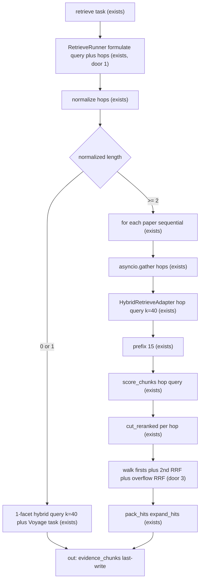

# Retrieve per-topic first pass

Sources:

- this conversation (2026-09-15) - packaging: one `retrieve` step, per-topic hybrid + per-topic Voyage, then slot fusion; reject N plan `retrieve` steps and reject one Voyage on the union `task` after combining lists
- live 4-fact writer run thread `6f59e74d-53ee-49b6-acf3-20d1fc7af050` - combined BM25-weight + RRF-k + embedding + store query scored 4/4; facts co-located; does not refute hop crowding
- `reports/retrieve/2609.01617v1/20260911T182017Z_q15.json` - q15 six-gold miss (Recall@10 = 2/6) with golds already in first-stage; Voyage on the union task ranked overviews above hop passages
- `reports/retrieve/2609.01617v1/20260915T181055Z.md` - current three-gold q15 Recall@10 = 1.0 (qrel relaxed); non-regression floor, not proof the miss is gone
- grill-me 2026-09-14 hops contract - hop predicate, retrieve-only schema, `len >= 2` gate, per-hop hybrid `k=40` + Voyage prefix 15, walk + 2nd RRF + overflow RRF `k=60`, T3 ignores hops
- `.specs/project/STATE.md` AD-013 formulate, AD-018 Voyage `rerank-3` + `cut_reranked`, AD-019 English internals, AD-027 T3 union / at most two `rerank-3` per step — this feature amends AD-018 and AD-027 for the multi first pass only

tlc-spec-lean profile is `light` (no pin in `AGENTS.md`). Live writer-pack recall is UAT, not the unittest discover gate. `light` will not catch a green test that would also pass under a wrong 1-facet implementation; the Independent Tests below must stub hops rather than rely on q15’s current three golds.

## Problem

On a first-pass retrieve against papers already admitted, the runner formulates one English hybrid string and scores the candidate list once with Voyage `rerank-3` against the full retrieve `task`. When that task asks for several distinct coverages — templates and BM25 `(k1, b)` and why a cross-encoder keeps an RRF term — overview chunks outscore hop-specific passages. `cut_reranked` (`margin=0.20`, `floor=0.30`, `top_n=10`) then packs the overviews and drops the hops. The student (and the Writer pack) pays with a partial grounded answer: some requested facts cited, the rest missing, while retrieve eval often accepts the overviews.

This is not paper admission. It is not vector+BM25 fusion of a single query (RRF already ran). The 11 Sep q15 report had all six golds in the hybrid list; Voyage against the union task put hop chunks at ranks 11–17.

A question that merely lists several atomic values that share a table or the abstract does not show this miss. The 15 Sep four-fact DocuSearch run packed Table II and V-B and answered 4/4 without decomposition. That case does not license skipping coverage-aware retrieve for questions whose facts live in different sections.

The planner already emits one `retrieve` `task` that names every focus. `evidence_chunks` is last-write, and dispatch runs retrieve sequentially, so splitting the same paper into N plan `retrieve` steps would overwrite packs and spend N evals inside `max_steps=8` and the ~2 min timeout. The miss has to be fixed inside the one retrieve the planner already emits.

When this ships, a first-pass retrieve whose formulate emits two or more topic strings packs one distinct keep-set per topic without extra graph nodes and without changing 1-coverage questions.

## Out of scope

| Excluded | Why |
| --- | --- |
| N `retrieve` steps in the plan, or `Send("retrieve")` | last-write `evidence_chunks` overwrites; sequential execute; N evals/retries; planner already fails to split (4-fact plan was one retrieve) |
| Classify the student query as open / multi-hop | gate is formulated `hops` length, not dataset `question_type` or a Portuguese connective heuristic |
| Parse hops from `PlanStep.task` with regex | hops are born in retrieve formulate structured output (AD-013: planner `task` stays the goal) |
| One Voyage on the union `task` after merging N hybrid lists | overview already ranks well on every sub-query; that is the q15 miss |
| Raise only `top_n` or loosen global margin | does not recover Voyage ranks 11–17 on a union list |
| Hops on T3 retry | AD-027: one retry = one `feedback` subquery |
| Search formulate hops | `FormulatedQuery` stays `{query}` |
| Planner schema change | planner still emits `task: str` |
| SSE event names / Chainlit / Writer eval | consume path unchanged |
| CI Recall threshold | retrieve eval has none (AD-023/AD-024) |
| Fan-out across different papers | already search waves + one retrieve over admitted papers |
| Restoring the six-id q15 qrel | current dataset has three `required_chunk_ids` and Recall@10 = 1.0; reopening qrel is a separate eval change |

## Assumptions

| Assumption | Chosen default | Rationale | Confirmed? |
| --- | --- | --- | --- |
| Packaging | Fan-out inside `RetrieveRunner` first pass, not N plan retrieve steps | User asked to plan this implementation after rejecting union-Voyage and after last-write / sequential retrieve were shown | y |
| Gate | After drop-empty and first-occurrence dedup, `len(hops) >= 2` selects the multi path; `len` 0 or 1 keeps 1-facet | False positives cost N Voyage calls; false negatives keep today’s path. One hop is not a second ranking query | n |
| Retrieve structured output | Fields `query` (English) and `hops` (`list[str]`, English). Search keeps `FormulatedQuery.{query}` | AD-013 specialist formulate; search json_schema must not grow unused hops | n |
| Runner ignores `query` on the multi path | Hybrid and Voyage use hop strings only when `len(hops) >= 2` | `query` remains required on the model so 1-facet still works | n |
| Hop cap | `Policy.retrieve_hop_cap = 6`; extras dropped as schema prefix | Grill-me 2026-09-14; bounds Voyage cost vs ~2 min timeout | n |
| Per-topic first stage | Per paper, per hop: hybrid `k=40` with hop as query; Voyage `rerank-3` on hybrid prefix `Policy.retrieve_hop_voyage_docs=15` with hop as query | Grill-me path F; first-stage was not the q15 miss, but hop-specific hybrid still helps lexical foci | n |
| Concurrency | Hops `asyncio.gather`; papers stay sequential `for` | Shared arXiv lock is irrelevant on cache hit; Voyage fan-out is the latency win | n |
| Fusion | Firsts: schema order, first not-yet-packed id on each hop cut. Seconds: after every first, RRF `k=60` among 2nd candidates, max two ids per hop. Overflow: RRF `k=60` on remaining cut survivors. Pack ≤10. `[n]` = firsts then seconds then overflow | Slot reservation is what stops overview from taking every seat. RRF-only lets overview win every hop | n |
| Per-hop `cut_reranked` | `margin=0.20`, `floor=0.30`, `top_n=15` (Voyage list length), relative to that hop’s best | Same relative cut as AD-018; `top_n=15` is the hop list, pack cap 10 is fusion output | n |
| Empty cut or hop error | 0 slots from that hop; no 1-facet fallback on `task` | Partial coverage beats a union Voyage that re-buries hops | n |
| T3 retry | Ignore `hops`; hybrid + Voyage = eval `feedback` only; union pin AD-027 | One retry remains one extra `rerank-3` | n |
| `retrieve_query_used` on multi first pass | Executed hop strings joined by one ASCII space, not unused `query` | Eval reports store one string | n |
| Live Independent Test | `scripts/retrieve_writer_recall.py --item-id q15` Recall@10 stays ≥ last `reports/retrieve/2609.01617v1/index.jsonl` for that item; 1-gold items keep their last Recall@10 floor | Current q15 is 3/3 at k=10; does not prove hops fired. Unit stubs prove the multi path | n |
| Combined eval items q17 and q18 | Dataset has no `q16`. Item `q17` is `combined_homogeneous` with Table II (`4cdbb16c-3817-4bf1-963f-e41eaebe8733`), chunking (`c5222792-6a8d-47b7-9efe-da4c85caee8d`), and sufficiency (`69885bfe-b65f-4153-91c5-bd16eeb63057`). Item `q18` is `combined_heterogeneous` with sub-problems (`d5b1b8f1-1a3d-4963-8af7-3f5de0f99328`) then those three ids. Live Recall@10 SHALL be 1.0 on each. Packing only Table II on q17 is 1/3 | User dropped q16; q17/q18 are the combined items in the qrel JSON | y |
| tlc-spec-lean profile | `light` | No pin in `AGENTS.md`; no UI | n |

**Open questions:** none - all resolved or logged above.

## Criteria

Grouped by slice — one observable outcome each. Numbering runs across the whole plan.

### S1: Formulate gate (P1)

**Acceptance Criteria**

1. The retrieve formulate structured output SHALL include `query` (English string) and `hops` (list of strings) and search formulate SHALL keep `FormulatedQuery` with only `query`
2. WHEN retrieve formulate returns `hops` THEN each hop string SHALL be English chunk terms and SHALL NOT be the full retrieve `task` prose
3. WHEN the retrieve formulate system prompt is read THEN it SHALL tell the model to emit `hops` with length ≥ 2 only when the task asks for distinct coverages (separate facts or section-like requests that one chunk cannot cover) and SHALL tell it to emit empty `hops` when one chunk can cover the task
4. WHEN raw `hops` contain empty or whitespace-only strings THEN the runner SHALL drop those strings before the length gate
5. WHEN raw `hops` contain duplicate strings THEN the runner SHALL keep the first occurrence and drop later copies before the length gate
6. WHEN the normalized `hops` list is longer than `Policy.retrieve_hop_cap` (6) THEN the runner SHALL use only the first 6 in schema order
7. WHEN the normalized `hops` length is 0 or 1 on a first pass THEN retrieve SHALL run the current 1-facet path: one hybrid per paper with `query` at `retrieve_first_stage_k=40`, one Voyage `rerank-3` whose query is `build_rerank_query(task, feedback)`, `cut_reranked` with `top_n=10`, `margin=0.20`, `floor=0.30`
8. WHEN the normalized `hops` length is ≥ 2 on a first pass THEN retrieve SHALL take the multi path and SHALL NOT use `query` as the hybrid query and SHALL NOT use `task` as the Voyage query

**Independent test:** pydantic schema on retrieve vs search; prompt substring tests; runner with stubbed formulate returning `[]`, one hop, two hops, empties, duplicates, seven hops; assert path and queries; no live OpenAI.

### S2: Per-topic hybrid and Voyage (P1)

**Acceptance Criteria**

9. WHEN the multi path runs on a first pass THEN for each admitted paper and each remaining hop the system SHALL call hybrid once with that hop string as the query and `k=40`
10. WHEN that hybrid ranked list is non-empty THEN Voyage `rerank-3` SHALL receive the first `retrieve_hop_voyage_docs` (15) documents of that list (or all of them if fewer) and SHALL use the hop string as the rerank query
11. WHEN a paper has two or more hops THEN those hop hybrid+Voyage calls SHALL run concurrently via `asyncio.gather`; papers SHALL stay in the existing sequential `for`
12. WHEN the multi path writes `retrieve_query_used` THEN that string SHALL contain the executed hop strings and SHALL NOT be the unused `query` field
13. The system SHALL call Voyage `rerank-3` at most `retrieve_hop_cap` times on a multi first pass (one per hop) and SHALL NOT add a Voyage call on the retrieve `task`
14. WHEN the multi path runs THEN the LangSmith `rerank` span (or a child per hop) SHALL record that the attempt used hops, including the hop count as an integer ≥ 2

**Independent test:** fake `HybridRetrievePort` and fake `score_chunks`; count calls, query strings, and document-list lengths per hop and per paper; assert gather vs paper order with a recording fake; no live Voyage.

### S3: Per-hop cut and slot+RRF fusion (P1)

**Acceptance Criteria**

15. WHEN a hop has Voyage scores THEN `cut_reranked` SHALL run on that hop’s scored list with `margin=0.20`, `floor=0.30`, `top_n=15`, relative to that hop’s best score
16. IF that cut is empty THEN that hop SHALL contribute 0 slots and SHALL NOT inject hybrid ensemble order into the pack
17. WHEN fusion starts THEN the system SHALL take, in schema order, the first `chunk_id` on each hop’s cut list that is not already packed (walk)
18. WHEN all hops have had their first-slot chance and packed length is below 10 THEN the system SHALL fill remaining seats with at most one extra `chunk_id` per hop; that extra SHALL be the next unpacked id on that hop’s cut list; which extras occupy seats SHALL be chosen by RRF among those candidates with `k=60`, not by schema order and not by raw Voyage scores across hops
19. WHEN packed length is still below 10 THEN the system SHALL fill from remaining cut-list ids (not yet packed) by RRF `k=60` using each hop’s rank on its own cut list, score `1/(60 + rank)`
20. WHEN fusion for a paper finishes THEN that paper’s `evidence_chunks` prefix SHALL contain at most 10 chunks
21. WHEN `[n]` is assigned inside a paper THEN order SHALL be firsts (schema order) then seconds (RRF order) then overflow (RRF order), then `pack_hits` / `expand_hits` as today
22. WHEN two admitted papers take the multi path THEN hop fusion SHALL run per paper and papers SHALL concatenate in admission order with continuous `[n]`, the same as today’s per-paper cut

**Independent test:** in-memory ranked lists with a shared overview id as #1 on every hop and golds as #2; assert walk packs the overview once, golds occupy later firsts, pack length ≤ 10, `[n]` order; table-driven 6 hops / 4 extra seats picks seconds by RRF not schema tail; no live Voyage.

### S4: Partial hop failure (P1)

**Acceptance Criteria**

23. IF Voyage `rerank-3` raises for one hop and other hops return scores THEN the failed hop SHALL contribute 0 slots and the successful hops SHALL still fuse
24. IF hybrid raises for one hop and other hops return THEN the failed hop SHALL contribute 0 slots and the successful hops SHALL still fuse
25. IF any hop fails THEN that retrieve attempt SHALL NOT fall back to a 1-facet Voyage on `task` and SHALL NOT start a new hybrid with `query`
26. IF every hop on a paper yields 0 slots THEN that paper SHALL contribute no new chunks and the runner SHALL still last-write `evidence_chunks` (empty or from other papers)

**Independent test:** fake one hop raising, others scoring; assert packed ids come only from the successful hops; fake all hops raising; assert no `task` Voyage query on that attempt.

### S5: 1-facet and T3 retry unchanged (P1)

**Acceptance Criteria**

27. WHILE normalized `hops` length is 0 or 1 on a first pass the system SHALL keep AD-018 1-facet scoring: one Voyage on the unique hybrid list, query `build_rerank_query(task, feedback)`
28. WHEN retrieve is a T3 retry THEN the runner SHALL ignore `hops` even if formulate emitted them
29. WHEN retrieve is a T3 retry THEN hybrid and Voyage SHALL use only eval `feedback`, first-stage `k` SHALL be `retrieve_retry_first_stage_k`, and union pin / add cap 5 / pack cap 15 SHALL stay as AD-027
30. WHEN retrieve is a T3 retry THEN the system SHALL call Voyage `rerank-3` at most once for that retry (not once per hop)

**Independent test:** reuse T3 query/pack/voyage tests; add formulate-with-hops on retry and assert feedback-only queries and a single retry `score_chunks` call.

### S6: Live writer-pack recall floor (P2)

**Acceptance Criteria**

31. WHEN `scripts/retrieve_writer_recall.py` runs item `q15` of `eval/retrieve/2609.01617v1/2609.01617v1.json` on cached `2609.01617` v1 THEN Recall@10 SHALL be at least the Recall@10 last recorded for `q15` in `reports/retrieve/2609.01617v1/index.jsonl`
32. WHEN the same CLI runs 1-gold items of that dataset (length of `required_chunk_ids` is 1) THEN each item’s Recall@10 SHALL be at least the Recall@10 last recorded for that `item_id` in `reports/retrieve/2609.01617v1/index.jsonl`
33. WHEN `scripts/retrieve_writer_recall.py` runs items `q17` and `q18` of that dataset on cached `2609.01617` v1 THEN each item’s Recall@10 SHALL equal 1.0 (q17: Table II `4cdbb16c-3817-4bf1-963f-e41eaebe8733`, chunking `c5222792-6a8d-47b7-9efe-da4c85caee8d`, sufficiency `69885bfe-b65f-4153-91c5-bd16eeb63057`; q18: those three plus sub-problems `d5b1b8f1-1a3d-4963-8af7-3f5de0f99328`)

**Independent test:** live UAT after unit proofs; not the unittest discover gate. No live OpenAI/Voyage from `tests/`. Dataset lock for `q17`/`q18` is a unittest that loads the JSON (no live APIs).

## Traceability

| ID | Slice | Criteria | Status |
| --- | --- | --- | --- |
| HOP-01 | S1 | 1, 2, 3, 4, 5, 6, 7, 8 | Pending |
| HOP-02 | S2 | 9, 10, 11, 12, 13, 14 | Pending |
| HOP-03 | S3 | 15, 16, 17, 18, 19, 20, 21, 22 | Pending |
| HOP-04 | S4 | 23, 24, 25, 26 | Pending |
| HOP-05 | S5 | 27, 28, 29, 30 | Pending |
| HOP-06 | S6 | 31, 32, 33 | Pending |

## Observable

| Surface | Decision | Landing |
| --- | --- | --- |
| document retrieve formulate schema | fields `query` + `hops` vs search `query` only | AC 1 |
| document retrieve formulate prompt | when to emit ≥2 hops vs empty | AC 2, 3 |
| document retrieve formulate prompt | tone / language | existing - English internals AD-019; `tests/test_internal_english.py` |
| collection `hops` | empty strings | AC 4 |
| collection `hops` | duplicates | AC 5 |
| collection `hops` | ordering and cap | AC 6, 17 |
| collection `hops` | exception that does not fit (`len` 0 or 1) | AC 7, 27 |
| document `retrieve_query_used` | what the eval report stores on multi | AC 12 |
| document LangSmith `rerank` span | multi vs 1-facet recorded | AC 14 |
| screen | n/a - Chainlit is out of scope and unchanged | n/a - no UI work in this feature |
| API `POST /research` | response shape | existing - SSE event names unchanged |
| API `POST /research` | error shape and codes | existing - unchanged FastAPI / SSE errors |
| API `POST /research` | who may call it | existing - no auth in v1 |
| API `POST /research` | versioning | n/a - single unversioned route |
| API `POST /research` | rate limit | n/a - this feature does not add API throttling; Voyage fan-out is AC 11, 13, 23 |
| command `scripts/retrieve_writer_recall.py` | flags / output | n/a - CLI unchanged; q15, 1-gold floors, and q17/q18 full recall are live Independent Tests AC 31, 32, 33 |
| collection eval items `q17` and `q18` | grouping, gold ids, combined reference | AC 33 |

## Flow

Reuses `RetrieveRunner.run`, `HybridRetrieveAdapter`, `score_chunks`, `cut_reranked`, `pack_hits`, `expand_hits`, T3 union helpers, and `build_rerank_query`. No new graph node. Search keeps `FormulatedQuery`. Dispatch still sends one retrieve to `execute`.

Retry stays inside `RetrieveRunner` (exists): ignore hops; hybrid + Voyage = `feedback` only; union pin (AD-027).

out: Writer (exists) reads `evidence_chunks`; one retrieve eval as today.

## Relations

None - no stored-data shape change

## Surface

None - nothing consumed outside

## Landing

| One-way door | Literal shape | Alternative rejected |
| --- | --- | --- |
| Retrieve formulate schema | Retrieve structured output fields: `query` (English string), `hops` (`list[str]`, English). Search `FormulatedQuery` stays `{query}` only. Runtime cap `Policy.retrieve_hop_cap=6` | Add optional `hops` on the shared model - search json_schema would emit hops with no consumer. Parse hops from `task` with regex - planner `task` is the eval target (AD-013). N planner retrieve steps - last-write pack and N evals |
| Multi-path gate | After drop-empty and first-occurrence dedup, `len(hops) >= 2` selects the multi path. `len` 0 or 1 keeps 1-facet (Voyage query = `task`, ignore a single hop string) | Classify the student question as open. Treat `len==1` as a Voyage query (changes 1-gold). Connective / comma heuristic without formulate |
| First-stage on multi | Per paper, per hop: hybrid `k=40` with hop as query; Voyage `rerank-3` on hybrid prefix `Policy.retrieve_hop_voyage_docs=15` with hop as query. Hops `asyncio.gather`; papers sequential. No Voyage on `task` | N hybrid then one RRF then one Voyage on `task` - q15 miss. N graph retrieve nodes. Voyage on all 40 per hop (cost). Hybrid `k=15` with no overfetch |
| Fusion inside a paper | Firsts: schema order, first not-yet-packed id on each hop cut list. Seconds: only after every first; RRF `k=60` among 2nd candidates; max two ids per hop. Overflow: RRF `k=60` on remaining cut survivors. Pack ≤10. `[n]` = firsts then seconds then overflow. `cut_reranked` per hop `margin=0.20` `floor=0.30` `top_n=15`. Empty cut or hop error = 0 slots, no 1-facet fallback | Global margin against the best score of a union Voyage. RRF-only (overview wins every hop). Always two slots in schema order (last hops starve). Raw Voyage scores across hops |
| Voyage budget vs AD-027 | Multi first pass: at most 6 `rerank-3` calls (one per hop, 15 docs). T3 retry: still at most one `rerank-3` on `feedback` (`k=10` hybrid). 1-facet first pass: still one `rerank-3`. Amends AD-027 “at most two `rerank-3` per step” for the multi first pass only | Keep AD-027 max two including a 6-hop first pass - cannot run per-topic Voyage |

- Nothing else in this change is hard to reverse. Function placement for RRF, Policy key names besides the ints above, and exact LangSmith span nesting stay in the diff.

After plan approval, append AD-028 in `.specs/project/STATE.md`: retrieve hops gate the multi path; amends AD-018 (one Voyage on `task`) for `len(hops)>=2` first pass only; amends AD-027 “at most two `rerank-3` per step” for that first pass (retry remains one extra call on `feedback`).

## Impact

| Front | What changes |
| --- | --- |
| domain | new term: `hops` - retrieve-formulate list of English topic queries; gate for the multi path when normalized length ≥ 2; lives on retrieve structured output, not planner `task`, not qrel |
| domain | existing term: `FormulatedQuery` remains search-only `{query}`. Retrieve no longer shares that one-field model. Callers: `agents/search.py`, `agents/query_schema.py`, `agents/retrieve.py` |
| domain | existing term: `retrieve_query_used` on a multi first pass is the executed hops, not the hybrid lexical of the whole task. Callers: eval writer-pack reports, `RetrieveRunner.run` |
| domain | existing term: Voyage rerank query on multi first pass is each hop, not `build_rerank_query(task, feedback)`. 1-facet and retry unchanged. Callers: `RetrieveRunner.run`, `tests/test_t3_query.py` |
| stored data | nothing to migrate in pgvector. No DROP of chunks. Checkpointed `retrieve_query_used` string may get longer (joined hops); no schema change |
| policy | new `retrieve_hop_cap=6`, `retrieve_hop_voyage_docs=15`, `retrieve_hop_rrf_k=60`. `retrieve_first_stage_k=40`, margin/floor, T3 retry ints unchanged |
| decisions | after plan approval, AD-028 as in Landing |
