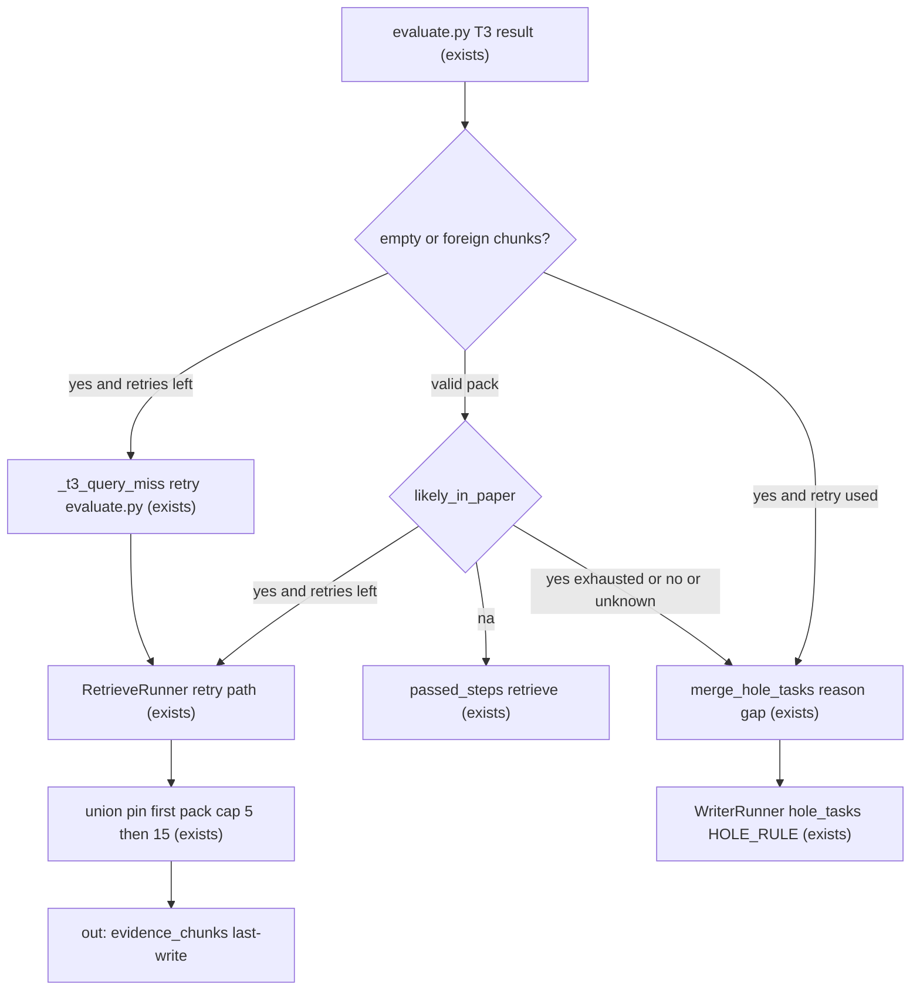

# Retrieve T3: union pack + gap-only retry

Sources:

- https://linear.app/arxiv-researcher/issue/ARX-9/retrieve-t3-union-do-pack-retry-so-do-gap - ticket, q11 evidence, blocks ARX-13
- grill-me 2026-09-13 frozen contract (this conversation) - T3 routing table, retry query, pack caps, Voyage bound, Writer channel, Policy numbers, eval field order
- `.specs/project/STATE.md` AD-014 / AD-015 LOOP-05, AD-018 cut knobs, AD-019 English internals, AD-022 WRITE-02, Quick 018 - constraints this feature amends or keeps

## Problem

A retrieve retry today replaces `evidence_chunks`. The second hybrid/Voyage pass can evict chunks the first pass already packed, including the gold the Writer needed. The student then gets a thinner, worse-cited answer for a question the first keep-set already covered.

Live evidence (q11, `2609.11929v1`, report `20260911T225845Z`, trace `b82fb81f-9fd0-4885-9772-e08bd56d7db8`): the question asks generation/editing/interleaved corpus sizes and composition. Gold `b87b59a7` is §4.3 (percentages ~44/29/19/8). The paper does not publish an absolute N. First retrieve packed 8 chunks with gold at rank 7 (Voyage 0.633). Eval retried for “total size”. The second query mixed in `59M` / `38M` / `120K`; gold score fell to 0.555; `margin=0.20` dropped it; the final pack of 5 replaced the first keep-set; Recall@5/@10/@15 fell to 0.667.

Cause in code now: `RetrieveRunner.run` last-writes `evidence_chunks` with no union; `build_rerank_query` concatenates task+feedback; `cut_reranked` is relative to this query’s best; `EvalResult` has no `likely_in_paper`; Quick 018 routes a paper-absent facet through `plan_inadequate`, which skips T3 retry but spends the remaining replan instead of pass+hole.

When this ships, a T3 retry only adds gap chunks on top of the first pack, the first `[n]` set stays, and eval does not hunt a facet the HTML does not publish.

## Out of scope

| Excluded | Why |
| --- | --- |
| ARX-13 (1 retrieval vs retrieval+retry metric) | ticket blocks it; run after this change or retry looks worse than it is |
| Search retry / search ranking | different agent, different judge |
| SSE event names / Chainlit | frozen out; existing `eval` frame stays |
| Shrinking the first pass below 10 to reserve retry slots | grill-me rejected; first pass is 10 |
| Fixed split first=`N`, retry=`N/2` on the happy path | grill-me rejected |
| `holes[]` list per facet | one retry = one subquery in `feedback` |
| `gap_query` field | feedback already is the subquery when `yes` |
| Third Voyage rerank of the union | cost bound is at most two `rerank-3` calls |
| Rescoring the first-stage ~40 or the pinned keep-set on retry | Q8 B short list |

## Assumptions

| Assumption | Chosen default | Rationale | Confirmed? |
| --- | --- | --- | --- |
| T3 routing table, query, pack, Voyage bound, Writer channel, Policy ints | as in the 2026-09-13 grill-me contract | user froze the contract in this session | y |
| Eval field order `reasoning`, `likely_in_paper`, `feedback` | retrieve semantic judge emits those three in that order | user stated it as the eval contract | y |
| `EvalResult.status` stays on the model | T1/T2a and empty/foreign deterministic still construct `status`; T3 semantic routes on `likely_in_paper` when readable | T1/T2a unchanged; empty-field fallback still needs `status` | y |
| Retry first-stage hybrid `k` | `Policy.retrieve_retry_first_stage_k = 10` | grill-me says retry uses a shorter list than 40 and does not name the int; 10 matches first-pass keep cap and can feed a 5-id add | n |
| Empty/illegible `likely_in_paper` with `status=fail` on T3 semantic | treat as `unknown` (pass + hole) | contract only names pass→`na` and retry→`unknown` | n |
| SSE `eval` data keys | stay `status`, `feedback`, `agent`, `step_index`, `plan_inadequate` | event names / Chainlit are out of scope | n |
| `na` feedback length | one short English sentence that no gap remains | contract says short when `na`, no character bound | n |
| Union lives in `RetrieveRunner.run`, channel stays last-write | runner reads the first pack and writes the unioned list | retrieve is not a `Send` fan-out; `papers` already unions via reducer because skip-walk omits the key | n |

**Open questions:** none - all resolved or logged above.

## Criteria

### S1: T3 eval routes on `likely_in_paper` (P1)

**Acceptance Criteria**

1. WHEN retrieve ingest case is `t3` and `likely_in_paper` is `na` THEN the system SHALL mark the retrieve step passed and SHALL NOT append a hole for that verdict and SHALL NOT retry retrieve
2. WHEN retrieve ingest case is `t3` and `likely_in_paper` is `yes` and that step’s retry count is below `Policy.max_retries_per_step` THEN the system SHALL set `eval_next` to `dispatch` so retrieve executes once more
3. WHEN retrieve ingest case is `t3` and `likely_in_paper` is `no` THEN the system SHALL mark the retrieve step passed and SHALL append `hole_tasks` `{task: <English feedback>, reason: "gap"}` and SHALL NOT retry retrieve
4. WHEN retrieve ingest case is `t3` and `likely_in_paper` is `unknown` THEN the system SHALL behave as criterion 3
5. WHEN retrieve ingest case is `t3` and `likely_in_paper` is empty or not one of `na`/`yes`/`no`/`unknown` and `status` is `pass` THEN the system SHALL treat the field as `na`
6. WHEN retrieve ingest case is `t3` and `likely_in_paper` is empty or not one of `na`/`yes`/`no`/`unknown` and `status` is `retry` THEN the system SHALL treat the field as `unknown`
7. WHEN retrieve ingest case is `t3` and `likely_in_paper` is one of `na`/`yes`/`no`/`unknown` THEN the system SHALL route by that field even when `status` disagrees
8. WHEN retrieve ingest case is `t3` and `evidence_chunks` is empty or a chunk is not from admitted papers and the step has retries remaining THEN the system SHALL retry retrieve
9. WHEN retrieve ingest case is `t3` and that step has already used `Policy.max_retries_per_step` and a gap remains THEN the system SHALL mark the retrieve step passed and SHALL append `hole_tasks` `{task: <English feedback>, reason: "gap"}` and SHALL NOT replan
10. WHILE retrieve ingest case is `t1` or `t2a` the system SHALL keep current routing: no retrieve-query retry; deterministic `plan_inadequate` still drives remaining replan
11. IF a listed facet is absent from the admitted paper THEN the T3 path SHALL NOT set `plan_inadequate` for that reason

**Independent test:** stub `EvalResult` values through `_evaluate_step` / retrieve strategy (no live OpenAI); assert pass vs retry vs hole vs replan for `na`/`yes`/`no`/`unknown`, empty-field fallbacks, R2 empty/foreign, retry exhausted, and T1/T2a unchanged.

### S2: Retry query is the gap only (P1)

**Acceptance Criteria**

12. WHEN retrieve is a retry THEN hybrid and Voyage SHALL use only the English eval `feedback` as the query string, not `task` concatenated with `feedback`
13. WHEN retrieve is a retry THEN formulate SHALL receive `feedback` and `previous_query` and SHALL NOT receive the full retrieve `task` as the objective
14. WHEN `likely_in_paper` is `yes` THEN `feedback` SHALL be the English subquery of the gap and SHALL NOT recite `[n]`, keep-set sizes, or numbers copied from current chunks
15. WHEN `likely_in_paper` is `no` or `unknown` THEN `feedback` SHALL be the English facet of the hole
16. The retrieve judge schema SHALL NOT include a field named `gap_query`

**Independent test:** unit tests on `build_rerank_query` / formulate human payload / checklist strings; first pass still uses the retrieve `task`.

### S3: First pack is pinned; union by `chunk_id` (P1)

**Acceptance Criteria**

17. WHEN retrieve is the first pass THEN `cut_reranked` SHALL use `retrieve_rerank_top_n=10`, `retrieve_rerank_margin=0.20`, `retrieve_rerank_floor=0.30`
18. WHEN retrieve is a retry THEN every `chunk_id` from the first pack SHALL remain in `evidence_chunks` in first-pass `[n]` order
19. WHEN retrieve is a retry THEN the system SHALL add at most `retrieve_retry_add_cap=5` new `chunk_id`s
20. WHEN a retry union has been written THEN `evidence_chunks` SHALL contain at most `retrieve_pack_cap_after_retry=15` chunks
21. IF retrieve does not retry THEN Writer-facing `evidence_chunks` SHALL contain at most 10 chunks
22. WHEN new ids are added THEN their `[n]` SHALL append after the first-pass list
23. WHEN retry applies `retrieve_rerank_floor=0.30` THEN that floor SHALL apply only to new candidates; IF none pass THEN the first pack SHALL remain unchanged
24. IF `evidence_chunks` has more than 10 items THEN those extra ids SHALL have been added by a T3 `yes` retry

**Independent test:** fake first pack + fake retry candidates; assert pin, cap 5, cap 15, `[n]` order, floor-miss keeps the old pack; no live Voyage.

### S4: At most two `rerank-3` calls (P1)

**Acceptance Criteria**

25. The system SHALL call Voyage `rerank-3` at most twice per retrieve step: first pass, plus retry only when routing is `yes`
26. WHEN retrieve is a retry THEN first-stage `k` SHALL be `retrieve_retry_first_stage_k` and Voyage SHALL score only that short candidate list and SHALL NOT rescore the first-stage 40 and SHALL NOT rescore the pinned keep-set
27. WHEN routing is `na` or `no` or `unknown` THEN that retrieve step SHALL call `rerank-3` once
28. The system SHALL NOT run a third `rerank-3` on the unioned pack

**Independent test:** fake hybrid + fake `score_chunks`; count calls and the document list length on retry.

### S5: Writer sees holes, not retrieve feedback (P1)

**Acceptance Criteria**

29. WHEN T3 appends a hole THEN Writer SHALL see it only through `hole_tasks` plus `Policy.HOLE_RULE`
30. The Writer prompt SHALL NOT include retrieve-step eval `feedback`; `step_eval_feedback` SHALL keep reading the Writer step index

**Independent test:** Writer prompt assembly with retrieve `eval_by_step` populated and Writer index distinct; retrieve feedback absent; `hole_tasks` present.

## Traceability

| ID | Slice | Criteria | Status |
| --- | --- | --- | --- |
| ARX9-01 | S1 | 1, 2, 3, 4, 5, 6, 7, 8, 9, 10, 11 | In checks |
| ARX9-02 | S2 | 12, 13, 14, 15, 16 | In checks |
| ARX9-03 | S3 | 17, 18, 19, 20, 21, 22, 23, 24 | In checks |
| ARX9-04 | S4 | 25, 26, 27, 28 | In checks |
| ARX9-05 | S5 | 29, 30 | In checks |

## Observable

| Surface | Decision | Landing |
| --- | --- | --- |
| document retrieve-judge schema | field order and values | AC 7, 16; eval contract `reasoning` then `likely_in_paper` then `feedback` |
| document retrieve-judge schema | empty / illegible `likely_in_paper` | AC 5, 6 |
| document retrieve checklist | structure: what to emit when `yes` vs `no`/`unknown` vs `na` | AC 1, 3, 14, 15 |
| document retrieve checklist | tone | existing - English internals AD-019; `tests/test_internal_english.py` |
| document retrieve checklist | what the reader does next | AC 2, 3, 9 - route table, not a new search |
| document Writer prompt | holes only via `hole_tasks` + `HOLE_RULE` | AC 29, 30 |
| screen | n/a - Chainlit is out of scope and unchanged | n/a - no UI work in this feature |
| API `POST /research` | response shape | n/a - SSE event names unchanged; no new `eval` payload keys under the SSE assumption |
| API `POST /research` | error shape and codes | existing - unchanged FastAPI / SSE errors |
| API `POST /research` | who may call it | existing - no auth in v1 |
| API `POST /research` | versioning | n/a - single unversioned route |
| API `POST /research` | rate limit | n/a - this feature does not change API throttling; Voyage bound is AC 25 |
| command `scripts/retrieve_writer_recall.py` | flags / output | n/a - CLI unchanged; q11 remaining gold after retry is the live Independent Test, not the unit gate |

## Flow

Reuses the existing `execute` → `evaluate` → `dispatch` loop, `RetrieveRunner.run`, `cut_reranked`, `score_chunks`, `merge_hole_tasks`, `Policy`, and Writer `HOLE_RULE`. No new graph node. No new SSE event.

First pass:

1. retrieve `task` enters `RetrieveRunner` (exists) - formulate from the task, hybrid at `retrieve_first_stage_k=40`, Voyage `rerank-3`, `cut_reranked` with `top_n=10`
2. `RetrieveRunner` (exists) last-writes `evidence_chunks` (at most 10) and skip-walk does not rewrite `papers`
3. `RetrieveEvalStrategy` (exists) - T1/T2a stay deterministic; T3 empty/foreign then semantic judge
4. `evaluate.py` `_evaluate_step` (exists) - routes on `likely_in_paper` (door 1) for valid T3 packs

Retry / hole fork:

Retry hop inside `RetrieveRunner` (exists): formulate from `feedback` + `previous_query` without the full task as objective; hybrid at `retrieve_retry_first_stage_k`; Voyage on that short list only; `cut_reranked` on new candidates (`top_n=5`, same margin/floor); union by `chunk_id`; pinned first pack never evicted.

out: Writer (exists) reads `evidence_chunks` and `hole_tasks`; `step_eval_feedback` at the Writer index stays empty of retrieve feedback.

## Relations

None - no stored-data shape change

## Surface

None - nothing consumed outside

## Landing

| One-way door | Literal shape | Alternative rejected |
| --- | --- | --- |
| Retrieve semantic judge schema | fields in order: `reasoning` (English), `likely_in_paper` (`na` \| `yes` \| `no` \| `unknown`), `feedback` (English). The field commands over `status`. `na` = no gap. `unknown` = gap we will not hunt. | Keep routing on `status` + `plan_inadequate` - Quick 018 spends the remaining replan for a paper-absent facet instead of pass+hole |
| T3 graph routing | `na` → pass, no hole. `yes` → one retry (`max_retries_per_step=1`). `no`/`unknown` → pass + `hole_tasks` `{reason: "gap"}`. After that one retry, still missing → pass + hole, no replan, even if the judge still says `yes`. Empty/foreign attempt 1 still retries (R2). T1/T2a unchanged. | Always retry T3 attempt 1 (AD-014/AD-015 LOOP-05 as written) - hunts unpublished N and contaminates rerank. Fail+replan after the retry cap - same replan spend the ticket removes |
| Writer-facing pack caps | `retrieve_rerank_top_n=10` (first pass), `retrieve_retry_add_cap=5`, `retrieve_pack_cap_after_retry=15`. Margin `0.20` and floor `0.30` unchanged. `[n]` = first-pass order then append. | Keep `top_n=15` and replace the list (today) - q11 gold dropped. Shrink first pass below 10 to reserve slots - out of scope. Third rerank of the union - extra Voyage bill with no new keep-set |

- Nothing else in this change is hard to reverse. Union-in-runner vs a `GraphState` reducer, and the retry first-stage `k` int, stay placement.

## Impact

| Front | What changes |
| --- | --- |
| domain | new term: `likely_in_paper` - T3 judge field that decides retry vs pass+hole; lives on retrieve `EvalResult`; `na` is not `unknown` |
| domain | existing term: `plan_inadequate` on retrieve T3 no longer means “facet absent from the paper” - Quick 018 checklist and LOOP-05 T3 paper-set branch. Search S8a and T1/T2a still use it. Callers: `evaluate.py` `_evaluate_step`, `RetrieveEvalStrategy`, planner S8a prompt |
| domain | existing term: `hole_tasks` `reason=gap` now also carries retrieve T3 unpublished/unknown facets, not only search/T2a ingest gaps. Callers: `merge_hole_tasks`, `WriterRunner` hole assembly, WRITE-02 |
| stored data | nothing to migrate in pgvector. Checkpointed `last_eval` may gain `likely_in_paper` / `reasoning`; missing field follows AC 5–6. No DROP of chunks |
| policy | `retrieve_rerank_top_n` 15 → 10. New `retrieve_retry_add_cap`, `retrieve_pack_cap_after_retry`, `retrieve_retry_first_stage_k`. `retrieve_writer_recall.DEFAULT_KS` already keys off `retrieve_rerank_top_n`; Recall@15 remains the after-retry ceiling |
| decisions | after plan approval, append AD-027 in `.specs/project/STATE.md`: T3 routes on `likely_in_paper`; paper-absent facet is pass+hole not replan; first pack is monotonic union. Supersedes AD-014/AD-015 T3 “attempt 1 always retries” for semantic misses only, and Quick 018’s `plan_inadequate` use for that facet |
