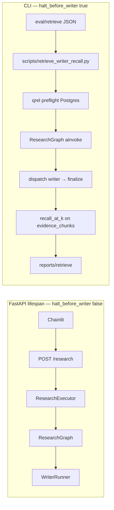
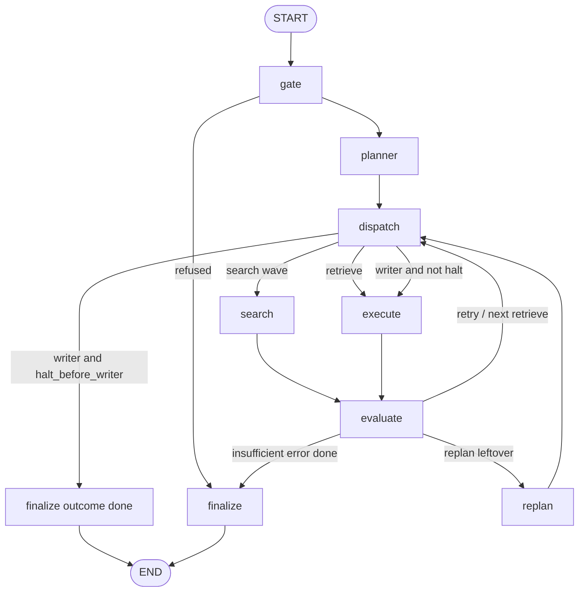
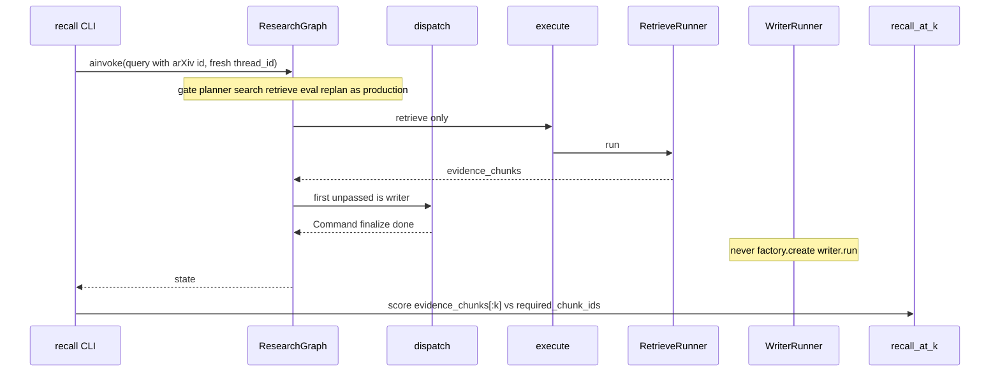

# Retrieve Writer-Pack Recall Design

**Spec**: `.specs/features/retrieve-writer-recall/spec.md` (E2E amendment 2026-09-10, AD-024)  
**Context**: `.specs/features/retrieve-writer-recall/context.md`  
**Parent designs**: `.specs/features/orchestrator-eval-replan/design.md` (loop) · `.specs/features/admission-retrieve-per-topic/design.md` (admission / T1–T3) · `.specs/features/retrieve-cross-encoder-rerank/design.md` (writer pack) · `.specs/features/sse-agent-dispatcher/design.md` (`ResearchGraph`) · `.specs/features/writer-stream-ragas/design.md` (report files under `reports/`)  
**Architecture constraints**: `.specs/features/arxiv-grounded-research/context.md` (PAT-01, PAT-07, PAT-08, PAT-12). PAT-11 HTTP consume path is **out of this slice**.  
**Status**: Code-validated T1–T8 (2026-09-10; uncommitted). Gate 130/130. Live Independent Test still UAT (preflight green).

This feature does **not** change Gate, planner, search, retrieve, Writer, SSE names, Chainlit, or `POST /research`. Isolated `RetrieveRunner` + frozen task is **deleted**, not deferred. The product number is Recall@k on `evidence_chunks` after a real `gate → planner → dispatch → search|execute → evaluate → replan` session that **stops before Writer execute**.

Locked in specify (not reopened here): SUT = final `evidence_chunks`; input = student `query` containing dataset `arxiv_id`; same compiled topology as production; fresh `thread_id` per item; hit = writer-visible pack (`chunk_id` or expanded table/equation body, AD-026); k = 5 / 10 / 15; qrel-must-exist-in-store preflight; no CI recall floor; reports under `reports/retrieve/`; no P2 isolated harness.

---

## Architecture Overview

The eval process is a **CLI**, not a graph node and not an HTTP route. It compiles the **same** `StateGraph` as FastAPI (`build_graph` / `ResearchGraph`) with one extra compile-time switch: `halt_before_writer=True`. That switch only changes **dispatch**: when the first unpassed plan step is `writer`, dispatch `Command`s to `finalize` with `outcome="done"` and **never** `goto="execute"`. Search waves, retrieve execute, retrieve eval, retries, and one remaining replan stay on the production nodes.

The CLI does **not** use `ResearchExecutor` (no SSE, no `answer_delta` unwrap). It `ainvoke`s `ResearchGraph.initial_graph_state(item.query)` once per item, scores the returned state’s `evidence_chunks` with the existing `recall_at_k` formula, and writes JSON/Markdown like the RAGAS report script.

Leftover AD-023 code (`retrieve_eval_state`, `evaluate_writer_pack`, frozen-task CLI loop, `questions[].question` schema) is **removed**. Scorer, preflight, and `reports/retrieve/` layout stay.







**Research notes (verification chain):**

- **Codebase:** `graph/nodes/dispatch.py` already decides the next hop: search `Send`, or `goto="execute"` when the first unpassed agent is `retrieve` or `writer`. `execute.py` then `factory.create(agent).run` for retrieve **or** writer and always emits `step_start` / `step_end`. After retrieve eval **pass**, `_apply_route` sets `eval_next="dispatch"` while a leftover writer step is unpassed. FastAPI compiles `ResearchGraph(deps, checkpointer=AsyncPostgresSaver)` with no extra flags (`main.py`). `ResearchGraph.initial_graph_state(query)` is the production input shape. Leftover `eval/retrieve_recall.py` still loads `questions[].question` and `evaluate_writer_pack` calls `RetrieveRunner` — that loop is the cancelled RWR-03 path. Scorer `recall_at_k` / `score_question` / `missing_qrel_ids` / `reports/retrieve/` write helpers are the reusable core. `Settings.research_timeout_seconds` is 120 (same cap as the API). `AgentFactory` always constructs `WriterRunner`; production must keep that. No `CONCERNS.md`.
- **Project docs:** AD-024 (E2E only, Writer off). Graph atlas: `.specs/features/admission-retrieve-per-topic/graph-flow.md` (dispatch table). Search formulate already emits `id:NNNN.NNNNN` when the student query contains a new-style id (quick 012 / `agents/search.py`). Writer pack is post `cut_reranked` / `pack_hits` / `expand_hits`. RAGAS report pattern: stdout + `reports/<kind>/` JSON + Markdown + `index.jsonl`, `--no-save`, Windows `WindowsSelectorEventLoopPolicy`.
- **LangGraph (docs + this repo’s `langgraph==1.2.11` notes in sse-agent-dispatcher design):** `interrupt_before=["execute"]` would also stop **retrieve** (shared node) — **rejected**. `interrupt()` inside a node is HITL, not this slice. Compile-time `halt_before_writer` on dispatch reuses the existing `finalize` destination; no new node. `ainvoke` without `stream_mode="custom"`: StreamWriter is a **no-op** on this install (sse empirical: payloads need `"custom"`). Eval does not need SSE. Checkpointer is **not** required for `ainvoke` (Pregel skips `thread_id` validation when `checkpointer is None`). Spec still wants a fresh `thread_id` in `configurable` for LangSmith grouping.
- **Uncertain:** If a future LangGraph makes `get_stream_writer()` raise inside `ainvoke`, Execute SHALL switch the harness to `astream(..., stream_mode="values")` and take the last values chunk — do **not** add SSE to the CLI. Exact LangSmith metadata for `configurable.thread_id` on a non-HTTP `ainvoke` is not verified here; Independent Test is “no Writer execute / no `answer_delta`”, not a LangSmith schema lock.

---

## Code Reuse Analysis

### Existing Components to Leverage

| Component | Location | How to Use |
| --------- | -------- | ---------- |
| `recall_at_k`, `chunk_ids_from_evidence`, `score_question`, `missing_qrel_ids`, `DEFAULT_KS`, report writers | `eval/retrieve_recall.py` | **Keep.** Amend dataset load + report payload. Delete isolated runner helpers. |
| `ResearchGraph.initial_graph_state` | `graph/research_graph.py` | Graph input = student `query` (same keys as `POST /research`). |
| `build_graph` / `GraphDeps` | `graph/build.py` | Compile once in the CLI. Pass `halt_before_writer=True` only here. |
| `make_dispatch_node` | `graph/nodes/dispatch.py` | Add default-false halt branch using existing `_first_unpassed_index`. |
| `PgChunkRepository.get_paper` / `paper_has_chunks` / `list_chunks` | `repo/chunks.py` | Preflight expected `(arxiv_id, version)` and qrel ids. |
| `AgentFactory` + search/retrieve/gate/planner runners | `agents/factory.py` | Same DI as lifespan. Do **not** `create("retrieve")` as the SUT. |
| `SearchEvalStrategy` / `RetrieveEvalStrategy` | `eval/strategies.py` | Same constructors as `main.py` (`api_key=settings.openai_api_key`). |
| Voyage + hybrid + arXiv adapters | `adapters/*` | Same as leftover CLI / lifespan. |
| RAGAS file layout | `scripts/ragas_writer_report.py` | Stamp filename, JSON + Markdown, `index.jsonl`, `--no-save`, `--out-dir`. |
| Windows event loop | leftover CLI / RAGAS | `WindowsSelectorEventLoopPolicy` before `asyncio.run`. |
| `Policy.retrieve_rerank_top_n` | `policy.py` | `DEFAULT_KS[-1]` stays 15. |

### Integration Points

| System | Integration Method |
| ------ | ------------------ |
| Compiled research graph | CLI compiles its **own** `ResearchGraph` in-process. Does **not** call FastAPI. |
| Postgres | Pool + `PgChunkRepository` for preflight and retrieve hybrid. **No** `AsyncPostgresSaver` on the eval compile (avoid checkpoint-table clutter). |
| LangSmith | Existing env tracing on `ainvoke`. Not the id source (RWR-09 is graph state). |
| `POST /research` / Chainlit | **Unchanged.** Lifespan must not pass `halt_before_writer=True`. |
| `scripts/draw_graph.py` | Keep `build_graph(deps)` default (halt off). Topology PNG unchanged. |

### Concerns / fragile areas

`.specs/codebase/CONCERNS.md` does not exist. Relevant STATE lessons:

| Concern | How this design mitigates |
| ------- | ------------------------- |
| LangGraph drops undeclared state keys | No new `GraphState` fields. Halt uses existing `outcome` + `finalize`. |
| `ChatOpenAI` needs `api_key` on construct | CLI passes `settings.openai_api_key` into `AgentFactory` and eval strategies, same as lifespan. |
| Windows ProactorEventLoop + psycopg | CLI sets `WindowsSelectorEventLoopPolicy`. |
| Shared arXiv Client 429 on parallel search | Items run **sequentially**. Do not fan-out dataset items. |
| Voyage 3 RPM fallback to ensemble pack | Not this slice; report still scores whatever pack retrieve wrote. |
| Isolated leftover CLI invites optimizing the wrong input | Delete `retrieve_eval_state` / `evaluate_writer_pack` and the frozen-task AST locks. |

---

## Components

### Dataset load (RWR-01)

- **Purpose**: Versioned golden set of student queries pinned to one paper; fail fast on schema or missing pin.
- **Location**: `src/plan_based_researcher/eval/retrieve_recall.py` (`load_dataset`); file `eval/retrieve/2609.01617v1.json`
- **Interfaces**:
  - JSON object requires `arxiv_id`, `version`, non-empty `items` (not `questions`).
  - Each item: `id`, `query`, non-empty `required_chunk_ids` (non-empty strings).
  - Optional passthrough (not required): `title` on the dataset; `question_type`, `reference_answer` on an item (keep if present so gold answers are not thrown away).
  - Load **fails** if `dataset.arxiv_id` is not a contiguous substring of that item’s `query` (v1 pin). `2609.01617v1` counts as containing `2609.01617`.
  - Load **fails** on empty `required_chunk_ids`, duplicate item ids, or leftover `questions` / `question` keys as the only question field (do not dual-read frozen-task `question`).
- **Dataclasses**: rename `RetrieveQuestion` → keep the type name or `RetrieveItem`; field `query` replaces `question`. `RetrieveDataset.items` replaces `questions`.
- **Shipped corpus**: rewrite the 15 DocuSearch items so each `query` is still the student question **and** includes `2609.01617`. Do **not** put “use the article with id” on a retrieve `task` — the planner writes the task.
- **Dependencies**: stdlib `json`
- **Reuses**: existing `ValueError` style in `_nonempty_str`

### Dispatch halt (RWR-06, RWR-07, RWR-08)

- **Purpose**: Harness-only stop when the next unpassed agent is `writer`, without a new node and without changing the student compile.
- **Location**: `src/plan_based_researcher/graph/nodes/dispatch.py`, `graph/build.py`, `graph/research_graph.py`
- **Interfaces**:
  - `make_dispatch_node(*, halt_before_writer: bool = False)` — default **False**.
  - After the existing search-wave branch, when `first` exists and `plan[first].agent == "writer"` **and** `halt_before_writer`: `return Command(update={"outcome": "done"}, goto="finalize")`. Do **not** set `step_index` into execute. Do **not** mark writer in `passed_steps`.
  - Retrieve still `goto="execute"`. Search waves unchanged. `max_steps` / unknown agent / empty plan paths unchanged.
  - `build_graph(deps, checkpointer=None, *, halt_before_writer: bool = False)` passes the flag into `make_dispatch_node`.
  - `ResearchGraph.__init__(..., *, halt_before_writer: bool = False)` forwards to `build_graph`.
  - `ResearchGraph.ainvoke(self, input, config=None, **kwargs)` — thin pass-through (CLI only). Production executor keeps `astream_events` only.
- **Lifespan / routes**: **must not** pass the flag (default False). `execute.py`, `WriterRunner`, `SSE_EVENTS`, Chainlit: **untouched**.
- **Why not `interrupt_before`:** `execute` is shared by retrieve and writer.
- **Why `outcome="done"`:** finalize’s pending/unknown branch emits `error`. `insufficient` would lie when a pack exists. `done` plus empty `writer_markdown` and writer **not** in `passed_steps` is the eval halt. Report `stop_reason` disambiguates (see data models).
- **Dependencies**: existing `Command`
- **Reuses**: `_first_unpassed_index`, dispatch destinations `("search", "execute", "finalize")`

### E2E item runner (RWR-06, RWR-07)

- **Purpose**: One graph run per golden item; return a scoreable snapshot without Writer tokens.
- **Location**: `src/plan_based_researcher/eval/retrieve_recall.py` (pure helpers) + `scripts/retrieve_writer_recall.py` (I/O, pool, compile)
- **Interfaces**:
  - `async def run_e2e_item(graph: ResearchGraph, *, query: str, thread_id: str, timeout_seconds: int) -> ItemRun` — `ainvoke(graph.initial_graph_state(query), config={"configurable": {"thread_id": thread_id}, "metadata": {"eval": "retrieve-writer-recall"}})` wrapped in `asyncio.wait_for`.
  - On timeout / cancel: `ItemRun` with empty `evidence_chunks`, `stop_reason="timeout"`, `outcome` empty or last-known if unavailable.
  - On success: copy `evidence_chunks`, `papers`, `plan`, `passed_steps`, `retrieve_query_used`, `outcome`, `error_message` from the returned state.
  - `extract_retrieve_task(plan, passed_steps) -> str` — task text of the **last passed** `agent=="retrieve"` step; `""` if none (RWR-09).
  - `admitted_paper_keys(papers) -> list[dict]` — `{arxiv_id, version}` per `papers` entry (RWR-09).
  - `stop_reason_from_state(state, *, timed_out: bool) -> str` — see data models.
- **Deleted**: `retrieve_eval_state`, `evaluate_writer_pack` (RetrieveRunner loop).
- **Compile in CLI**: `ResearchGraph(deps, checkpointer=None, halt_before_writer=True)`. One graph for the whole dataset; sequential items.
- **Timeout**: `Settings.research_timeout_seconds` (120), same as API. Per item, not the whole dataset.
- **Dependencies**: `ResearchGraph`, asyncio
- **Reuses**: `score_question` on the snapshot (no LLM in the scorer)

### CLI + reports (RWR-04, RWR-05, RWR-09)

- **Purpose**: Operator command: preflight, run E2E, print Markdown, save `reports/retrieve/`.
- **Location**: `scripts/retrieve_writer_recall.py`
- **Interfaces**:
  - Args: `--dataset` (default `eval/retrieve/2609.01617v1.json`), `--no-save`, `--out-dir` (default `reports/retrieve`).
  - Description text: E2E graph through retrieve, Writer off — **not** “frozen RetrieveRunner”.
  - Preflight (exit **2**, stderr, **before** any `ainvoke`): paper missing, paper has no chunks, or `missing_qrel_ids` non-empty. Same as today’s leftover script.
  - Scoring success: stdout Markdown + files; process exit **0** even if every Recall@k is 0.0. No recall threshold.
  - Load / unexpected graph exception after preflight: item `stop_reason="error"` (or abort the process if compile/settings fail — exit non-zero, not a recall code).
  - Filename stamp: reuse leftover `{scored_at}_{arxiv_id}v{version}` plus `index.jsonl` append.
- **Factory**: construct adapters + `AgentFactory` + `GraphDeps` like `main.py` lifespan (OpenAI + Voyage keys). Do **not** omit `WriterRunner` from the factory (production class unchanged). Halt is what prevents `create("writer").run`.
- **`MOCK_ARXIV_ID`**: CLI does not set or clear it. If `.env` pins search, admitted papers will show the mock; operators who want a real `id:` search unset it. Out of scope to change `ArxivPaperAdapter`.
- **Dependencies**: `Settings`, pool, `ResearchGraph`
- **Reuses**: leftover preflight + report write; RAGAS `--no-save` / Windows policy

### Production freeze (RWR-08)

- **Purpose**: Students still get Writer.
- **Location**: `main.py`, `api/executor.py`, `api/routes.py`, `ui/app.py`, `agents/writer.py`, `graph/nodes/execute.py`
- **Interfaces**: no edits except `build_graph` / `ResearchGraph` **default** args.
- **Tests**: source inspect — `main.py` does not pass `halt_before_writer=True`; `ResearchExecutor` still `astream_events` only; `execute.py` still allows `agent == "writer"`.

---

## Data Models

### Dataset JSON

```python
class RetrieveItem:  # frozen dataclass
    id: str
    query: str
    required_chunk_ids: tuple[str, ...]
    question_type: str = ""
    reference_answer: str = ""

class RetrieveDataset:
    arxiv_id: str
    version: str
    title: str
    items: tuple[RetrieveItem, ...]
```

**Pin rule:** `arxiv_id in item.query` (contiguous substring). Version in the query is optional.

### ItemRun (graph snapshot)

```python
class ItemRun:
    query: str
    thread_id: str
    outcome: str  # pending | refused | done | insufficient | error | ""
    stop_reason: str
    evidence_chunks: object
    retrieve_query_used: str
    retrieve_task: str
    admitted_papers: tuple[dict, ...]  # arxiv_id + version
    plan: list
```

**`stop_reason` (report, not GraphState):**

| Condition | `stop_reason` |
| --------- | ------------- |
| `asyncio.TimeoutError` | `timeout` |
| `outcome == "refused"` | `refused` |
| `outcome == "error"` | `error` |
| `outcome == "insufficient"` | `insufficient` |
| Halt: `outcome == "done"` and writer never in `passed_steps` | `writer_skipped` |
| Writer somehow in `passed_steps` | `writer_ran` (treat as harness bug; still score pack if present; Independent Test must fail this) |

### RecallReport (amended payload)

`QuestionScore` gains `query` (replace `question`), `retrieve_task`, `admitted_papers`, `stop_reason`, `thread_id`. `RecallReport` keeps `arxiv_id`, `version`, `ks`, `macro`, `micro`; serialize items under `"items"` (not `"questions"`).

`report_as_dict` / `report_markdown` include per item: `query`, retrieve `task` if any, admitted keys, delivered ids, hits, misses, Recall@5/@10/@15, `retrieve_query_used`, plus macro/micro. Expected paper is the dataset `arxiv_id` + `version` (header). Wrong admitted paper is visible as keys + misses (recall 0); do **not** skip scoring.

**Relationships:** one `RetrieveDataset` → N `ItemRun`s → N `QuestionScore`s. Macro = mean of per-item Recall@k. Micro = total hits / total qrel ids (existing `_averages`).

---

## Error Handling Strategy

| Error Scenario | Handling | User Impact |
| -------------- | -------- | ----------- |
| Bad JSON / missing pin / empty qrel list | `ValueError` at load; CLI exit non-zero before Postgres | Operator fixes dataset |
| Paper or qrel ids missing in Postgres | stderr + exit 2; no scoring | Re-ingest or regenerate ids |
| Gate refuse | Item Recall@k = 0; `stop_reason=refused`; no Writer | Report row |
| Timeout | Empty delivered ids; `stop_reason=timeout`; next item still runs | Report row |
| `insufficient` / `error` before a pack | Score whatever `evidence_chunks` exist (often empty → 0.0); reason on the row | Report row |
| Search admits the wrong paper | Score anyway; list admitted keys | Recall 0 + visible keys |
| Retrieve retries then passes | Score **final** `evidence_chunks` | Same as production last pack |
| Leftover writer after retrieve pass | Halt at dispatch; `writer_skipped` | No Writer tokens |
| Plan has no retrieve (writer first / search→writer) | Halt or production insufficient; empty or stale pack; report retrieve_task `""` | Recall 0 + attribution |
| `k < 1` | `recall_at_k` raises `ValueError` (existing) | Unit tests only |
| Duplicate `chunk_id` in evidence | Membership once (`set` in `recall_at_k`) | Unchanged |

---

## Tech Decisions (non-obvious)

| Decision | Choice | Rationale |
| -------- | ------ | --------- |
| Where to stop | Dispatch when first unpassed is `writer` | Last moment before `execute`; retrieve still shares `execute`; no new node (spec) |
| How to compile halt | `halt_before_writer: bool = False` on `make_dispatch_node` / `build_graph` / `ResearchGraph` | Student lifespan omits the flag; CLI cannot forget a runtime config key on a shared compiled graph |
| Halt `outcome` | `"done"` | Finalize would emit `error` on `pending`; not `insufficient` when a pack exists |
| Consume API | `ainvoke`, not `ResearchExecutor` | No SSE / no `answer_delta`; StreamWriter no-op is acceptable |
| Checkpointer | `None` | Spec needs topology + Postgres chunks, not checkpoint rows; still pass `thread_id` |
| Isolated RetrieveRunner | **Delete** | AD-024 / RWR-03 cancelled; leftover would optimize the wrong input |
| Item parallelism | Sequential | ArXiv lock + Voyage RPM; `max_steps` timeout is per item |
| Factory still has Writer | Keep `WriterRunner` in `AgentFactory` | RWR-08; halt is the stop rule, not a fake roster |
| Dataset key rename | `items[].query` | Spec lock; pin is the student string, not a frozen retrieve task |

---

## Test Plan (for Tasks / Execute)

`.specs/codebase/TESTING.md` does not exist. Same as prior features: stdlib `unittest` in `tests/`. Live Independent Test is UAT (Postgres + ingested `2609.01617v1`, may be blocked by B-001).

| Requirement | Test |
| ----------- | ---- |
| RWR-01 | Load shipped JSON after rewrite; reject missing pin, empty `required_chunk_ids`, `questions`/`question`-only leftover shape |
| RWR-02 | Existing `recall_at_k` tests **stay** (8/10 → 0.8; short pack; bad k) |
| RWR-03 | **Removed.** Drop `RetrieveEvalStateTest`, `EvaluateWriterPackTest`, script AST “planner/search stay out” / `factory.create("retrieve")` |
| RWR-04 | Existing `missing_qrel_ids` test stays; script still calls it before `ainvoke` (AST) |
| RWR-05 / RWR-09 | `report_as_dict` includes query, retrieve_task, admitted_papers, retrieve_query_used, scores; Markdown mentions them |
| RWR-06 | `run_e2e_item` with a **fake** `ResearchGraph` (records `ainvoke` input `query`, returns a state dict) — no Voyage/Postgres |
| RWR-07 | Dispatch unit test: halt True + unpassed writer → `Command` `goto="finalize"`, `outcome="done"`; retrieve still `goto="execute"`; halt False + writer still `goto="execute"` |
| RWR-08 | `main.py` / executor source inspect; execute still lists `writer`; factory still registers writer |
| Script | AST: `halt_before_writer=True`, `ResearchGraph`, `ainvoke` or `run_e2e_item`, `WindowsSelectorEventLoopPolicy`, `reports/retrieve`, `index.jsonl`; **not** `evaluate_writer_pack` |

**Independent Test (UAT, not the unit gate):** ingest `2609.01617v1`; run the CLI on the student-query dataset; traces/logs show retrieve execute and **no** Writer `run` / no `answer_delta`; report lists pack ids and the planner retrieve `task`.

---

## Out of scope (design)

- New LangGraph node, `GraphState` keys, or `interrupt_before`
- Changing search formulate / `id:` rules (already in production)
- Open-world eval without a pin
- CI fail on recall floor
- RAGAS / Writer markdown
- Parallel dataset items
- Replacing `WriterRunner` in the factory with a stub (halt is the contract; a stub would hide a dispatch regression by turning it into `error` instead of a failed Independent Test)

---

## Tips

- **Confirm before Execute** — spec/design/tasks are Draft until you approve `tasks.md`.
- No `mermaid-studio` skill in this environment; diagrams are inline mermaid.
- No `codenavi` skill; exploration used repo search / file reads.
