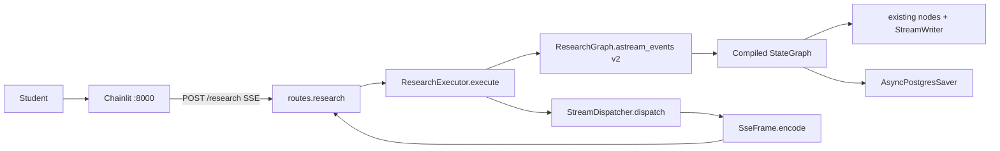
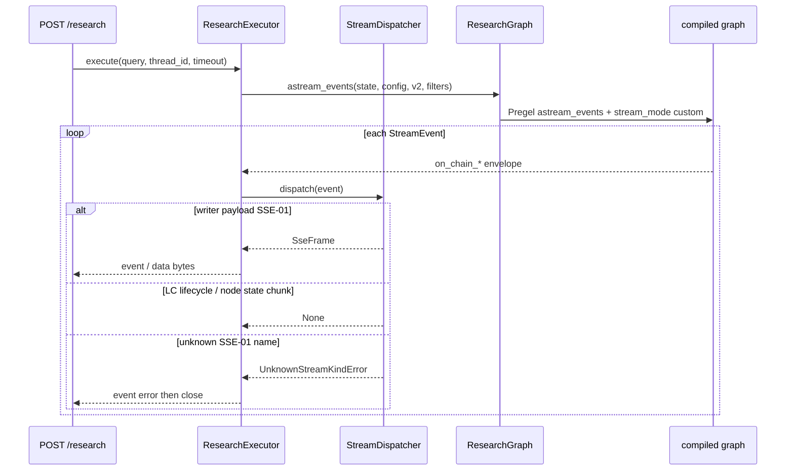

# SSE Agent Dispatcher Design

**Spec**: `.specs/features/sse-agent-dispatcher/spec.md`  
**Architecture constraints**: `.specs/features/arxiv-grounded-research/context.md` (PAT-01, PAT-07, PAT-08, PAT-11 consume path amended by this spec, PAT-12)  
**Status**: Validated 2026-09-07 (T1–T7 uncommitted; unit gate 34/34; live headers + first SSE-01 frames; full Independent Tests still UAT)

This feature does **not** change Gate, plan vocabulary, admission, retrieve, Writer grounding, SSE-01 **event names**, SSE-01 **payload shapes**, Chainlit, or `{ query, thread_id }`. It splits today’s `routes.iter_sse` into a compile-once **graph wrapper**, an **execute facade**, and a **dispatcher** that owns LC filters plus SSE-01 handlers.

Locked in specify (not reopened here): `POST /research`; client names `gate` … `error`; no `answer_delta`; no LC `on_chat_model_*` / `on_tool_*` on the wire; dispatcher owns `include_types`; unknown domain kind fails; wrapper compiles with existing `GraphDeps` + checkpointer; no graph-local `call_model`; names must not collide with node `dispatch` or eval `*Strategy`.

---

## Architecture Overview

FastAPI remains the HTTP edge (PAT-08: no adapter classes). Lifespan still builds factory, eval strategies, pool, and `AsyncPostgresSaver.setup()`, then constructs **one** `ResearchGraph` (wrapper around `build_graph`) and **one** `ResearchExecutor` (`ResearchGraph` + `StreamDispatcher.default()`). `POST /research` validates the body, reads the timeout, and returns `StreamingResponse(executor.execute(...))` with unbuffered SSE headers.

The facade is the only production iterator. It calls `ResearchGraph.astream_events(..., version="v2", include_types=dispatcher.include_types, **dispatcher.astream_kwargs)`. It must not branch on SSE-01 names. Each included LangChain `StreamEvent` goes to `dispatcher.dispatch`. Writer-shaped payloads become `SseFrame` bytes; LC lifecycle envelopes that are not writer payloads yield nothing; unknown SSE-01 names raise `UnknownStreamKindError` (facade then emits `error` and closes). CAP-01 timeout still wraps `anext` and emits `insufficient` `{ "reason": "timeout" }`.

Nodes keep `get_stream_writer()({ "event": "<SSE-01>", "data": {...} })`. Chainlit keeps parsing the same frames.





**Research notes (verification chain):**

- **Codebase:** `api/routes.py` owns HTTP 400, `_initial_state`, `graph.astream(..., stream_mode=["updates", "custom"], version="v2")`, `_custom_payload`, timeout `wait_for`, `error`/`insufficient`, and `aclose`. Headers today: `Cache-Control: no-cache`, `X-Accel-Buffering: no`. **`Connection: keep-alive` is missing** (STRM-01). `api/sse.py` already has `SSE_EVENTS` + `encode_sse` / `encode_payload` (JSON via `json.dumps`, unknown name → `ValueError`). `ui/sse_map.py` imports `SSE_EVENTS`. Lifespan stores `app.state.graph = build_graph(...)`. Nodes already emit `{event, data}` with SSE-01 names. `graph/nodes/dispatch.py` and eval `*Strategy` stay untouched. `scripts/draw_graph.py` calls `build_graph` directly (keep that function).
- **Project docs:** PAT-07 compile once; PAT-11 still FastAPI `StreamingResponse` (consume API is now `astream_events` v2). Parent design’s mapper + `astream` updates+custom is what this slice replaces. CAP-01 timeout remains a request budget around the iterator.
- **Installed libraries (this venv, 2026-09-07):** `langgraph==1.2.11`, `langchain-core==1.6.0`. `CompiledStateGraph.astream_events` for `version="v2"` is `Runnable.astream_events` (callback `StreamEvent` dicts). `version="v3"` is a different Pregel transformer API; **out of scope**. `include_types` filters **runnable types** (`chain`, `chat_model`, `llm`, `tool`, …), not SSE-01 names and not `on_custom_event`. Custom callback events (`adispatch_custom_event`) filter on the **user-defined name**, not `"custom"`.
- **Empirical (tiny `StateGraph` + `get_stream_writer`, same install):** default `astream_events(version="v2")` → StreamWriter is a **no-op**; no writer payload. `include_types=["custom"]` → **zero** events. `include_types=["chain"]` without `stream_mode` → `on_chain_*` only, still no writer payload. Passing **`stream_mode="custom"`** (kwargs into `astream_events`) makes writer dicts appear as `on_chain_stream` on the root run (`name` defaults to `"LangGraph"`) with `data.chunk == {event, data}`. Node return values still appear as separate `on_chain_stream` chunks **without** those keys. `stream_mode=["custom"]` (list) wraps the chunk as `("custom", payload)` — **do not use the list form**. `on_custom_event` is **not** how StreamWriter surfaces on this version. Chat-model tokens use run type `chat_model`; omitting that type from `include_types` keeps them off the facade.
- **Official LangGraph streaming docs** describe `astream(..., stream_mode="custom")` `StreamPart`s, not this callback envelope. Spec still requires `astream_events` as the public execute path (STRM-09). Design therefore **widens filters** (`include_types=["chain"]` + `stream_mode="custom"`) rather than calling `astream` from the facade.
- **FastAPI:** keep `StreamingResponse` + hand-rolled frames (PAT-11). Do not add `sse-starlette`. `Connection: keep-alive` is for HTTP/1.1 hops; HTTP/2 may ignore it (spec edge case).
- **Uncertain:** a future LangGraph may emit StreamWriter as `on_custom_event`. Execute SHALL keep a unit test that a writer `{event, data}` round-trips through `dispatch`. If that test fails after an upgrade, widen `include_types` / unwrap — do not switch the public path to `astream`.

---

## Code Reuse Analysis

### Existing Components to Leverage

| Component | Location | How to Use |
| --------- | -------- | ---------- |
| `SSE_EVENTS` + `encode_sse` | `api/sse.py` | Promote to `SseFrame.encode`. Keep `SSE_EVENTS` for Chainlit. Keep `encode_sse` as a one-liner around `SseFrame` so `ui/sse_map.py` does not change. |
| `_custom_payload` / `iter_sse` timeout / `aclose` | `api/routes.py` | Move iterator + timeout + `aclose` into `ResearchExecutor`. Replace `_custom_payload` with dispatcher unwrap. Delete per-kind logic from the route. |
| `_initial_state` | `api/routes.py` | Move next to the wrapper (`initial_graph_state`). Same keys as today. |
| `build_graph` / `GraphDeps` | `graph/build.py` | Wrapper `__init__` calls `build_graph`. Scripts keep importing `build_graph`. |
| Lifespan wiring | `main.py` | Same pool, `setup()`, factory, eval strategies. Store executor (and wrapper) on `app.state` instead of a bare compiled graph. |
| `ResearchRequest` / HTTP 400 | `api/schemas.py`, `routes.py` | Unchanged parse path. |
| Node `get_stream_writer` payloads | `graph/nodes/*.py` | **Reuse as-is.** No node edits. |
| Chainlit parser | `ui/sse_map.py`, `ui/app.py` | **Reuse as-is.** |
| `get_settings` | `api/deps.py` | Keep. Replace `get_graph` with `get_executor`. |

### Integration Points

| System | Integration Method |
| ------ | ------------------ |
| FastAPI `StreamingResponse` | Route returns facade iterator; media type `text/event-stream`; headers from `SSE_HEADERS`. |
| LangGraph checkpointer | Wrapper compile still passes `AsyncPostgresSaver`; `configurable.thread_id` still set in the facade. |
| LangChain `astream_events` v2 | Wrapper thin pass-through; dispatcher supplies `include_types` and `stream_mode`. |
| Chainlit | Unchanged HTTP client of `POST /research`. |

### Concerns / fragile areas

`.specs/codebase/CONCERNS.md` does not exist. Relevant lessons from STATE: compile once; do not construct `ChatOpenAI` per request; WindowsSelectorEventLoop for scripts (uvicorn already compatible). This slice must not move LLM construction into the wrapper.

---

## Components

### `SseFrame`

- **Purpose**: Encode one UTF-8 SSE record `event: …\ndata: <json>\n\n` for SSE-01 names only.
- **Location**: `src/plan_based_researcher/api/sse.py`
- **Interfaces**:
  - `SseFrame(event: str, data: object)` — `event` must be in `SSE_EVENTS` or encode raises `ValueError` (same as today).
  - `encode(self) -> bytes` — `json.dumps(data, default=str)`; not LangChain `dumps`.
  - `SSE_HEADERS: dict[str, str]` — `Cache-Control: no-cache`, `Connection: keep-alive`, `X-Accel-Buffering: no`.
  - `encode_sse(event, data) -> bytes` — `SseFrame(event, data).encode()` (compat).
- **Dependencies**: stdlib `json`
- **Reuses**: current `encode_sse` body

### `StreamDispatcher`

- **Purpose**: Own LC include filters and the SSE-01 kind → handler map; unwrap `astream_events` envelopes; fail unknown domain kinds.
- **Location**: `src/plan_based_researcher/api/stream_dispatcher.py` (not `dispatch.py`, not `*Strategy`)
- **Interfaces**:
  - `UnknownStreamKindError(kind: str)` — dedicated error; not empty string, not skip.
  - `__init__(self, handlers: Mapping[str, Callable[[object], SseFrame]], *, include_types: Sequence[str] = ("chain",), stream_mode: str = "custom")`
  - `@classmethod default(cls) -> StreamDispatcher` — one handler per `SSE_EVENTS` name; each handler is `lambda data, name=name: SseFrame(name, data)` (dictionary entries, not `if/elif`).
  - `include_types: Sequence[str]` — passed to `astream_events` (runnable types). Default `("chain",)`. **Not** SSE-01 names.
  - `astream_kwargs: dict` — `{"stream_mode": "custom"}` so StreamWriter is live. String `"custom"`, not `["custom"]`.
  - `dispatch(self, event: Mapping[str, Any]) -> SseFrame | None` — see unwrap rules below.
- **Dependencies**: `SseFrame`, `SSE_EVENTS`
- **Reuses**: today’s allowlist + payload encode

**Unwrap rules (`dispatch`):**

1. If `event["event"] != "on_chain_stream"` → return `None` (start/end/other lifecycle). Not a domain kind.
2. Let `chunk = event["data"]["chunk"]` (missing → `None`). If `chunk` is `tuple` and `chunk[0] == "custom"`, use `chunk[-1]` (defensive; production kwargs must still use the string mode).
3. If `chunk` is a `dict` containing **both** `"event"` and `"data"`:
   - Look up `handlers[chunk["event"]]`. Missing → `UnknownStreamKindError`.
   - Handler returns `SseFrame`.
4. Otherwise return `None` (node state / graph chunks). Those are LC envelopes, not malformed writer payloads.
5. Writer dict with `"event"` but not `"data"` (or non-SSE-01 `event`) → fail (edge case in spec: not `{event, data}` with SSE-01 name).

`include_types` and handler keys are **two namespaces**. Alignment for a healthy run: `include_types` is wide enough to admit writer `on_chain_stream` (`chain` + `stream_mode="custom"`) and narrow enough to exclude `chat_model` / `llm` / `tool`. Handler keys equal `SSE_EVENTS`. The spec’s “kind in include_types but not in the map” maps to: a **writer-shaped** chunk whose `event` string is not in `handlers`.

The facade must not hardcode `"chain"`, `"custom"`, or SSE-01 names.

### `ResearchGraph`

- **Purpose**: Compile the research `StateGraph` once; expose `astream_events` as a thin pass-through.
- **Location**: `src/plan_based_researcher/graph/research_graph.py`
- **Interfaces**:
  - `__init__(self, deps: GraphDeps, checkpointer: Any | None = None)` — `self._compiled = build_graph(deps, checkpointer=checkpointer)`. No `ChatOpenAI`. No `call_model` node.
  - `astream_events(self, input, config=None, **kwargs)` — `return self._compiled.astream_events(input, config, **kwargs)`
  - `initial_graph_state(query: str) -> dict[str, Any]` — today’s `_initial_state` keys (`query`, `messages`, plan/eval/retrieve maps, `outcome="pending"`, `eval_next="dispatch"`, …). Not a single `messages` string.
- **Dependencies**: `GraphDeps`, `build_graph`
- **Reuses**: `graph/build.py` unchanged

### `ResearchExecutor`

- **Purpose**: Facade: iterate the wrapper, dispatch, timeout, `error` / `aclose`. No encoding branches.
- **Location**: `src/plan_based_researcher/api/executor.py`
- **Interfaces**:
  - `__init__(self, graph: ResearchGraph, dispatcher: StreamDispatcher)`
  - `execute(self, query: str, thread_id: str, timeout_seconds: int) -> AsyncIterator[bytes]`
    - `config = {"configurable": {"thread_id": thread_id}}`
    - `stream = graph.astream_events(graph.initial_graph_state(query), config=config, version="v2", include_types=dispatcher.include_types, **dispatcher.astream_kwargs)`
    - Deadline loop + `asyncio.wait_for(anext(...), remaining)` as today
    - Timeout → `yield SseFrame("insufficient", {"reason": "timeout"}).encode(); return`
    - For each event: `frame = dispatcher.dispatch(event)`; if `frame is not None`: `yield frame.encode()`
    - `except Exception`: `yield SseFrame("error", {"message": str(exc)}).encode()`
    - `finally`: `aclose` if present
- **Dependencies**: wrapper, dispatcher, `SseFrame` for timeout/error only (same encoder as handlers)
- **Reuses**: `iter_sse` control flow

`if frame is not None` is not an SSE-01 name branch.

### Route + lifespan (PAT-12)

- **Purpose**: HTTP boundary only.
- **Location**: `api/routes.py`, `api/deps.py`, `main.py`
- **Interfaces**:
  - `get_executor(request) -> ResearchExecutor`
  - `POST /research`: parse JSON / `thread_id` (unchanged 400s) → `StreamingResponse(executor.execute(...), media_type="text/event-stream", headers=SSE_HEADERS)`
  - Lifespan: `ResearchGraph(deps, checkpointer)` + `ResearchExecutor(wrapper, StreamDispatcher.default())` on `app.state`
- **Dependencies**: FastAPI `Depends`
- **Reuses**: `_parse_research_request`

Route module SHALL NOT call `astream` / `astream_events`. Keep `build_graph` for `scripts/draw_graph.py`.

---

## Data Models

### `SseFrame`

```python
@dataclass(frozen=True, slots=True)
class SseFrame:
    event: str
    data: object

    def encode(self) -> bytes: ...
```

**Relationships**: `event` ∈ `SSE_EVENTS`. `data` is the same JSON object nodes already put in `writer({..., "data": ...})`.

### LangChain `StreamEvent` (consumed, not copied into our package)

```python
{"event": "on_chain_stream", "name": "LangGraph", "data": {"chunk": {"event": "plan", "data": {...}}}, ...}
```

**Relationships**: envelope only. Client never sees `event: on_chain_stream`.

### HTTP

`ResearchRequest` unchanged. Response headers: `SSE_HEADERS` + `Content-Type: text/event-stream`.

---

## Error Handling Strategy

| Error scenario | Handling | User impact |
| -------------- | -------- | ----------- |
| Missing/blank `thread_id` or non-JSON body | HTTP 400 before SSE (unchanged) | No stream |
| CAP-01 deadline | Facade yields `insufficient` `{reason: timeout}` and returns | Chainlit shows timeout reason |
| Unhandled exception in generator | Facade yields `error` `{message}` and closes | Same as today |
| Unknown SSE-01 name / malformed writer dict | `UnknownStreamKindError` → caught as exception → `error` frame | Stream fails loud |
| LC `on_chain_start` / `on_chain_end` / non-writer chunks | `dispatch` returns `None` | No extra client frames |
| Client disconnect | `finally` `aclose` | Iterator closed |
| HTTP/2 ignores `Connection` | Still set the three headers | Proxies that honor `X-Accel-Buffering` still flush |

No app-level list of frames before yield (STRM-02).

---

## Tech Decisions (non-obvious)

| Decision | Choice | Rationale |
| -------- | ------ | --------- |
| Public consume API | `astream_events(version="v2")` plus dispatcher kwargs | Spec STRM-09; not `astream` in the facade/route |
| Why writer payloads need `stream_mode="custom"` | Pregel only installs a real `StreamWriter` when `"custom"` is in stream modes; v2 `astream_events` does not set that unless kwargs pass it | Verified on `langgraph==1.2.11` |
| `include_types` default | `("chain",)` | Admits writer `on_chain_stream`; excludes `chat_model` / `llm` / `tool` (STRM-10) |
| `stream_mode` form | String `"custom"`, not `["custom"]` | List form wraps `chunk` as `("custom", payload)` |
| Two maps on the dispatcher | LC filters vs SSE-01 handlers | `include_types` is runnable types; SSE-01 names are inner `chunk["event"]` |
| Ignore non-writer chain streams | `dispatch` → `None` | Otherwise node state chunks would trip unknown-kind on every run |
| Wrapper vs `app.state.graph` | `ResearchGraph` + `ResearchExecutor` on lifespan | PAT-07; route does not iterate |
| Timeout/error encoding | `SseFrame` in the facade | Not graph writer events; still the same encoder |
| `version="v3"` | Out of scope | Different API; spec locks v2 |

---

## Testing (Execute preview)

No `.specs/codebase/TESTING.md`. Follow existing `unittest` style (`tests/test_internal_english.py`).

| Check | How |
| ----- | --- |
| STRM-03 | `SseFrame("plan", {...}).encode()` round-trips JSON keys Chainlit reads; same for `answer_complete` |
| STRM-04 | `default()` handlers cover `SSE_EVENTS`; unknown inner event raises `UnknownStreamKindError` |
| STRM-05 | Facade/route source has no SSE-01 name `if/elif`; `include_types` read from dispatcher |
| STRM-09 / writer unwrap | Tiny compiled graph + `get_stream_writer`; `dispatch` of recorded `on_chain_stream` yields `plan` frame when using `default().astream_kwargs` |
| STRM-10 | Dispatcher `include_types` does not contain `chat_model` / `llm` / `tool` |
| STRM-01 | Route `StreamingResponse` headers include all three keys + `text/event-stream` (unit or inspect) |

Manual UAT (after Tasks): in-domain `POST /research` until `done`/`insufficient`; only SSE-01 names; Chainlit unchanged; follow-up `thread_id` still resumes.

---

## Requirement mapping

| ID | Design coverage |
| -- | --------------- |
| STRM-01 | `SSE_HEADERS` on `StreamingResponse` |
| STRM-02 | One `yield` per dispatched frame; no batch list |
| STRM-03 | `SseFrame.encode` + existing JSON |
| STRM-04 | `StreamDispatcher.default()` map + `UnknownStreamKindError` |
| STRM-05 | Facade has no SSE-01 branches; `include_types` property |
| STRM-06 | `ResearchGraph` compiled in lifespan |
| STRM-07 | Route → `executor.execute` only |
| STRM-08 | `initial_graph_state` + `thread_id` config; no per-request LLM |
| STRM-09 | Facade `astream_events` v2 + dispatcher filters |
| STRM-10 | `include_types=("chain",)`; unwrap inner SSE-01 name |
| STRM-11 | Nodes unchanged; no `answer_delta` handler |
| STRM-12 | Timeout / `error` / `aclose` in facade |
