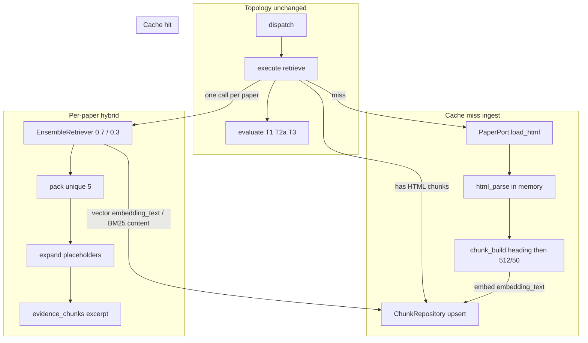
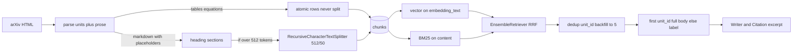

# Structured-Aware Chunking Design

**Spec**: `.specs/features/structured-aware-chunking/spec.md`  
**Parent designs**: `.specs/features/admission-retrieve-per-topic/design.md` (ranking walk, per-paper hybrid, T1/T2a/T3) · `.specs/features/orchestrator-eval-replan/design.md` (EnsembleRetriever RRF 0.7/0.3)  
**Architecture constraints**: `.specs/features/arxiv-grounded-research/context.md` (PAT-01–PAT-12 still apply)  
**Parser spike (behavior source)**: `scripts/arxiv_html_units.py`  
**Status**: Executed (T1–T19, 2026-09-03)

This feature does **not** add graph nodes, SSE event names, Citation fields, or a second corpus. LangGraph stays `gate → planner → dispatch → search|execute → evaluate → replan|finalize`. What changes is **what retrieve fetches on a cache miss**, **how rows are stored**, and **how per-paper hybrid packs and expands excerpts**.

Grill-me knobs in the spec are locked (no ingest LLM, extractive equation window, table header+2 rows, overfetch ≥3×k, in-memory parser). This design does not reopen them.

---

## Architecture Overview

Retrieve ingest stops calling LangChain `ArxivLoader` / PDF. On a cache miss for `(arxiv_id, version)`, the arXiv adapter GETs HTML, a pure parser (promoted from the spike, **no disk, no assets**) emits atomic table/equation units plus residual markdown prose, a chunk builder heading-splits then applies 512/50 **inside a section**, embeddings are taken from `embedding_text`, and `PgChunkRepository` upserts one `chunks` table (PAT-09, not a units table).

Hybrid stays **N adapter calls** (one per usable paper). Each call overfetches, a packer dedups atomic `unit_id`s and backfills to `k=5`, an expander inlines full unit bodies (once) into Writer/Citation `excerpt`. Graph execute, admission, search, and Writer `[n]` numbering stay as in the admission design.





**Research notes (verification chain):**

- **Codebase:** Ingest lives in `RetrieveRunner` (`agents/retrieve.py`): `get_paper` miss → `PaperPort.load_pdf_text` → `RecursiveCharacterTextSplitter.from_tiktoken_encoder` 512/50 on the **whole** dump → `embed_documents` → `upsert_paper_with_chunks(paper, list[str], vectors)`. Cache identity is a `papers` row, not “has chunks.” Hybrid (`adapters/hybrid.py`) BM25-indexes `EvidenceChunk.excerpt` (today = `content`) and vector-ranks SQL `embedding <=> query LIMIT k`; `EnsembleRetriever` (langchain_classic) RRF-merges the **full union** of both lists (no built-in top-k); the runner then slices `[:retrieve_k_per_paper]`. `EvidenceChunk` / `Citation` have no `kind`/`section`. Spike `scripts/arxiv_html_units.py` already: HTML URL, layout-only `ltx_tabular` drop, equation vs table vs figure, `[KIND:html_id]` placeholders, markdownify + `$tex$`, bibliography/frontmatter drop. It **also** downloads figure assets and writes `_tmp_arxiv_html` — production must not.
- **Project docs:** AD-016, spec HTML-01–MIG-01, PAT-01 (no new nodes), PAT-03/08 (outbound HTML load), PAT-09 (one repo, selected papers only), PAT-10 (k and splitter knobs). No `.specs/codebase/CONCERNS.md`. Fragile spots unchanged: `dict_row` column names, Windows event loop, `ChatOpenAI` `api_key`, `eval_next` on `GraphState`.
- **LangChain:** `MarkdownHeaderTextSplitter` (`langchain_text_splitters`) splits on ATX headers and puts the path in metadata (`headers_to_split_on`, `strip_headers=True`). Then the **existing** `RecursiveCharacterTextSplitter.from_tiktoken_encoder` runs **per section**. `EnsembleRetriever` has no `k`; overfetch is `LIMIT`/`BM25Retriever.k` on the two legs. Confirmed in installed `langchain_classic/retrievers/ensemble.py` (`weighted_reciprocal_rank` returns the unique union sorted by RRF).
- **Uncertain:** I could not find a documented guarantee that every arXiv HTML response sets `Content-Type: text/html`. Design treats PDF magic / missing article root as ingest failure (walk), not as an exception.

---

## Code Reuse Analysis

### Existing Components to Leverage

| Component | Location | How to Use |
| --------- | -------- | ---------- |
| Retrieve ranking walk / T1 T2a T3 | `agents/retrieve.py` | **Keep** skip-walk on retry, follow-up skip-walk, `merge_papers`, formulate, per-paper loop, `retrieve_ingest`. Replace PDF load + whole-text split + `[:k]` with HTML ingest + pack + expand. |
| Hybrid adapter | `adapters/hybrid.py` | **Reuse** EnsembleRetriever RRF, `id_key="chunk_id"`, `_VectorRetriever`. Change BM25 `page_content` to stored `content`; pass overfetch `k`; return `ChunkRecord`s (not Writer excerpts). |
| Chunk repository | `repo/chunks.py`, `ports/chunks.py` | Extend schema and upsert; add `paper_has_chunks`; SELECT `kind` / `unit_id` / `metadata` / `content`. Keep `dict_row` mapping. |
| Paper port / adapter | `ports/papers.py`, `adapters/arxiv.py` | Keep `search` + shared `Client` + `_REQUEST_LOCK`. Replace `load_pdf_text` / `ArxivLoader` with `load_html` (`httpx`, `asyncio.to_thread`). |
| Spike parser | `scripts/arxiv_html_units.py` | **Promote** layout-only drop, equation TeX, table markdownify, inline `$tex$`, bib/frontmatter drop, article-root check. **Change** figure handling (collapse `ltx_table`, caption-only images). **Strip** disk writes and asset downloads from the library path. |
| Tiktoken splitter | `RetrieveRunner` today | Move 512/50 into `ingest/chunk_build.py`; still `Policy.chunk_size` / `chunk_overlap` / `chunk_encoding`. |
| Policy / registry | `policy.py`, `agents/registry.py` | `retrieve_k_per_paper=5`; overfetch factor; retrieve abilities say HTML / k=5. |
| Writer / Citation / SSE / Chainlit | `agents/writer.py`, `api/schemas.py`, `ui/` | **Unchanged types.** They already copy `excerpt`; expander must write the expanded string there before numbering. |
| Eval T1/T2a/T3 | `eval/strategies.py`, `graph/nodes/evaluate.py` | Routing unchanged. Copy “PDF” → “HTML” in T2a/T1 feedback and planner constraints only. |
| Graph / execute / admission | `graph/build.py`, `execute.py`, `eval/admission.py` | **No edits** except wording if a string still says PDF ingest. |

### Integration Points

| System | Integration Method |
| ------ | ------------------ |
| LangGraph | No new keys. `evidence_chunks[].excerpt` becomes expanded HTML-derived text. `retrieve_ingest` cases unchanged (empty/missing HTML = same as empty PDF for T1/T2a/RETR-06). |
| Postgres | Recreate `chunks` when the live table lacks `kind` (local wipe). Do **not** DROP on every `ensure_schema`. Checkpointer tables untouched. |
| Embeddings | `embed_documents` on `embedding_text` only; query embed unchanged. |
| arXiv | Search still `arxiv.Client`. Retrieve full text is `GET https://arxiv.org/html/{id}v{ver}` under the existing request lock. |
| SSE / Chainlit | Same event names; side panel shows expanded `Citation.excerpt`. |

No `CONCERNS.md`. Mitigations: never index `dict_row` by `0`; strip U+0000 from HTML-derived strings (same class of bug as PDF NUL); do not write `_tmp_arxiv_html` from retrieve.

---

## Components

### Policy (PAT-10) — RETR-05, SPLIT-01

- **Purpose**: Single copy of k, overfetch, HTML URL, splitter, hole wording.
- **Location**: `src/plan_based_researcher/policy.py`
- **Interfaces**:
  - `Policy.retrieve_k_per_paper: int = 5` — packed unique hits per paper and post-pack cap (replaces 3).
  - `Policy.retrieve_overfetch_factor: int = 3` — each hybrid leg asks for `factor * retrieve_k_per_paper` (15 today). Spec floor is ≥3×k.
  - `Policy.html_url(arxiv_id, version) -> str` — `https://arxiv.org/html/{arxiv_id}v{version}` (version already normalized, no extra `v`).
  - `Policy.PREAMBLE_SECTION: str = "Preamble"` — `metadata.section` when prose has no heading.
  - Splitter 512/50/`cl100k_base` unchanged; they apply **inside a section**, never to atomics.
  - `HOLE_RULE` student-facing sentence stays “no usable paper”; do not say PDF.
- **Dependencies**: none
- **Reuses**: existing allowlist, recency, hybrid weights, caps

### PaperPort — HTML-01, HTML-02, RETR-06

- **Purpose**: Outbound search + HTML fetch. No PDF.
- **Location**: `src/plan_based_researcher/ports/papers.py`
- **Interfaces**:

```python
@dataclass(frozen=True, slots=True)
class HtmlLoadResult:
    status: Literal["ok", "missing", "empty", "not_html"]
    body: bytes = b""
    content_type: str = ""

class PaperPort(Protocol):
    async def search(self, query: str, *, max_results: int) -> list[PaperHit]: ...
    async def load_html(self, arxiv_id: str, version: str) -> HtmlLoadResult: ...
```

- **Delete** `load_pdf_text`. Callers treat `ok` with a body as parse input; any other status is ingest failure for that key (walk). Timeouts / DNS / `httpx` transport errors still **raise** (SSE `error`), same as today’s PDF infra failures.
- **Dependencies**: none
- **Reuses**: `PaperHit` unchanged

### ArxivPaperAdapter — HTML-01

- **Purpose**: Shared arXiv search client + HTML GET off the event loop.
- **Location**: `src/plan_based_researcher/adapters/arxiv.py`
- **Interfaces**:
  - `search` — unchanged (`_CLIENT`, `_REQUEST_LOCK`, `arxiv<4`).
  - `load_html` — `asyncio.to_thread` + same `_REQUEST_LOCK`; `httpx.get` (`follow_redirects=True`, 30s timeout, User-Agent identifying this app, not a crawler). Map HTTP 404/403 → `missing`; empty body → `empty`; `Content-Type` `application/pdf` or body starting with `%PDF` → `not_html`; HTTP 200 with a body → `ok` (article-root check is the parser’s job).
  - Remove `ArxivLoader`, `_load_pdf_text_sync`, `_sanitize_pdf_text` (NUL strip moves to chunk build for all stored strings).
- **Dependencies**: `httpx` (already direct), `arxiv` for search only
- **Reuses**: `_REQUEST_LOCK` so parallel `Send("search")` and retrieve HTML do not burst
- **Drop**: `pymupdf` from `pyproject.toml` (only existed for `ArxivLoader`)

### HTML parser — PARSE-01, PARSE-02, PARSE-03

- **Purpose**: Bytes → units + residual markdown. In memory only.
- **Location**: `src/plan_based_researcher/ingest/html_parse.py` (**new**; promote from spike)
- **Interfaces**:

```python
@dataclass(frozen=True, slots=True)
class ParsedUnit:
    kind: Literal["table", "equation"]
    html_id: str
    caption: str          # equation: ltx_tag text; table: figcaption / ltx_caption
    table_number: str     # tables only; see Labels
    body: str             # table markdown or TeX ($$...$$)

@dataclass(frozen=True, slots=True)
class ParsedPaper:
    usable: bool
    prose_markdown: str
    units: list[ParsedUnit]
    reason: str           # empty if usable
```

- `parse_arxiv_html(html_bytes: bytes) -> ParsedPaper` — sync; retrieve wraps it in `asyncio.to_thread`.
- **Must reuse from spike:** `_ARTICLE_ROOT` required (else `usable=False`); `_is_layout_only_table` decompose; `_equation_tex` / `_rewrite_inline_math`; `_table_to_markdown` (drop `ltx_rule`, markdownify); `_drop_bibliography` / `_drop_frontmatter`; generated `html_id` `unit-0001` when the element has no `id`; placeholders `[TABLE:{id}]` / `[EQUATION:{id}]`.
- **Must change from spike (spec):**
  1. **Do not** create `figure` units, download assets, or emit `[FIGURE:…]`.
  2. Process **`figure.ltx_table` first**: one `table` unit; caption from the figure; body from the inner tabular markdown; `html_id` from the **figure** `id` (fallback: inner table id, then generated). Replace the **whole figure** so the inner table is not extracted again.
  3. **`figure.ltx_figure` (image):** replace the figure with its caption as a text node (plain text). No unit.
  4. Then remaining `table` nodes: equation classes / `ltx_eqn_table` → `equation`; else `table`.
  5. Return structures only — **no** `Path`, **no** `_tmp_arxiv_html`.
- Unusable: no article root, or (stripped prose empty **and** `units` empty).
- **Dependencies**: `beautifulsoup4`, `lxml`, `markdownify` (promote from spike extras to project deps)
- **Reuses**: spike helpers listed above

`scripts/arxiv_html_units.py` becomes a **debug CLI** over `parse_arxiv_html` (MAY write sidecars). Production retrieve must not import the script.

### Labels — EMB-02, RETR-07

- **Purpose**: One function for ingest `embedding_text` and retrieve later-occurrence labels.
- **Location**: `src/plan_based_researcher/ingest/labels.py` (**new**)
- **Interfaces**:
  - `equation_label(tag: str) -> str` — `Equation ({tag})` if tag else `Equation`
  - `table_label(number: str, caption: str) -> str` — if caption is empty: `Table {number}`. If caption already starts with `Table` (case-insensitive): use caption as the whole label (avoids `Table 1: Table 1: …`). Else `Table {number}: {caption}`.
  - `table_number_for(unit) -> str` — `ltx_tag` / leading `Table <token>` in caption if present, else 1-based index among **table** units in parse order.
- **Dependencies**: none
- **Reuses**: none

### Chunk builder — SPLIT-01, STORE-01, EMB-02

- **Purpose**: `ParsedPaper` → ordered `ChunkDraft` rows (no IO).
- **Location**: `src/plan_based_researcher/ingest/chunk_build.py` (**new**)
- **Interfaces**:

```python
@dataclass(frozen=True, slots=True)
class ChunkDraft:
    kind: Literal["prose", "table", "equation"]
    unit_id: str | None
    embedding_text: str
    content: str
    metadata: dict  # exactly section, caption, unit_ids
```

- `build_chunk_drafts(parsed: ParsedPaper) -> list[ChunkDraft]`
- **Prose path:**
  1. `MarkdownHeaderTextSplitter` on ATX `#`…`######` (`strip_headers=True`). Join nested header metadata with ` > ` → `section`. No headers → `Policy.PREAMBLE_SECTION`.
  2. If a section’s tiktoken length (`Policy.chunk_encoding`, `disallowed_special=()`) > `chunk_size`, `RecursiveCharacterTextSplitter.from_tiktoken_encoder` **on that section only** (overlap 50). Otherwise one chunk.
  3. `content` keeps placeholders. `embedding_text` replaces each `[TABLE:id]` / `[EQUATION:id]` via `labels.py` (unknown id → leave placeholder).
  4. `metadata.unit_ids` = ordered unique ids from placeholders in `content`. `unit_id` is NULL. `caption` is `""`.
- **Atomic path (never split, even if >512):**
  - `content` = caption/tag **line** + full `body` (not truncated).
  - Table `embedding_text` = caption + markdown **header row** + **first two data rows** (skip `|---|` separator). If the table cannot be parsed, caption + first three non-empty body lines (still no LLM).
  - Equation `embedding_text` = `section` path of the **containing subsection** (the heading-split section whose prose contains `[EQUATION:{id}]`, else `PREAMBLE_SECTION`) + tiktoken window `min(section_len, 200)` **centered on the placeholder** + tag + TeX.
  - `metadata.section` as above; `caption` as stored caption/tag; `unit_ids = [html_id]`; `unit_id = html_id`.
- Strip U+0000 from every string field before return.
- **Dependencies**: `langchain_text_splitters`, `tiktoken` (already transitive)
- **Reuses**: today’s tiktoken splitter factory; parser units

### ChunkRepository — STORE-01, HTML-02, MIG-01

- **Purpose**: Persist dual text + kind; cache = **has HTML-derived chunks**, not merely a `papers` row.
- **Location**: `ports/chunks.py`, `repo/chunks.py`
- **Interfaces** (delta):

```python
@dataclass(frozen=True, slots=True)
class ChunkRecord:
    chunk_id: str
    arxiv_id: str
    version: str
    title: str
    year: int
    url: str
    kind: Literal["prose", "table", "equation"]
    unit_id: str | None
    content: str
    metadata: dict
    # excerpt is NOT stored; retrieve writes it after expand

class ChunkRepository(Protocol):
    async def get_paper(...) -> PaperRecord | None: ...
    async def paper_has_chunks(self, arxiv_id: str, version: str) -> bool: ...
    async def upsert_paper_with_chunks(
        self,
        paper: PaperRecord,
        drafts: list[ChunkDraft],
        embeddings: list[list[float]],
    ) -> None: ...
    async def similarity_search(...) -> list[ChunkRecord]: ...
    async def list_chunks(...) -> list[ChunkRecord]: ...
```

- `paper_has_chunks`: `SELECT EXISTS (...)` on `chunks` for that key. **Cache hit** iff this is true (HTML-02). A `papers` row with zero chunks is a miss (re-fetch).
- `similarity_search`: still `ORDER BY embedding <=> query LIMIT k` but SELECT includes `kind`, `unit_id`, `content`, `metadata` (not `embedding_text` at retrieve time).
- `list_chunks`: same columns, `ORDER BY chunk_index`.
- **Delete** the `list[str]` upsert overload.
- **Dependencies**: psycopg, pgvector
- **Reuses**: `ensure_schema` in lifespan; `dict_row`; delete-then-insert per paper

### Hybrid adapter — RETR-08

- **Purpose**: Per-paper RRF over mixed prose+atomic rows; vector vs lexical **different text**.
- **Location**: `adapters/hybrid.py`
- **Interfaces**:

```python
@dataclass(frozen=True, slots=True)
class HybridResult:
    ranked: list[ChunkRecord]  # RRF order, unique by chunk_id
    corpus: list[ChunkRecord]  # all rows for those keys (expansion lookup)

class HybridRetrievePort(Protocol):
    async def retrieve(
        self, query: str, paper_keys: list[tuple[str, str]], k: int
    ) -> HybridResult: ...
```

- `k` is the **per-leg overfetch** (runner passes `3 * retrieve_k_per_paper`), not the packed 5.
- BM25 `Document.page_content = content`; metadata carries `chunk_id`, `kind`, `unit_id`, `metadata`, paper fields. Vector SQL uses stored embeddings of `embedding_text`.
- Empty keys or empty corpus → `HybridResult([], [])`.
- **Do not** pack or expand here (runner owns k=5 and excerpt policy).
- **Dependencies**: `ChunkRepository`, `EmbeddingPort`, EnsembleRetriever
- **Reuses**: `_VectorRetriever`, weights from Policy, `id_key="chunk_id"`

### Packer — RETR-08

- **Purpose**: Overfetched RRF list → at most `retrieve_k_per_paper` unique hits.
- **Location**: `src/plan_based_researcher/ingest/pack.py` (**new**)
- **Interfaces**: `pack_hits(ranked: list[ChunkRecord], k: int) -> list[ChunkRecord]`
- **Algorithm (locked):**
  1. `covered: set[str] = empty`. `kept = []`.
  2. Walk `ranked` in order. Stop when `len(kept) == k` or the list is exhausted.
  3. **Atomic** (`kind` in `table|equation`): skip if `unit_id` is in `covered`; else keep and add `unit_id` to `covered`.
  4. **Prose**: always keep (until `k`); add every placeholder id in `content` (regex `\[(TABLE|EQUATION):([^\]]+)\]`, spec: trust `content` over `metadata.unit_ids`) to `covered`.
  5. Backfill is just continuing this walk (skipped atomics free a slot for later unique hits).
- Consequence: prose-then-atomic of the same unit drops the atomic (AC3). Atomic-then-prose keeps both; expansion puts the full body on the atomic hit and a **label** on the later prose (independent test b). Two overlapping prose chunks both stay; expansion full-then-label.
- **Dependencies**: none
- **Reuses**: none

### Expander — RETR-07, RETR-09

- **Purpose**: Packed hits → Writer `excerpt` strings. Same string for `Citation` / Chainlit.
- **Location**: `src/plan_based_researcher/ingest/expand.py` (**new**)
- **Interfaces**: `expand_hits(packed: list[ChunkRecord], corpus: list[ChunkRecord]) -> list[str]`
- Index atomic rows in `corpus` by `unit_id` (that paper only; hybrid is already per-paper).
- `shown: set[str]` in **packed rank order**:
  - **Atomic hit:** excerpt = `metadata.section` + newline + `content` if section else `content`. Add `unit_id` to `shown`. (RETR-09 always uses full atomic `content`; packing prevents a second full copy via a later atomic.)
  - **Prose hit:** replace each placeholder in `content`: if `unit_id` not in `shown` and the unit exists, splice that unit’s full `content` and add to `shown`; else splice the **label** (same rules as ingest). Missing unit → label if caption/tag known else leave placeholder. Do not add `[n]` slots.
- **Dependencies**: `labels.py`
- **Reuses**: none

### RetrieveRunner — HTML-01, HTML-02, RETR-05, RETR-06, RETR-07, RETR-08

- **Purpose**: Walk rankings, ingest HTML, hybrid+pack+expand, number `[n]`.
- **Location**: `agents/retrieve.py`
- **Interfaces**: `run(state) -> dict` (same keys as today)
- **Walk (attempt 1, current plan has passed searches):** for each `ranked_keys` entry, skip if already in `usable`; **cache hit** = `paper_has_chunks`; else `load_html` → `parse_arxiv_html` → `build_chunk_drafts` → `embed_documents(embedding_text)` → `upsert_paper_with_chunks`. Sync parse/build in `asyncio.to_thread`. Failure statuses, unusable parse, or zero drafts → **next key, same execute** (RETR-06). First success admits that paper. Exhausted ranking → gap (T2a). **No PDF.**
- **T3 retry / follow-up:** skip walk; hybrid existing `papers` (unchanged).
- **T1:** `merged` empty → no formulate/hybrid (unchanged).
- **Per paper after merge:** `result = hybrid.retrieve(query, [key], k=3*retrieve_k_per_paper)`; `packed = pack_hits(result.ranked, k=retrieve_k_per_paper)`; `excerpts = expand_hits(packed, result.corpus)`; omit the paper if `packed` is empty; else emit `EvidenceChunk` dicts with **expanded** `excerpt`, continuous `[n]`. Do **not** `[:k]` before pack.
- **Dependencies**: `PaperPort`, `ChunkRepository`, `EmbeddingPort`, `HybridRetrievePort`, ingest modules
- **Reuses**: formulate, `_paper_ref_*`, `merge_papers`, `retrieve_ingest` shape

### Tool registry / abilities — PAT-03

- **Purpose**: `arxiv_load` means HTML load, not PDF.
- **Location**: `agents/tools.py` (name stays `arxiv_load` so the registry/factory do not grow a new tool key), `agents/registry.py`
- **Interfaces**: retrieve abilities: walk `ranked_keys`, ingest one usable **HTML** paper per ranking, hybrid **k=5** per paper. Search abilities: do not fetch HTML (search still titles+abstracts).
- **Reuses**: `ToolRegistry.get`

### Copy-only eval / planner — amended RETR-03 / T2a

- **Purpose**: Student/eval text matches HTML ingest.
- **Location**: `eval/strategies.py` T2a feedback; `agents/planner.py` T1/T2a constraints
- **Interfaces**: replace “PDF” with “HTML” / “paper HTML”. Routing **unchanged**.
- **Reuses**: LOOP-05, WRITE-02

---

## Data Models

### `chunks` table (STORE-01, MIG-01)

```sql
CREATE TABLE chunks (
  chunk_id UUID PRIMARY KEY,
  arxiv_id TEXT NOT NULL,
  version TEXT NOT NULL,
  chunk_index INT NOT NULL,
  kind TEXT NOT NULL CHECK (kind IN ('prose', 'table', 'equation')),
  unit_id TEXT,
  embedding_text TEXT NOT NULL,
  content TEXT NOT NULL,
  embedding vector(1536) NOT NULL,
  metadata JSONB NOT NULL,
  UNIQUE (arxiv_id, version, chunk_index),
  FOREIGN KEY (arxiv_id, version) REFERENCES papers (arxiv_id, version)
);

CREATE UNIQUE INDEX chunks_atomic_identity
  ON chunks (arxiv_id, version, unit_id)
  WHERE unit_id IS NOT NULL;
```

`papers` columns unchanged. Atomic identity is `(arxiv_id, version, unit_id)` via the **partial** unique index (prose has `unit_id` NULL; PostgreSQL UNIQUE would already allow multiple NULLs, but the partial index states the spec).

`metadata` **exactly**:

```python
{"section": str, "caption": str, "unit_ids": list[str]}
```

Enforced in Python on upsert, not a DB CHECK.

**Migration (local only, once):** in `ensure_schema`, if `chunks` exists and has **no** `kind` column: `DROP TABLE chunks;` then `DELETE FROM papers;` then CREATE new `chunks` (+ index). If `chunks` already has `kind`, `CREATE IF NOT EXISTS` only. **Never DROP on every API start.** Do not touch LangGraph checkpoint tables.

`chunk_index`: prose drafts in heading/split order (0..n-1), then atomic units in parse order.

### Graph / Writer models

`EvidenceChunk` TypedDict and `Citation` **do not gain** `kind` or `section`. `excerpt` is the expander output. `n` numbering unchanged.

`RetrieveIngestReport` unchanged. Missing HTML is the same `case` as today’s empty PDF (`t1` / `t2a` gap).

### Control flow (normative delta)

```text
retrieve execute walk (attempt 1, has passed searches):
  for key in ranked_keys:
    if key in usable: continue
    if paper_has_chunks: admit cache hit
    else load_html → parse → split/embed/upsert
         on missing/empty/not_html/unusable/zero rows: next key
    stop at first usable HTML paper
  exhausted ranking → gap_step_indices

per usable paper:
  hybrid k = 3 * retrieve_k_per_paper
  pack to retrieve_k_per_paper unique
  expand excerpts
  concat in papers order, continuous [n]
```

---

## Error Handling Strategy

| Error scenario | Handling | User impact |
| -------------- | -------- | ----------- |
| HTML 404 / 403 / empty / PDF body | Ingest failure; next `ranked_keys` | Same as empty PDF today (T2a/T1/WRITE-02) |
| 200 HTML but no article root / empty prose and no units | Ingest failure; walk | No PDF fallback |
| Layout-only `ltx_tabular` | Discarded at parse | Not stored |
| `figure.ltx_table` wrapping a table | One table unit; figure id | Inner table not a second row |
| Image figure | Caption spliced into prose | No unit, no files, no `[FIGURE:]` |
| Section with no heading | `metadata.section = "Preamble"`; 512/50 if needed | Chunks still exist |
| Overlap-50 duplicates a placeholder in two kept prose hits | Both occupy k slots; first ranked excerpt gets full body, later label | Independent test b |
| One prose chunk, many units | Expand each; k stays 5 hits | Full body or label per `unit_id` |
| Table longer than Writer context | Inject whole; no truncate | Possible long `[n]` (spec-accepted) |
| `metadata.unit_ids` ≠ placeholders | Expansion trusts `content` | Metadata is an aid only |
| Same `html_id` in two papers | Lookup always `(arxiv_id, version, unit_id)`; per-paper corpus | No cross-paper splice |
| Orphan placeholder (unit row missing) | Label if possible, else leave placeholder | Retrieve still returns |
| Cache: `papers` row, zero chunks | Treat as miss; re-fetch HTML | Recovers partial upserts |
| Timeout / OpenAI / DB | Exception → SSE `error` | Not an eval status |
| Old PDF schema on startup | One-time DROP `chunks` + DELETE `papers` | Local corpus wiped; checkpointer kept |

---

## Tech Decisions (only non-obvious ones)

| Decision | Choice | Rationale |
| -------- | ------ | --------- |
| Where parse lives | `ingest/html_parse.py`, not the spike and not `retrieve.py` | Spike writes disk; runner is already the walk/hybrid orchestrator; PAT-08 fetch stays in the adapter |
| Figure collapse vs spike deepest-first | `ltx_table` figures **before** inner tables | Spike would emit inner table + figure asset unit; spec wants one table |
| Cache predicate | `paper_has_chunks`, not `get_paper` | Spec is HTML-derived **chunks**; leftover `papers` rows after a failed ingest must not skip fetch |
| Dual text in one table | `embedding_text` + `content` columns | Spec forbids a `units` table / ParentDocumentRetriever |
| BM25 vs vector text | BM25 `content`; SQL vector of `embedding_text` | Spec RETR-08; EnsembleRetriever cannot mix fields unless we set `page_content` to `content` and precompute vectors |
| Overfetch | `k=15` on **both** legs; pack walks the RRF union | Ensemble has no `k`; ≥3×5 candidates; packer enforces 5 unique |
| Pack atomic vs prose | Drop later **atomic** if `unit_id` already covered; never drop prose for that reason | Matches AC3 + independent test b (two prose stay; full then label) |
| Hybrid port return | `HybridResult(ranked, corpus)` | Expansion needs atomic rows that may not be in the packed 5; avoids a second `list_chunks` |
| Writer types | No `kind`/`section` on `EvidenceChunk`/`Citation` | Spec RETR-09; excerpt carries the body |
| Schema migrate | Detect missing `kind`, DROP `chunks` + DELETE `papers` once | Spec MIG-01 local wipe; `CREATE IF NOT EXISTS` cannot add columns and must not wipe every boot |
| Tool name | Keep `arxiv_load` | PAT-03 registry key; behavior becomes HTML |
| Remove PyMuPDF | Drop dependency with `ArxivLoader` | No remaining PDF path |
| Preamble label | `"Preamble"` not `""` | Spec allows either; a stable string is better for BM25/embed |
| Sync work | `asyncio.to_thread` for HTTP + parse + chunk_build | Spec HTML-01; embeddings stay async |
| Spike after promote | CLI wrapper around library | Avoid two parsers drifting |

---

## Package layout (delta)

```
src/plan_based_researcher/
  ingest/
    html_parse.py       # PARSE-01–03
    labels.py           # EMB-02 / RETR-07 labels
    chunk_build.py      # SPLIT-01, EMB-02
    pack.py             # RETR-08
    expand.py           # RETR-07, RETR-09
  ports/papers.py       # load_html, HtmlLoadResult; drop load_pdf_text
  ports/chunks.py       # ChunkRecord, ChunkDraft, paper_has_chunks
  adapters/arxiv.py     # HTML GET; drop ArxivLoader
  adapters/hybrid.py    # HybridResult; BM25 on content
  repo/chunks.py        # new columns + one-shot wipe
  agents/retrieve.py    # HTML walk; pack; expand; k=5
  agents/registry.py    # abilities
  agents/planner.py     # T1/T2a wording
  eval/strategies.py    # T2a wording
  policy.py             # k=5, overfetch_factor, html_url, PREAMBLE_SECTION
scripts/arxiv_html_units.py   # debug CLI over parse_arxiv_html
```

**Add (direct):** `beautifulsoup4`, `lxml`, `markdownify`.  
**Remove:** `pymupdf`; retrieve-path `ArxivLoader`.  
No new graph node files. No new SSE events. Do not add a `units` table, PGVectorStore, ParentDocumentRetriever, figure assets, or ingest LLM.

---

## Requirement mapping (design coverage)

| ID | Design coverage |
| -- | --------------- |
| HTML-01 | `PaperPort.load_html`; adapter drops `ArxivLoader`; retrieve walk never calls PDF |
| HTML-02 | `paper_has_chunks` skip fetch; miss fetch+upsert |
| PARSE-01 | Parser: display eq/tables atomic; inline `$tex$`; layout `ltx_rule` tables discarded |
| PARSE-02 | `ltx_table` figure collapse; image figure → caption text; no assets / `[FIGURE:]` |
| PARSE-03 | Placeholders in prose `content`; library parser is in-memory |
| SPLIT-01 | MarkdownHeaderTextSplitter then 512/50 inside section; atomics never split |
| STORE-01 | `kind`, `unit_id`, `embedding_text`, `content`, JSONB triple; partial unique atomic identity |
| EMB-02 | Labels in prose `embedding_text`; table/equation heuristics; no ingest LLM; atomic `content` full |
| RETR-05 | `retrieve_k_per_paper=5`; per-paper hybrid; concat; continuous `[n]` |
| RETR-06 | Walk; first usable HTML; missing HTML ≠ arXiv search miss; no PDF |
| RETR-07 | Expander: first `unit_id` full `content`, later prose label; no extra `[n]` |
| RETR-08 | Mixed index; vector `embedding_text`; BM25 `content`; overfetch 3×k; pack dedup+backfill |
| RETR-09 | Atomic excerpt = section + `content`; Writer/Citation share expanded excerpt |
| MIG-01 | One-shot DROP `chunks` + DELETE `papers` when `kind` missing; PDF path deleted |

**Coverage:** 14/14 spec IDs have a component and data shape.

---

## Out of design (still deferred / parent-locked)

Image/figure units and vision, LLM unit summaries, PDF fallback, dual PDF+HTML corpus, `units` table / LangChain PGVectorStore / ParentDocumentRetriever, new SSE names, Citation `kind`/`section`, Gate / search / admission / T1–T3 **routing** / hybrid **weights** / Writer `[n]` **format**, graph node changes, production dual-write migration, pytest/Testcontainers (still deferred in STATE). Truncating tables to protect the Writer context window.

---

## Confirm before Tasks

Please approve this design (or name locks to change). Tasks draft: `.specs/features/structured-aware-chunking/tasks.md` (T1–T19). After you approve spec + design + tasks, next phase is **Execute**. Do not start Execute from the spec or design alone.

Proposed locks if you approve as written:

1. **HTML-only `PaperPort.load_html`** — delete `load_pdf_text` / `ArxivLoader` / PyMuPDF.
2. **Cache = `paper_has_chunks`** — not `get_paper` alone.
3. **One `chunks` table** with `kind`, `unit_id`, `embedding_text`, `content`, JSONB `{section, caption, unit_ids}`; partial unique `(arxiv_id, version, unit_id)`.
4. **Parser in `ingest/`** — spike becomes a debug CLI; retrieve never writes `_tmp_arxiv_html`.
5. **`retrieve_k_per_paper=5`**, overfetch `3×` on both ensemble legs, pack/expand in retrieve after hybrid.
6. **Pack drops later atomics** when `unit_id` is already covered; overlapping prose both stay.
7. **`EvidenceChunk` / `Citation` unchanged** — expanded `excerpt` only.
8. **One-shot local wipe** when `chunks.kind` is missing; no DROP every startup; no new LangGraph nodes.
