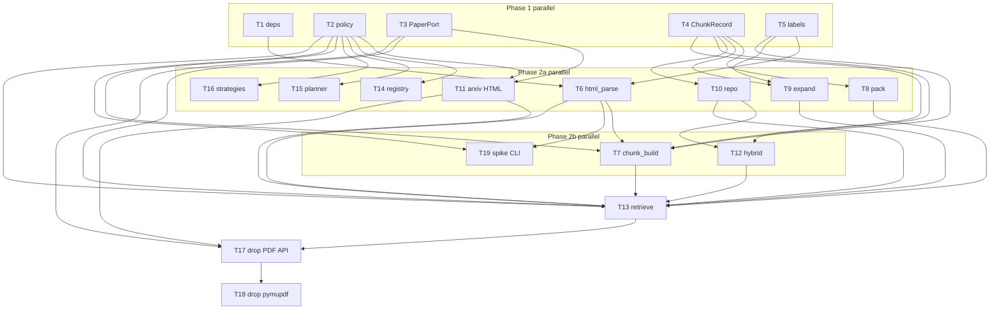

# Structured-Aware Chunking Tasks

**Design**: `.specs/features/structured-aware-chunking/design.md`  
**Spec**: `.specs/features/structured-aware-chunking/spec.md`  
**Status**: Execute complete (T1–T19, 2026-09-03). Independent Tests on `1706.03762` v7 passed 2026-09-03 (quick 014).

Automated tests (pytest, Testcontainers, e2e) are **out of scope**, same as v1, `orchestrator-eval-replan`, and `admission-retrieve-per-topic`. There is no `.specs/codebase/TESTING.md`. Done-when is implementation complete vs the approved design. Spec “Independent Test” lines (`1706.03762` v7 ingest/retrieve) passed 2026-09-03 (quick 014).

No new graph nodes, no new SSE event names, no `units` table, no ingest LLM, no figure assets, no PDF fallback. `EvidenceChunk` TypedDict / `Citation` stay excerpt-only.

`ChunkDraft` lives in `ports/chunks.py` (protocol layer). `ingest/chunk_build.py` imports it — ports must not import `ingest`.

---

## Execution Plan

### Phase 1: Foundation (all `[P]`)

```
T1 [P]  T2 [P]  T3 [P]  T4 [P]  T5 [P]
```

### Phase 2a: Isolated modules (all `[P]`, after Phase 1)

```
T1,T5 ──→ T6  html_parse.py
T4     ──→ T8  pack.py
T4,T5  ──→ T9  expand.py
T4     ──→ T10 repo/chunks.py
T2,T3  ──→ T11 adapters/arxiv.py
T2     ──→ T14 registry.py
T2     ──→ T15 planner.py
T2     ──→ T16 strategies.py
```

T6, T8, T9, T10, T11, T14, T15, T16 do **not** share files and do **not** depend on each other.

### Phase 2b: After 2a deps (all `[P]`)

```
T2,T4,T5,T6 ──→ T7  chunk_build.py
T4,T10      ──→ T12 adapters/hybrid.py
T2,T6       ──→ T19 scripts/arxiv_html_units.py
```

T7, T12, T19 do **not** share files and do **not** depend on each other.

### Phase 3: Retrieve integration (sequential)

```
T2, T3, T6, T7, T8, T9, T10, T11, T12 ──→ T13 retrieve.py
```

### Phase 4: Delete PDF path (sequential)

```
T3, T11, T13 ──→ T17 ──→ T18
```

---

## Task Breakdown

### T1: Add HTML parser dependencies [P]

**What**: Add direct deps `beautifulsoup4`, `lxml`, and `markdownify`. Do **not** remove `pymupdf` yet (T18).
**Where**: `pyproject.toml` (and lockfile)
**Depends on**: None
**Reuses**: existing `uv` lock workflow (orchestrator T1)
**Requirement**: PARSE-01, PARSE-02, PARSE-03

**Tools**: MCP NONE · Skill NONE

**Done when**:

- [x] All three packages listed under `[project].dependencies`
- [x] Lockfile updated (`uv lock` / `uv sync`)
- [x] `pymupdf` still present until T18

**Tests**: none
**Gate**: none

**Verify**: `uv sync` succeeds; `python -c "import bs4, lxml, markdownify"`

**Commit**: `chore(chunking): add beautifulsoup4, lxml, and markdownify`

---

### T2: Policy k=5, overfetch, HTML URL, preamble [P]

**What**: Set packed k to 5; add overfetch factor, `html_url`, and `PREAMBLE_SECTION`.
**Where**: `src/plan_based_researcher/policy.py`
**Depends on**: None
**Reuses**: existing `Policy` class, splitter 512/50/`cl100k_base`, hybrid weights, `HOLE_RULE`
**Requirement**: RETR-05, SPLIT-01, HTML-01

**Tools**: MCP NONE · Skill NONE

**Done when**:

- [x] `Policy.retrieve_k_per_paper == 5` (was 3)
- [x] `Policy.retrieve_overfetch_factor == 3`
- [x] `Policy.html_url(arxiv_id, version)` returns `https://arxiv.org/html/{arxiv_id}v{version}` with version already normalized (no extra `v`)
- [x] `Policy.PREAMBLE_SECTION == "Preamble"`
- [x] Splitter knobs, hybrid weights, `max_papers`, `HOLE_RULE` unchanged; `HOLE_RULE` still says “no usable paper” and does not say PDF

**Tests**: none
**Gate**: none

**Verify**: `python -c "from plan_based_researcher.policy import Policy; assert Policy.retrieve_k_per_paper==5; assert Policy.retrieve_overfetch_factor==3; assert Policy.html_url('1706.03762','7')=='https://arxiv.org/html/1706.03762v7'; assert Policy.PREAMBLE_SECTION=='Preamble'; assert 'PDF' not in Policy.HOLE_RULE"`

**Commit**: `feat(chunking): set per-paper k=5, overfetch, and HTML URL`

---

### T3: PaperPort HTML load result [P]

**What**: Add `HtmlLoadResult` and `load_html`; keep `load_pdf_text` until T17 so retrieve still type-checks.
**Where**: `src/plan_based_researcher/ports/papers.py` (export from `ports/__init__.py`)
**Depends on**: None
**Reuses**: existing `PaperHit`, `PaperPort.search`
**Requirement**: HTML-01, HTML-02, RETR-06

**Tools**: MCP NONE · Skill NONE

**Done when**:

- [x] `HtmlLoadResult` is frozen/slots with `status: Literal["ok","missing","empty","not_html"]`, `body: bytes = b""`, `content_type: str = ""`
- [x] `PaperPort.load_html(arxiv_id, version) -> HtmlLoadResult` is on the protocol
- [x] `load_pdf_text` still on the protocol (deleted in T17)
- [x] `search` / `PaperHit` unchanged

**Tests**: none
**Gate**: none

**Verify**: `python -c "from plan_based_researcher.ports.papers import HtmlLoadResult, PaperPort; assert HtmlLoadResult(status='ok').body==b''"`

**Commit**: `feat(chunking): add PaperPort.load_html`

---

### T4: ChunkDraft, ChunkRecord, repository protocol [P]

**What**: Add ingest/retrieve row types and the new repository methods; replace `list[str]` upsert and `EvidenceChunk` dataclass returns.
**Where**: `src/plan_based_researcher/ports/chunks.py`
**Depends on**: None
**Reuses**: existing `PaperRecord`; do **not** change `graph/state.py` `EvidenceChunk` TypedDict
**Requirement**: STORE-01, HTML-02, EMB-02

**Tools**: MCP NONE · Skill NONE

**Done when**:

- [x] `ChunkDraft`: `kind` (`prose`\|`table`\|`equation`), `unit_id: str | None`, `embedding_text`, `content`, `metadata: dict`
- [x] `ChunkRecord`: paper fields + `kind`, `unit_id`, `content`, `metadata` — **no** `excerpt`, **no** `embedding_text` (retrieve does not SELECT it)
- [x] `paper_has_chunks(arxiv_id, version) -> bool` on the protocol
- [x] `upsert_paper_with_chunks(paper, drafts: list[ChunkDraft], embeddings)` — the `list[str]` overload is gone
- [x] `similarity_search` / `list_chunks` return `list[ChunkRecord]`
- [x] Ports dataclass `EvidenceChunk` is **deleted** (Writer still uses the graph TypedDict)

**Tests**: none
**Gate**: none

**Verify**: `python -c "from plan_based_researcher.ports.chunks import ChunkDraft, ChunkRecord; import plan_based_researcher.ports.chunks as m; assert not hasattr(m,'EvidenceChunk')"`; `graph/state.py` still defines TypedDict `EvidenceChunk` with `excerpt` and without `kind`

**Commit**: `feat(chunking): add ChunkDraft and ChunkRecord to chunk port`

---

### T5: Equation and table labels [P]

**What**: One module for ingest `embedding_text` labels and retrieve later-occurrence labels.
**Where**: `src/plan_based_researcher/ingest/labels.py` (create `ingest/__init__.py`)
**Depends on**: None
**Reuses**: none
**Requirement**: EMB-02, RETR-07

**Tools**: MCP NONE · Skill NONE

**Done when**:

- [x] `equation_label(tag: str) -> str` → `Equation ({tag})` if tag else `Equation`
- [x] `table_label(number: str, caption: str) -> str`: empty caption → `Table {number}`; caption already starts with `Table` (case-insensitive) → caption as the whole label; else `Table {number}: {caption}`
- [x] `table_number_for(*, tag: str, caption: str, index_among_tables: int) -> str`: `tag` or leading `Table <token>` in caption if present, else 1-based `index_among_tables` as string
- [x] No import of `html_parse` / `ChunkRecord` (string-only API)

**Tests**: none
**Gate**: none

**Verify**: `python -c "from plan_based_researcher.ingest.labels import equation_label, table_label, table_number_for; assert equation_label('1')=='Equation (1)'; assert table_label('1','')=='Table 1'; assert table_label('1','Table 1: BLEU')=='Table 1: BLEU'; assert table_label('2','Results')=='Table 2: Results'"`

**Commit**: `feat(chunking): add equation and table label helpers`

---

### T6: In-memory arXiv HTML parser [P]

**What**: Promote the spike parser to a library function: bytes → `ParsedPaper` (units + residual markdown). No disk, no assets, no `[FIGURE:]`.
**Where**: `src/plan_based_researcher/ingest/html_parse.py`
**Depends on**: T1, T5
**Reuses**: spike helpers in `scripts/arxiv_html_units.py`: `_ARTICLE_ROOT`, `_is_layout_only_table`, `_equation_tex`, `_rewrite_inline_math`, `_table_to_markdown`, `_drop_bibliography`, `_drop_frontmatter`; `labels.table_number_for`
**Requirement**: PARSE-01, PARSE-02, PARSE-03, HTML-01

**Tools**: MCP `user-context7` (markdownify / BeautifulSoup if API is unclear) · Skill NONE

**Done when**:

- [x] `ParsedUnit`: `kind` `table`\|`equation`, `html_id`, `caption`, `table_number`, `body`
- [x] `ParsedPaper`: `usable`, `prose_markdown`, `units`, `reason`
- [x] `parse_arxiv_html(html_bytes: bytes) -> ParsedPaper` is sync; no `Path`, no `_tmp_arxiv_html`, no HTTP
- [x] Missing article root → `usable=False`; stripped prose empty **and** `units` empty → `usable=False`
- [x] Layout-only `ltx_tabular` decomposed; inline math rewritten to `$tex$`; bibliography/frontmatter dropped
- [x] `figure.ltx_table` processed **first**: one `table` unit; caption from the figure; body from inner tabular; `html_id` from figure id (fallback inner table id, then generated `unit-0001`); whole figure replaced so the inner table is not extracted again
- [x] `figure.ltx_figure` replaced with caption plain text; no unit, no `[FIGURE:]`
- [x] Remaining `table` nodes: equation classes / `ltx_eqn_table` → `equation`; else `table`
- [x] Generated `html_id` `unit-NNNN` when element has no `id`; placeholders `[TABLE:{id}]` / `[EQUATION:{id}]` in prose
- [x] `scripts/arxiv_html_units.py` is **not** imported (T19 wraps this module later)

**Tests**: none
**Gate**: none

**Verify**: `python -c "from plan_based_researcher.ingest.html_parse import parse_arxiv_html, ParsedPaper"` plus a tiny in-process HTML snippet: article root present; one `ltx_table` figure → one table unit; one `ltx_figure` → caption in prose and no figure unit; layout-only table absent from `units`.

**Commit**: `feat(chunking): parse arXiv HTML units in memory`

---

### T7: Heading split then 512/50 chunk drafts [P]

**What**: `ParsedPaper` → ordered `ChunkDraft` rows (no IO). Atomics never split.
**Where**: `src/plan_based_researcher/ingest/chunk_build.py`
**Depends on**: T2, T4, T5, T6
**Reuses**: `MarkdownHeaderTextSplitter` (`headers_to_split_on` ATX `#`…`######`, `strip_headers=True`); existing `RecursiveCharacterTextSplitter.from_tiktoken_encoder` factory; `labels.py`; `Policy.chunk_size` / `chunk_overlap` / `chunk_encoding` / `PREAMBLE_SECTION`
**Requirement**: SPLIT-01, STORE-01, EMB-02

**Tools**: MCP `user-context7` (`MarkdownHeaderTextSplitter`) · Skill NONE

**Done when**:

- [x] `build_chunk_drafts(parsed: ParsedPaper) -> list[ChunkDraft]`
- [x] Prose: heading-split; nested header path joined with ` > ` → `metadata.section`; no headers → `PREAMBLE_SECTION`; 512/50 **inside that section only** if tiktoken length (`disallowed_special=()`) > `chunk_size`
- [x] Prose `content` keeps placeholders; `embedding_text` replaces `[TABLE:id]` / `[EQUATION:id]` via `labels.py` (unknown id → leave placeholder); `unit_id` is `None`; `caption` is `""`; `metadata.unit_ids` = ordered unique ids from placeholders in `content`
- [x] Atomic rows **never** split (even if body >512): `content` = caption/tag line + full `body`; `unit_id = html_id`; `unit_ids = [html_id]`
- [x] Table `embedding_text` = caption + markdown header row + first two data rows (skip `|---|` separator); unparsable table → caption + first three non-empty body lines
- [x] Equation `embedding_text` = containing subsection path (section whose prose contains `[EQUATION:{id}]`, else `PREAMBLE_SECTION`) + tiktoken window `min(section_len, 200)` **centered on the placeholder** + tag + TeX
- [x] Order: prose drafts in heading/split order, then atomic units in parse order
- [x] Strip U+0000 from every string field before return
- [x] No LLM calls

**Tests**: none
**Gate**: none

**Verify**: `python -c "from plan_based_researcher.ingest.chunk_build import build_chunk_drafts"`; a `ParsedPaper` with one long section yields multiple `prose` drafts and one unsplit `table`/`equation` draft; prose `content` still has `[EQUATION:…]` while `embedding_text` has `Equation (`.

**Commit**: `feat(chunking): build section-aware chunk drafts`

---

### T8: Pack unique hits to k [P]

**What**: Overfetched RRF list → at most `k` unique hits (drop later atomics whose `unit_id` is already covered).
**Where**: `src/plan_based_researcher/ingest/pack.py`
**Depends on**: T4
**Reuses**: none
**Requirement**: RETR-08

**Tools**: MCP NONE · Skill NONE

**Done when**:

- [x] `pack_hits(ranked: list[ChunkRecord], k: int) -> list[ChunkRecord]`
- [x] Walk `ranked` in order; stop when `len(kept)==k` or list exhausted
- [x] Atomic (`table`\|`equation`): skip if `unit_id` in `covered`; else keep and add `unit_id`
- [x] Prose: always keep (until `k`); add every placeholder id in `content` via regex `\[(TABLE|EQUATION):([^\]]+)\]` (trust `content`, not `metadata.unit_ids`)
- [x] Two overlapping prose hits both stay; later atomic of a covered `unit_id` is dropped (AC3)

**Tests**: none
**Gate**: none

**Verify**: `python -c` with three fake `ChunkRecord`s: prose covering `E1`, then atomic `E1`, then another prose → packed `k=2` keeps both prose and drops the atomic.

**Commit**: `feat(chunking): pack unique unit_id hits`

---

### T9: Expand placeholders into excerpts [P]

**What**: Packed hits → Writer excerpt strings (full body once per `unit_id`, then label).
**Where**: `src/plan_based_researcher/ingest/expand.py`
**Depends on**: T4, T5
**Reuses**: `ingest/labels.py`
**Requirement**: RETR-07, RETR-09

**Tools**: MCP NONE · Skill NONE

**Done when**:

- [x] `expand_hits(packed: list[ChunkRecord], corpus: list[ChunkRecord]) -> list[str]` (same length as `packed`)
- [x] Index atomic rows in `corpus` by `unit_id` (caller already scoped to one paper)
- [x] Atomic hit: excerpt = `metadata.section` + newline + `content` if section else `content`; add `unit_id` to `shown`
- [x] Prose hit: replace each placeholder: if `unit_id` not in `shown` and unit exists, splice that unit’s full `content` and add to `shown`; else splice the **label**; missing unit → label if caption/tag known else leave placeholder
- [x] Does not add `[n]` slots; does not truncate table/equation bodies

**Tests**: none
**Gate**: none

**Verify**: `python -c` with packed `[prose, prose]` sharing `[EQUATION:E1]`: first excerpt contains the TeX body, second contains `Equation (` and not a second full body.

**Commit**: `feat(chunking): expand unit placeholders in excerpts`

---

### T10: HTML chunks schema and repository [P]

**What**: Recreate `chunks` for dual text + kind; cache predicate `paper_has_chunks`; SELECT/upsert new columns. One-shot wipe when `kind` is missing.
**Where**: `src/plan_based_researcher/repo/chunks.py`
**Depends on**: T4
**Reuses**: existing `ensure_schema` lifespan call, `dict_row` **column names** (never `row[0]`), delete-then-insert per paper, `PaperRecord`
**Requirement**: STORE-01, HTML-02, MIG-01

**Tools**: MCP NONE · Skill NONE

**Done when**:

- [x] `CREATE TABLE chunks` matches design: `kind` CHECK (`prose`\|`table`\|`equation`), `unit_id`, `embedding_text`, `content`, `embedding vector(1536)`, `metadata JSONB`, UNIQUE `(arxiv_id, version, chunk_index)`, FK to `papers`
- [x] Partial unique index `chunks_atomic_identity` on `(arxiv_id, version, unit_id) WHERE unit_id IS NOT NULL`
- [x] `ensure_schema`: if `chunks` exists and has **no** `kind` column → `DROP TABLE chunks;` then `DELETE FROM papers;` then CREATE; if `kind` already exists → `CREATE IF NOT EXISTS` only; **never** DROP on every API start; do not touch LangGraph checkpoint tables
- [x] `paper_has_chunks`: `SELECT EXISTS (...)` on `chunks` for that key
- [x] `upsert_paper_with_chunks` takes `list[ChunkDraft]`; embeds already computed; Python-enforces `metadata` keys exactly `{section, caption, unit_ids}`; `chunk_index` = enumerate order
- [x] `similarity_search` / `list_chunks` SELECT `kind`, `unit_id`, `content`, `metadata` (not `embedding_text`); map with `dict_row` names to `ChunkRecord`
- [x] Ports dataclass `EvidenceChunk` is not used

**Tests**: none
**Gate**: none

**Verify**: Grep `repo/chunks.py` for `kind`, `embedding_text`, `paper_has_chunks`, `chunks_atomic_identity`; grep `ensure_schema` / wipe path for `kind` column check; grep confirms no `row[0]`. Import `PgChunkRepository` succeeds.

**Commit**: `feat(chunking): persist kind, unit_id, and dual text columns`

---

### T11: Arxiv adapter HTML GET [P]

**What**: Implement `load_html` off the event loop under the existing request lock. Keep `load_pdf_text` until T17.
**Where**: `src/plan_based_researcher/adapters/arxiv.py`
**Depends on**: T2, T3
**Reuses**: `_REQUEST_LOCK`, `_CLIENT` / `search`, `httpx` (already direct), `Policy.html_url`, `asyncio.to_thread`
**Requirement**: HTML-01, RETR-06, PAT-03

**Tools**: MCP NONE · Skill NONE

**Done when**:

- [x] `load_html` uses `asyncio.to_thread` + `_REQUEST_LOCK`; `httpx.get` with `follow_redirects=True`, 30s timeout, User-Agent identifying this app (not a crawler)
- [x] HTTP 404/403 → `missing`; empty body → `empty`; `Content-Type` `application/pdf` or body starting with `%PDF` → `not_html`; HTTP 200 with a body → `ok` (article-root is the parser’s job)
- [x] Timeouts / DNS / `httpx` transport errors **raise** (same as today’s PDF infra failures)
- [x] `search` unchanged; `load_pdf_text` still present until T17

**Tests**: none
**Gate**: none

**Verify**: `python -c "from plan_based_researcher.adapters.arxiv import ArxivPaperAdapter; assert hasattr(ArxivPaperAdapter,'load_html')"`; grep `load_html` path has no `ArxivLoader`.

**Commit**: `feat(chunking): fetch arXiv HTML in the paper adapter`

---

### T12: Hybrid returns ChunkRecords and BM25s content [P]

**What**: Per-paper EnsembleRetriever over mixed rows; vector vs lexical use different text; return ranked + corpus (no pack/expand).
**Where**: `src/plan_based_researcher/adapters/hybrid.py`
**Depends on**: T4, T10
**Reuses**: `_VectorRetriever`, `EnsembleRetriever` RRF weights from Policy, `id_key="chunk_id"`
**Requirement**: RETR-08

**Tools**: MCP NONE · Skill NONE

**Done when**:

- [x] `HybridResult(ranked: list[ChunkRecord], corpus: list[ChunkRecord])`
- [x] `HybridRetrievePort.retrieve(...) -> HybridResult` (`k` is per-leg **overfetch**, not packed 5)
- [x] BM25 `Document.page_content = content`; metadata carries `chunk_id`, `kind`, `unit_id`, `metadata`, paper fields
- [x] Vector leg still SQL `embedding <=> query LIMIT k` (embeddings of `embedding_text`)
- [x] Empty keys or empty corpus → `HybridResult([], [])`
- [x] Does **not** pack, expand, or slice to `retrieve_k_per_paper`

**Tests**: none
**Gate**: none

**Verify**: Grep `hybrid.py` for `page_content=chunk.content` (or equivalent); `retrieve` return annotation is `HybridResult`; no `pack_hits` / `expand_hits` import.

**Commit**: `feat(chunking): hybrid ranks ChunkRecords with BM25 on content`

---

### T13: Retrieve HTML walk, pack, and expand

**What**: Cache = `paper_has_chunks`; miss loads HTML → parse → drafts → embed `embedding_text` → upsert; per paper overfetch, pack to 5, expand excerpts, continuous `[n]`.
**Where**: `src/plan_based_researcher/agents/retrieve.py`
**Depends on**: T2, T3, T6, T7, T8, T9, T10, T11, T12
**Reuses**: formulate, `_paper_ref_*`, `merge_papers`, `retrieve_ingest` shape, skip-walk on T3 retry / follow-up, T1 empty merged
**Requirement**: HTML-01, HTML-02, RETR-05, RETR-06, RETR-07, RETR-08, RETR-09

**Tools**: MCP NONE · Skill NONE

**Done when**:

- [x] Attempt 1 with passed searches: for each `ranked_keys` entry, skip if already in `usable`; **cache hit** iff `paper_has_chunks` (not `get_paper` alone); else `load_html` → `parse_arxiv_html` → `build_chunk_drafts` in `asyncio.to_thread` → `embed_documents(embedding_text)` → `upsert_paper_with_chunks`
- [x] `ok` with unusable parse, zero drafts, or non-`ok` status → next key, same execute; first success admits that paper; exhausted ranking → gap (T2a); **no** `load_pdf_text` / splitter in this module
- [x] T3 retry / no passed searches: skip walk; hybrid existing `papers` (unchanged)
- [x] T1 `merged` empty: no formulate/hybrid (unchanged)
- [x] Per merged paper: `hybrid.retrieve(query, [key], k=Policy.retrieve_overfetch_factor * Policy.retrieve_k_per_paper)`; `pack_hits(ranked, k=retrieve_k_per_paper)`; `expand_hits(packed, corpus)`; omit paper if packed empty; emit graph `EvidenceChunk` dicts with **expanded** `excerpt` and continuous `[n]`; do **not** `[:k]` before pack
- [x] Does not import `scripts.arxiv_html_units`; does not write `_tmp_arxiv_html`
- [x] Graph TypedDict / Citation fields unchanged (no `kind` / `section` on `evidence_chunks`)

**Tests**: none
**Gate**: none

**Verify**: Grep `retrieve.py` for `load_html`, `paper_has_chunks`, `pack_hits`, `expand_hits`, `retrieve_overfetch_factor`; grep finds no `load_pdf_text`, no `ArxivLoader`, no `RecursiveCharacterTextSplitter`; no `from scripts`.

**Commit**: `feat(chunking): retrieve HTML ingest with packed expanded excerpts`

---

### T14: Retrieve abilities say HTML and k=5 [P]

**What**: Registry abilities: walk ingest one usable **HTML** paper; hybrid **k=5**; search still titles+abstracts (do not fetch HTML).
**Where**: `src/plan_based_researcher/agents/registry.py`
**Depends on**: T2
**Reuses**: `REGISTRY["retrieve"].tools == ("arxiv_load",)` — do not add a tool key
**Requirement**: PAT-03, RETR-05, HTML-01

**Tools**: MCP NONE · Skill NONE

**Done when**:

- [x] Retrieve abilities: walk `ranked_keys`, ingest one usable HTML paper per ranking, hybrid k=5 per paper; formulates English query; does not search arXiv
- [x] Search abilities: do not fetch HTML (still titles+abstracts only)
- [x] Tool name remains `arxiv_load`; factory/registry grow no new tool key

**Tests**: none
**Gate**: none

**Verify**: Grep `registry.py` retrieve abilities for `HTML` and `k=5`; grep finds no `PDF` in retrieve abilities; `arxiv_load` still the retrieve tool.

**Commit**: `feat(chunking): describe HTML ingest in retrieve abilities`

---

### T15: Planner T1/T2a wording is HTML [P]

**What**: Replan constraints say HTML ingest failure, not PDF.
**Where**: `src/plan_based_researcher/agents/planner.py`
**Depends on**: T2
**Reuses**: existing T1/T2a/T3 branches in `replan_remaining`; LOOP-05 / WRITE-02 routing **unchanged**
**Requirement**: RETR-06 (amended RETR-03 wording)

**Tools**: MCP NONE · Skill NONE

**Done when**:

- [x] T2a constraint: “no usable paper” / paper HTML — does not say PDF
- [x] T1 constraint: failure is HTML ingest, not PDF
- [x] No new replan enum; `graph/nodes/replan.py` untouched

**Tests**: none
**Gate**: none

**Verify**: Grep `planner.py` for `PDF` is gone (or only in comments if any remain unrelated); T1/T2a strings mention HTML or “usable paper”.

**Commit**: `feat(chunking): planner T1/T2a constraints say HTML`

---

### T16: Retrieve eval copy says HTML [P]

**What**: T2a feedback and T3 checklist say HTML walk, not PDF. Routing unchanged.
**Where**: `src/plan_based_researcher/eval/strategies.py` (`RetrieveEvalStrategy` copy only)
**Depends on**: T2
**Reuses**: existing T1/T2a short-circuit and T3 judge; do not change `EvalResult` statuses
**Requirement**: RETR-06 (amended RETR-03 / RETR-04 copy)

**Tools**: MCP NONE · Skill NONE

**Done when**:

- [x] `_retrieve_checklist` T3 sentence: not a new **HTML** walk (not PDF)
- [x] T2a feedback: ingested no usable HTML (not PDF)
- [x] T1/T2a still skip the mini-judge; T3 routing unchanged

**Tests**: none
**Gate**: none

**Verify**: Grep `strategies.py` retrieve checklist / T2a feedback for `PDF` is gone; `case == "t1"` / `"t2a"` branches unchanged.

**Commit**: `feat(chunking): retrieve eval copy says HTML ingest`

---

### T17: Delete PDF load from port and adapter

**What**: Remove `load_pdf_text` / `ArxivLoader` from the paper port and adapter now that retrieve uses `load_html`.
**Where**: `src/plan_based_researcher/ports/papers.py`, `src/plan_based_researcher/adapters/arxiv.py`
**Depends on**: T3, T11, T13
**Reuses**: T11 `load_html`; NUL strip already in chunk_build (T7)
**Requirement**: HTML-01, MIG-01

**Tools**: MCP NONE · Skill NONE

**Done when**:

- [x] `PaperPort` has no `load_pdf_text`
- [x] Adapter has no `ArxivLoader`, `_load_pdf_text_sync`, `_sanitize_pdf_text`, `load_pdf_text`
- [x] `search` + `load_html` remain; `_REQUEST_LOCK` still serializes both

**Tests**: none
**Gate**: none

**Verify**: `python -c "from plan_based_researcher.ports.papers import PaperPort; assert not hasattr(PaperPort,'load_pdf_text')"`; grep `src/plan_based_researcher` for `ArxivLoader` and `load_pdf_text` is empty.

**Commit**: `feat(chunking): remove PDF load from paper port`

---

### T18: Drop PyMuPDF dependency

**What**: Remove `pymupdf` now that `ArxivLoader` is gone.
**Where**: `pyproject.toml` (and lockfile)
**Depends on**: T17
**Reuses**: T1 lock workflow
**Requirement**: MIG-01

**Tools**: MCP NONE · Skill NONE

**Done when**:

- [x] `pymupdf` absent from `[project].dependencies`
- [x] Lockfile updated (`uv lock` / `uv sync`)
- [x] Parse deps from T1 still present

**Tests**: none
**Gate**: none

**Verify**: `uv sync` succeeds; `python -c "import pymupdf"` fails; `import bs4` still works.

**Commit**: `chore(chunking): drop pymupdf after HTML ingest`

---

### T19: Spike script becomes parse CLI [P]

**What**: Debug CLI over `parse_arxiv_html`. MAY write sidecars. MUST NOT be the production parser.
**Where**: `scripts/arxiv_html_units.py`
**Depends on**: T2, T6
**Reuses**: `parse_arxiv_html`, `Policy.html_url`; CLI may still fetch HTML and write `_tmp_arxiv_html`
**Requirement**: PARSE-03

**Tools**: MCP NONE · Skill NONE

**Done when**:

- [x] Script calls `parse_arxiv_html` (no duplicated extract/figure-download library path)
- [x] Production modules (`agents/retrieve.py`, `ingest/html_parse.py`) do not import this script
- [x] CLI MAY write sidecars; retrieve path still must not

**Tests**: none
**Gate**: none

**Verify**: Grep `scripts/arxiv_html_units.py` for `parse_arxiv_html`; grep `src/plan_based_researcher` for `arxiv_html_units` is empty.

**Commit**: `refactor(chunking): wrap HTML parser in the debug CLI`

---

## Parallel Execution Map

```
Phase 1 (all [P]):
  T1  T2  T3  T4  T5

Phase 2a (all [P], different files):
  T1,T5 → T6  html_parse.py
  T4    → T8  pack.py
  T4,T5 → T9  expand.py
  T4    → T10 repo/chunks.py
  T2,T3 → T11 adapters/arxiv.py
  T2    → T14 registry.py
  T2    → T15 planner.py
  T2    → T16 strategies.py

Phase 2b (all [P], after 2a):
  T2,T4,T5,T6 → T7  chunk_build.py
  T4,T10      → T12 hybrid.py
  T2,T6       → T19 scripts/arxiv_html_units.py

Phase 3:
  T2,T3,T6,T7,T8,T9,T10,T11,T12 → T13 retrieve.py

Phase 4 (sequential):
  T3,T11,T13 → T17 → T18
```



**File serialization (do not parallelize):**

- `ports/papers.py`: T3 → T17
- `adapters/arxiv.py`: T11 → T17
- `pyproject.toml`: T1 → T18
- `agents/retrieve.py`: T13 only

**Parallelism constraint:** `[P]` tasks in the same phase do not share a file and do not depend on each other.

**How parallel execution works:** `[P]` tasks in a phase run via sub-agents concurrently. Sequential tasks (T13, T17, T18) run one sub-agent at a time. Orchestrator updates this file’s checkboxes after each task.

---

## Requirement Traceability (tasks)

| ID | Tasks |
| -- | ----- |
| HTML-01 | T2, T3, T6, T11, T13, T14, T17 |
| HTML-02 | T3, T4, T10, T13 |
| PARSE-01 | T1, T6 |
| PARSE-02 | T1, T6 |
| PARSE-03 | T1, T6, T19 |
| SPLIT-01 | T2, T7 |
| STORE-01 | T4, T7, T10 |
| EMB-02 | T4, T5, T7 |
| RETR-05 | T2, T13, T14 |
| RETR-06 | T3, T11, T13, T15, T16 |
| RETR-07 | T5, T9, T13 |
| RETR-08 | T8, T12, T13 |
| RETR-09 | T9, T13 |
| MIG-01 | T10, T17, T18 |

**Coverage:** 14/14 spec IDs have ≥1 task. 0 unmapped tasks without a requirement.

---

## Task Granularity Check

| Task | Scope | Status |
| ---- | ----- | ------ |
| T1 | 1 file (`pyproject.toml` add deps) | ✅ Granular |
| T2 | 1 class (`policy.py`) | ✅ Granular |
| T3 | 1 port module (add HTML types) | ✅ Granular |
| T4 | 1 port module (chunk types) | ✅ Granular |
| T5 | 1 new module (`labels.py`) | ✅ Granular |
| T6 | 1 new parser module | ✅ Granular |
| T7 | 1 new builder module | ✅ Granular |
| T8 | 1 function (`pack_hits`) | ✅ Granular |
| T9 | 1 function (`expand_hits`) | ✅ Granular |
| T10 | 1 repository module | ✅ Granular |
| T11 | 1 adapter method (`load_html`) | ✅ Granular |
| T12 | 1 adapter module (return type + BM25 field) | ✅ Granular |
| T13 | 1 runner (`retrieve.py`; walk+pack+expand cohesive, same as admission T9) | ✅ Granular |
| T14 | 1 registry abilities text | ✅ Granular |
| T15 | 1 planner copy site | ✅ Granular |
| T16 | RetrieveEvalStrategy copy only | ✅ Granular |
| T17 | Port + adapter PDF deletion (one concept, two files that must stay in sync) | ⚠️ Cohesive |
| T18 | 1 file (`pyproject.toml` drop pymupdf) | ✅ Granular |
| T19 | 1 script wrap | ✅ Granular |

T17 is two files on purpose: deleting `load_pdf_text` from the protocol without the adapter (or the reverse) leaves a broken `PaperPort`. T13 is one runner on purpose: hybrid already returns `HybridResult` after T12, so walk and pack/expand cannot compile as separate retrieve.py slices.

---

## Diagram-Definition Cross-Check

| Task | Depends On (body) | Diagram shows | Status |
| ---- | ----------------- | ------------- | ------ |
| T1 | None | Phase 1, no inbound | ✅ Match |
| T2 | None | Phase 1, no inbound | ✅ Match |
| T3 | None | Phase 1, no inbound | ✅ Match |
| T4 | None | Phase 1, no inbound | ✅ Match |
| T5 | None | Phase 1, no inbound | ✅ Match |
| T6 | T1, T5 | T1→T6, T5→T6 | ✅ Match |
| T7 | T2, T4, T5, T6 | T2→T7, T4→T7, T5→T7, T6→T7 | ✅ Match |
| T8 | T4 | T4→T8 | ✅ Match |
| T9 | T4, T5 | T4→T9, T5→T9 | ✅ Match |
| T10 | T4 | T4→T10 | ✅ Match |
| T11 | T2, T3 | T2→T11, T3→T11 | ✅ Match |
| T12 | T4, T10 | T4→T12, T10→T12 | ✅ Match |
| T13 | T2, T3, T6, T7, T8, T9, T10, T11, T12 | those nine arrows into T13 | ✅ Match |
| T14 | T2 | T2→T14 | ✅ Match |
| T15 | T2 | T2→T15 | ✅ Match |
| T16 | T2 | T2→T16 | ✅ Match |
| T17 | T3, T11, T13 | T3→T17, T11→T17, T13→T17 | ✅ Match |
| T18 | T17 | T17→T18 | ✅ Match |
| T19 | T2, T6 | T2→T19, T6→T19 | ✅ Match |

Phase-1 `[P]` tasks T1–T5 have no inter-deps. Phase-2a `[P]` tasks T6, T8, T9, T10, T11, T14, T15, T16 do not depend on each other. Phase-2b `[P]` tasks T7, T12, T19 do not depend on each other. T13 / T17 / T18 are sequential.

---

## Test Co-location Validation

`.specs/codebase/TESTING.md` does not exist. Project decision (v1 tasks + STATE): automated tests deferred.

| Task | Code layer | Matrix requires | Task says | Status |
| ---- | ---------- | --------------- | --------- | ------ |
| T1–T19 | policy / ports / ingest / repo / adapters / agents / eval / scripts | none (no matrix; deferred) | none | ✅ OK |

No task uses “tested in another task” as a deferral of a required type. Spec independent tests (`1706.03762` v7) passed 2026-09-03 (quick 014).

---

## Confirm before Execute

Executed 2026-09-03. Spec + design + this task list were treated as approved when Execute was requested. Independent Tests on `1706.03762` v7 passed 2026-09-03 (quick 014).
