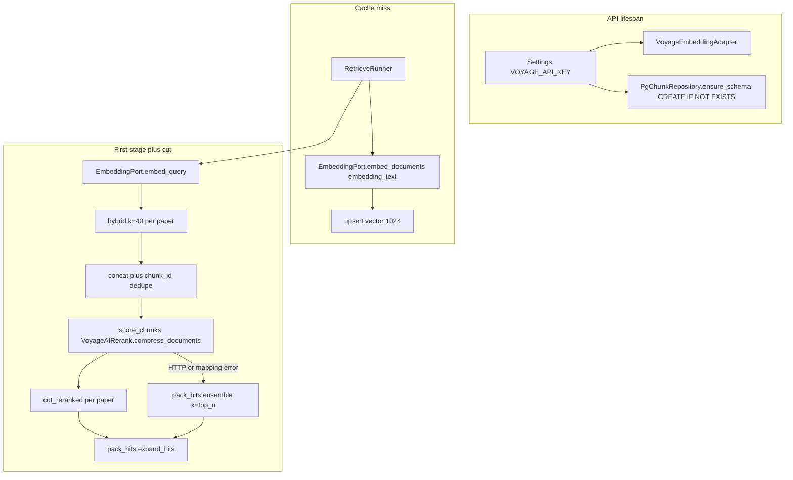
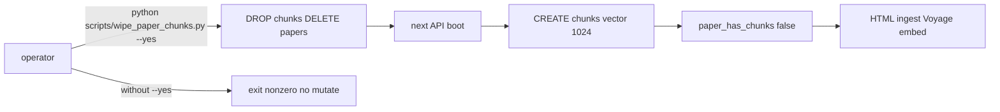
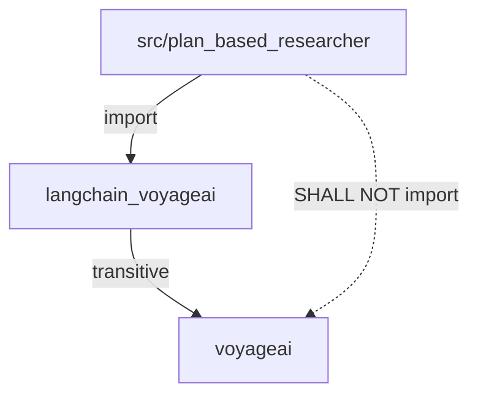

# Voyage 4 Large Embeddings Design

**Spec**: `.specs/features/voyage-4-large-embeddings/spec.md`  
**Parent designs**: `.specs/features/retrieve-cross-encoder-rerank/design.md` (score/cut/pack; client lock superseded) · `.specs/features/structured-aware-chunking/design.md` (`embedding_text` ingest, CREATE IF NOT EXISTS)  
**Architecture constraints**: `.specs/features/arxiv-grounded-research/context.md` (PAT-01–PAT-12 still apply)  
**Status**: Validated T1–T8 2026-09-08 (code; unittest discover 57/57). Live Independent Tests remain UAT. Not committed.

This feature does **not** add graph nodes, SSE event names, Citation fields, a second corpus, or a compressor around hybrid. LangGraph stays `gate → planner → dispatch → search|execute → evaluate → replan|finalize`. What changes is **who embeds** (`voyage-4-large` at 1024-d behind the existing `EmbeddingPort`), **chunk DDL width**, **how the operator clears a leftover 1536 table**, and **which LangChain class** `score_chunks` calls (`VoyageAIRerank.compress_documents` instead of `voyageai.Client` in app code).

Locked in specify (not reopened here): model id `voyage-4-large`; width **1024** with **no** `output_dimension`; `input_type` document vs query; `VoyageAIRerank` + `rerank-3`; score the **full** unique list (not `Policy.retrieve_rerank_top_n` as Voyage `top_k`); no `ContextualCompressionRetriever`; `ensure_schema` CREATE-only; wipe is `scripts/wipe_paper_chunks.py --yes`; no app `import voyageai`; shared `VOYAGE_API_KEY`; OpenAI remains LLM-only; hybrid weights, first-stage `k=40`, `cut_reranked`, pack/expand, splitter, HTML parse unchanged.

---

## Architecture Overview

Retrieve ingest still embeds each draft’s `embedding_text` through `EmbeddingPort.embed_documents` and persists with `upsert_paper_with_chunks`. Hybrid still calls `EmbeddingPort.embed_query` on the formulated query. The production adapter wraps `langchain_voyageai.VoyageAIEmbeddings` (`model="voyage-4-large"`, omit `output_dimension`) instead of `OpenAIEmbeddings`. pgvector `chunks.embedding` is `vector(Policy.embedding_dimensions)` with that constant **1024**. Boot never drops corpus tables; an operator script drops `chunks` and deletes `papers` only with `--yes`. After that, the next `ensure_schema` creates an empty 1024 table and retrieve reingests HTML on cache miss.

Rerank stays one pass per execute on the unique first-stage list, then per-paper `cut_reranked` → `pack_hits` / `expand_hits`. `score_chunks` constructs `VoyageAIRerank` and calls **`compress_documents`** (not `ContextualCompressionRetriever`). Scores are mapped back to **input order** via `input_index` on the Documents, then the existing mapper. Runtime failure still packs ensemble order with `k=top_n`.







**Research notes (verification chain):**

- **Codebase:** Lifespan constructs `OpenAIEmbeddingAdapter(api_key=settings.openai_api_key)` and passes it into `HybridRetrieveAdapter` / `AgentFactory`. `OpenAIEmbeddingAdapter` wraps `langchain_openai.OpenAIEmbeddings(model="text-embedding-3-small")` and delegates `aembed_documents` / `aembed_query`. `RetrieveRunner` already `embed_documents([draft.embedding_text, …])` on HTML miss and `asyncio.to_thread(score_chunks, unique, rerank_query, api_key=self._voyage_api_key)`. `score_chunks` currently builds `voyageai.Client(..., timeout=30, max_retries=0).rerank(..., truncation=True)` with **no** `top_k`. `ensure_schema` on **HEAD** still `DROP TABLE chunks` + `DELETE FROM papers` when `kind` is missing; `_CHUNKS_SQL` is `vector(1536)`. Working tree already started CREATE-only + `Policy.embedding_dimensions=1024` and an untracked wipe script — Execute must match **this** design, not assume WIP is complete. `test_cut_reranked.py` is **absent** on disk (same class of gap as the SSE unittest lesson). No `.specs/codebase/CONCERNS.md`. Fragile spots unchanged: leftover `vector(1536)` vs `CREATE IF NOT EXISTS`, `dict_row`, Windows asyncio policy for scripts, `ChatOpenAI` `api_key`.
- **Project docs:** AD-021 / spec VOY-01–08. PAT-08: embeddings stay behind `EmbeddingPort`; Voyage HTTP for rerank stays in `ingest/rerank.py` (no new port). PAT-09: one `chunks` table, RAG scoped to selected papers. PAT-10: `embedding_dimensions` is a named Policy constant used by DDL. PAT-12: same required `Settings.voyage_api_key` for embed + rerank; no Voyage ping in lifespan. Structured-aware **kind wipe** is superseded (spec). Cut knobs (`retrieve_rerank_top_n` / margin / floor) are **not** this feature — do not “fix” them here.
- **Voyage embeddings (docs.voyageai.com, 2026-09-08):** `voyage-4-large` default width **1024** (also 256/512/2048 via `output_dimension`). `input_type` `query` / `document` prepends retrieval prompts; `None` is worse for RAG. Truncation defaults **True**. Float vectors (not int8/binary).
- **langchain-voyageai 0.4.1 (PyPI wheel source, inspected 2026-09-08):**
  - `VoyageAIEmbeddings`: required `model`; `output_dimension` default `None` (omit → API default 1024); `truncation=True`; `api_key` alias of `voyage_api_key` from `VOYAGE_API_KEY`. `embed_documents` / `aembed_documents` call the regular embed API with **`input_type="document"`**. `embed_query` / `aembed_query` use **`"query"`**. Async client is `voyageai.client_async.AsyncClient`. Do **not** use `voyage-context-4` (different API path).
  - `VoyageAIRerank`: `top_k: Optional[int] = None` (constructor default is **not** a small integer). `truncation: bool = True`. `compress_documents` / `acompress_documents` call `client.rerank(..., top_k=self.top_k, truncation=self.truncation)`, then return **score-sorted** `Document` copies with `metadata["relevance_score"]`. Empty input → `[]` (no HTTP). Public docs wrap this class in `ContextualCompressionRetriever`; **we call `compress_documents` directly**.
  - Partner constructs `voyageai.Client(api_key=..., base_url=...)` with **no** `timeout` / `max_retries` kwargs. Spec allows “partner equivalent” for the old 30s / `max_retries=0` intent. App code SHALL NOT construct `voyageai.Client` to inject those kwargs.
- **LangChain docs:** `from langchain_voyageai import VoyageAIEmbeddings, VoyageAIRerank`. Official reranker notebook uses `top_k=3` + compressor retriever — that pattern is **out of scope**.
- **Uncertain:** Exact default HTTP timeout on `voyageai.Client()` when the partner omits it — I could not import the installed SDK from the default interpreter. Treat partner Client defaults as the timeout/retry policy. If Preview `rerank-3` 400s on oversize tables, that is still RRF fallback (parent). `SELECT vector_dims(embedding)` works on pgvector; if a local image lacks that function, `SELECT array_length(embedding::real[], 1)` (or equivalent) is the fallback Independent Test.

---

## Code Reuse Analysis

### Existing Components to Leverage

| Component | Location | How to Use |
| --------- | -------- | ---------- |
| `EmbeddingPort` | `ports/embeddings.py` | **Unchanged** protocol: `embed_documents` / `embed_query`. |
| OpenAI adapter pattern | `adapters/openai_embeddings.py` | **Copy the wrapper shape** onto a Voyage adapter; then **delete** this file. |
| Lifespan wiring | `main.py` | Swap adapter class; pass `settings.voyage_api_key` into the embedding adapter (OpenAI key stays on chat factory). |
| Hybrid vector leg | `adapters/hybrid.py` | **Reuse as-is.** Still `await embeddings.embed_query(query)`. |
| HTML miss embed | `agents/retrieve.py` | **Reuse as-is.** Still `embed_documents` on `embedding_text`. Score/cut/fallback block **unchanged** except it keeps calling `score_chunks`. |
| Score helpers | `ingest/rerank.py` | **Keep** `build_rerank_query`, `document_text`, `cut_reranked`, `scores_from_rerank_results`, LangSmith `voyage_rerank` wrappers. **Replace** the `voyageai.Client` body of `score_chunks`. |
| Chunk repo | `repo/chunks.py` | DDL width from Policy; **remove** `_legacy_chunks_without_kind` DROP/DELETE. Upsert / similarity SQL unchanged. |
| Settings | `config.py` | **Reuse** required `voyage_api_key`. No new env var. |
| Policy cut knobs | `policy.py` | **Do not change** first-stage `k`, `retrieve_rerank_*` cut fields. **Add** `embedding_dimensions = 1024`. |
| Script style | `scripts/draw_graph.py` | Argparse + `if __name__`. Wipe script adds `--yes` and Windows selector policy (STATE lesson). |

### Integration Points

| System | Integration Method |
| ------ | ------------------ |
| Voyage Embeddings API | Only through `VoyageAIEmbeddings` inside `VoyageEmbeddingAdapter`. |
| Voyage Rerank API | Only through `VoyageAIRerank.compress_documents` inside `score_chunks`. |
| pgvector | `embedding vector(1024)` on **new** `chunks` tables. Existing `vector(1536)` is left in place until the operator script. |
| LangGraph checkpointer | Untouched. Wipe script SHALL NOT `DROP` checkpoint tables. |
| `langchain-openai` | Chat models only (`ChatOpenAI` in runners). Not embeddings. |

---

## Components

### VoyageEmbeddingAdapter — VOY-01, VOY-02

- **Purpose**: Production `EmbeddingPort` wrapping LangChain `VoyageAIEmbeddings` the same way today’s adapter wraps `OpenAIEmbeddings`.
- **Location**: `src/plan_based_researcher/adapters/voyage_embeddings.py` (new). **Delete** `adapters/openai_embeddings.py`.
- **Interfaces**:
  - `VoyageEmbeddingAdapter(api_key: str | None = None)` — construct `VoyageAIEmbeddings(model=EMBEDDING_MODEL_ID, api_key=api_key, truncation=True)` when `api_key` is passed; otherwise let the partner read `VOYAGE_API_KEY`. SHALL NOT pass `output_dimension`. SHALL NOT pass `model="voyage-4"` / `voyage-4-lite`.
  - `async embed_documents(texts: list[str]) -> list[list[float]]` — `await self._embeddings.aembed_documents(texts)` (partner sets `input_type="document"`).
  - `async embed_query(text: str) -> list[float]` — `await self._embeddings.aembed_query(text)` (partner sets `input_type="query"`).
- **Constant**: `EMBEDDING_MODEL_ID = "voyage-4-large"` in this module (parallel to `RERANK_MODEL_ID`).
- **Dependencies**: `langchain_voyageai.VoyageAIEmbeddings`, `EmbeddingPort` (structural).
- **Reuses**: OpenAI adapter’s two-method async wrapper. Lifespan already injects one embedding object into hybrid + retrieve.

### Lifespan / factory wiring — VOY-02

- **Purpose**: One Voyage embedding instance for ingest and hybrid; OpenAI key remains chat-only.
- **Location**: `src/plan_based_researcher/main.py`
- **Change**:
  - `embeddings = VoyageEmbeddingAdapter(api_key=settings.voyage_api_key)`
  - Keep `AgentFactory(..., api_key=settings.openai_api_key, voyage_api_key=settings.voyage_api_key)`
  - Do **not** construct `OpenAIEmbeddings` / `OpenAIEmbeddingAdapter`
  - Do **not** HTTP-ping Voyage at startup
- **Dependencies**: existing `Settings`, `HybridRetrieveAdapter`, `AgentFactory`
- **Reuses**: PAT-07 compile-once lifespan; PAT-12 DI

### Policy + chunk DDL — VOY-03, VOY-04

- **Purpose**: Single width constant for pgvector DDL; boot cannot destroy corpus.
- **Location**: `policy.py`, `repo/chunks.py`
- **Interfaces**:
  - `Policy.embedding_dimensions: int = 1024`
  - `_CHUNKS_SQL` uses `vector({Policy.embedding_dimensions})` (f-string, same pattern as today’s hardcoded width)
  - `ensure_schema`: `CREATE EXTENSION IF NOT EXISTS vector`; `CREATE TABLE IF NOT EXISTS` papers; `CREATE TABLE IF NOT EXISTS` chunks + indexes. **No** `DROP TABLE chunks`. **No** `DELETE FROM papers`. **No** `_legacy_chunks_without_kind`.
- **Unchanged columns**: `kind`, `unit_id`, `embedding_text`, `content`, JSONB `{section, caption, unit_ids}`, atomic identity index, `chunk_index` unique.
- **Leftover 1536**: `CREATE IF NOT EXISTS` is a no-op. Next ingest of 1024-d `Vector(...)` fails at INSERT (pgvector dimension mismatch). That is the **safe fail**. Do not catch-and-wipe. Do not ALTER.
- **Dependencies**: Policy import in `chunks.py` (already started in working tree)
- **Reuses**: `_schema_statements`, existing upsert/search SQL

### Operator wipe script — VOY-04

- **Purpose**: Deliberate local corpus reset so the next boot can CREATE `vector(1024)` chunks.
- **Location**: `scripts/wipe_paper_chunks.py`
- **Interfaces**:
  - CLI: `--yes` flag required.
  - Without `--yes`: print a refusal on stderr, `sys.exit` nonzero (**2**), mutate nothing (do not connect, or connect read-only — prefer **no connection** so a missing DB cannot be touched).
  - With `--yes`: `Settings()` → async psycopg connection (`autocommit=True`, `dict_row`) → `DROP TABLE IF EXISTS chunks` → `DELETE FROM papers` if `papers` exists → print before-counts. SHALL NOT drop / truncate LangGraph checkpointer tables (do not `DROP SCHEMA`, do not `DROP TABLE` by wildcard).
  - Windows: `WindowsSelectorEventLoopPolicy` before `asyncio.run` (STATE lesson).
- **Dependencies**: `Settings.database_url` only. Does **not** import the graph, embeddings, or `voyageai`.
- **Reuses**: Settings + dict_row pool lessons; not `PgChunkRepository.ensure_schema` (script must not CREATE).

### `score_chunks` via VoyageAIRerank — VOY-05, VOY-06, VOY-07

- **Purpose**: Same retrieve cut, LangChain partner client instead of app-level `voyageai.Client`.
- **Location**: `src/plan_based_researcher/ingest/rerank.py`
- **Interfaces** (signatures **unchanged**):
  - `score_chunks(chunks: list[ChunkRecord], query: str, *, api_key: str) -> list[float]`
  - `scores_from_rerank_results(n_docs: int, results: Sequence[Any]) -> list[float]` — still requires `.index` + `.relevance_score`; still raises on missing/duplicate/out-of-range
- **Normative `score_chunks` body:**
  1. If `chunks` is empty → `[]` (do not construct `VoyageAIRerank`, no HTTP).
  2. `docs = [Document(page_content=document_text(c), metadata={"input_index": i}) for i, c in enumerate(chunks)]`.
  3. `compressor = VoyageAIRerank(model=RERANK_MODEL_ID, api_key=api_key, top_k=len(docs), truncation=True)`. SHALL NOT pass `top_k=Policy.retrieve_rerank_top_n`. SHALL NOT omit an explicit `top_k` even though 0.4.1 defaults `None` — passing `len(docs)` is the spec override that survives a future small default.
  4. `compressed = compressor.compress_documents(docs, query)` (sync; `RetrieveRunner` already `asyncio.to_thread`s this function).
  5. Build result-like objects `{index: metadata["input_index"], relevance_score: metadata["relevance_score"]}` from `compressed` and `return scores_from_rerank_results(len(chunks), ...)`.
  6. Missing `relevance_score` / `input_index` → raise (same incomplete-coverage path → retrieve RRF fallback).
- **SHALL NOT**: `import voyageai` / `from voyageai`; instantiate `ContextualCompressionRetriever`; call `acompress_documents` (would change the to_thread boundary without benefit); wrap hybrid.
- **LangSmith**: keep `@traceable(name="voyage_rerank", ...)` and `_voyage_rerank_inputs` (omit API key). Do not pass LangChain callbacks that would log the key.
- **Timeout / retries**: partner `Client()` defaults (no app `voyageai.Client(timeout=30, max_retries=0)`). Failures still surface as exceptions → existing `except Exception` in `RetrieveRunner`.
- **Dependencies**: `langchain_voyageai.VoyageAIRerank`, `langchain_core.documents.Document`
- **Reuses**: `document_text`, `scores_from_rerank_results`, `RERANK_MODEL_ID = "rerank-3"`, retrieve fallback

### RetrieveRunner / factory — VOY-07

- **Purpose**: Keep hybrid → unique list → one score pass → per-paper cut → pack/expand.
- **Location**: `agents/retrieve.py`, `agents/factory.py`
- **Change**: **None** to control flow, Policy cut knobs, or `voyage_api_key` plumbing. After Execute, this module still must not import `voyageai` or `ContextualCompressionRetriever`.
- **Reuses**: entire parent walk (RETR-10 / RERANK-05/06)

### Dependencies — VOY-06

- **Location**: `pyproject.toml` (+ lockfile in Execute)
- **Add:** `langchain-voyageai` (minimum **0.4.1**, the inspected partner API).
- **Remove** the direct `voyageai` runtime line if present; the partner package already depends on `voyageai<1,>=0.4.1`. Transitive SDK is required; app source still must not import it.
- **Keep:** `langchain-openai` for chat only.
- **Do not add:** `ContextualCompressionRetriever` usage; `langchain_community.embeddings.VoyageEmbeddings`.

### Docs — VOY-08

- **Location**: `.specs/project/PROJECT.md` (stack: embeddings Voyage `voyage-4-large` 1024-d; OpenAI LLM-only). Parent EMB-01 / STORE-01 width banners already listed in the spec supersedes table — Execute updates those files when Tasks say so.
- **`.env.example`**: add `VOYAGE_API_KEY=` (existing STATE todo; not a new var). Boot already requires it.

### Tests

- **Restore** `tests/test_cut_reranked.py` if still missing (cut algorithm, `build_rerank_query`, `document_text`, `scores_from_rerank_results`).
- **Extend** (stdlib unittest, no live Voyage in CI):
  - `score_chunks([])` returns `[]` and does not construct `VoyageAIRerank` (mock/patch constructor).
  - Mock `compress_documents` to return score-sorted Documents with `input_index` + `relevance_score`; assert **input-order** floats.
  - Missing index / missing score raises; retrieve still uses that raise as fallback (existing runner `except` — no graph test required).
  - Grep-oriented Independent Tests live in spec; Tasks will encode them as Done-when, not necessarily as unittest.
- **Do not** call the live embedding/rerank API in unit tests.

Live Independent Tests (1024-d ingest after wipe; leftover 1536 INSERT fail; `2609.01617` / `1706.03762` retrieve) stay **UAT** (B-001 may still block).

---

## Data Models

No new persisted columns, graph keys, or HTTP fields. `ChunkRecord` / `EvidenceChunk` / `Citation` unchanged.

### Policy (delta)

| Field | Type | Default | Used by |
| ----- | ---- | ------- | ------- |
| `embedding_dimensions` | `int` | `1024` | `_CHUNKS_SQL` `vector(...)` |

Cut / first-stage fields stay as in the running `Policy` (this design does not edit `retrieve_rerank_top_n`).

### Embedding adapter (not persisted)

```python
EMBEDDING_MODEL_ID = "voyage-4-large"
# VoyageAIEmbeddings(..., truncation=True)  # no output_dimension
```

### Rerank Documents (ephemeral)

```python
Document(
    page_content=document_text(chunk),  # section + content; not embedding_text
    metadata={"input_index": int},      # slot in the unique first-stage list
)
# compress_documents adds metadata["relevance_score"] (and total_tokens; ignore)
```

**Relationships**: `input_index` is only for mapping; it is not stored on `ChunkRecord`.

### Settings

| Field | Env | Default |
| ----- | --- | ------- |
| `voyage_api_key` | `VOYAGE_API_KEY` | none (required) — **shared** embed + rerank |

---

## Error Handling Strategy

| Error scenario | Handling | User impact |
| -------------- | -------- | ----------- |
| `VOYAGE_API_KEY` missing/blank at boot | `Settings()` validation error | Process does not start (parent) |
| Wipe without `--yes` | Exit 2, no SQL | Corpus unchanged |
| Leftover `vector(1536)` + 1024 ingest | Postgres INSERT error on upsert | That paper’s walk fails like other ingest errors; boot does **not** drop the table |
| `chunks` missing after wipe | Next `ensure_schema` CREATE 1024 | Cache miss → HTML + Voyage embed |
| Checkpointer still lists paper keys after wipe | `paper_has_chunks` false | Reingest; do not assume rows exist |
| Embed HTTP / rate limit on ingest | Surfaces as retrieve ingest failure for that paper; walk `ranked_keys` (parent) | Hole / next key as today |
| Rerank HTTP / mapping / Preview 4xx | Existing `except Exception` → ensemble `pack_hits(k=top_n)` | RRF-order `[n]` this execute |
| Empty unique list | `score_chunks` → `[]`, no Voyage | Empty evidence / T3 as today |
| Over-long table `content` | Partner `truncation=True` on embed and rerank **scoring** only | Stored `content` stays full (parent) |
| `top_k` accidentally set to `retrieve_rerank_top_n` | Forbidden by this design | Would skip cut-on-full-list (out of scope to ship) |
| App `import voyageai` | Forbidden; partner may import transitively | Grep Independent Test fails |

Infrastructure failures (OpenAI formulate, DB connect) still raise → SSE `error`.

---

## Tech Decisions (only non-obvious ones)

| Decision | Choice | Rationale |
| -------- | ------ | --------- |
| Partner vs SDK in app | `langchain-voyageai` only in app imports | Spec lock; OpenAI analog (`OpenAIEmbeddings`). SDK stays transitive. |
| Embed `input_type` | Rely on partner `embed_documents`/`embed_query` (hardcoded document/query in 0.4.1) | Spec forbids `input_type=None`. Do not call a general-text helper. |
| Width | Omit `output_dimension`; Policy/DDL 1024 | Voyage default; Matryoshka 256/512/2048 out of scope. |
| Rerank method | `compress_documents`, not compressor retriever | Spec: score full unique list then `cut_reranked`. Stock `top_k=3` examples would skip that. |
| `top_k` | `top_k=len(documents)` per `score_chunks` call | Spec override. 0.4.1 default is `None` (all docs), but docs/examples use `3`; explicit length survives a default change. |
| Score order | `input_index` metadata + existing `scores_from_rerank_results` | Partner returns **score-sorted** Documents; Voyage `index` is not on the Document unless we stamp it. |
| Timeout 30s / `max_retries=0` | Partner `Client()` defaults | App cannot construct `voyageai.Client` without violating VOY-06. Spec allows partner equivalent. |
| Sync compress + `to_thread` | Keep | Avoid changing `RetrieveRunner`; `acompress_documents` is unused. |
| New `RerankPort` | No | Parent PAT-08; call site stays `ingest/rerank.py`. |
| Wipe at boot | No; operator script | Spec: automatic DROP is dangerous on the next model swap. |
| Python length assert before INSERT | No | Leftover 1536 is a **column** problem; Postgres mismatch is the signal. |
| Direct `voyageai` pyproject dep | Drop; depend on `langchain-voyageai>=0.4.1` | Partner pulls the SDK. |
| `retrieve_rerank_top_n` 12 vs current 15 | Do not touch | Out of scope; cut knobs stay as running Policy. |

---

## Package layout (delta)

```
src/plan_based_researcher/
  adapters/voyage_embeddings.py   # NEW VoyageEmbeddingAdapter
  adapters/openai_embeddings.py   # DELETE
  ingest/rerank.py                # VoyageAIRerank.compress_documents; no import voyageai
  repo/chunks.py                  # vector(Policy.embedding_dimensions); no kind wipe
  policy.py                       # embedding_dimensions = 1024
  main.py                         # VoyageEmbeddingAdapter(voyage_api_key)
scripts/wipe_paper_chunks.py      # NEW --yes DROP chunks / DELETE papers
pyproject.toml                    # langchain-voyageai; drop direct voyageai
.env.example                      # VOYAGE_API_KEY
tests/test_cut_reranked.py        # restore + compress_documents mapping mocks
.specs/project/PROJECT.md         # embeddings vendor line
```

No new graph node files. No new SSE events. Do not add `ContextualCompressionRetriever`, OpenAI embedding fallback, in-place re-embed, or checkpointer wipes.

---

## Requirement mapping (design coverage)

| ID | Design coverage |
| -- | --------------- |
| VOY-01 | `VoyageEmbeddingAdapter` + `VoyageAIEmbeddings(model="voyage-4-large")`; partner document/query `input_type`; `EmbeddingPort` unchanged; no `output_dimension` |
| VOY-02 | Lifespan constructs Voyage adapter with `settings.voyage_api_key`; delete OpenAI embedding adapter from retrieve/ingest wiring |
| VOY-03 | `Policy.embedding_dimensions=1024`; `_CHUNKS_SQL` uses it; other columns unchanged |
| VOY-04 | `ensure_schema` CREATE-only (remove kind wipe); `scripts/wipe_paper_chunks.py --yes`; leftover 1536 fails INSERT |
| VOY-05 | `score_chunks` → `VoyageAIRerank.compress_documents` (`rerank-3`, `top_k=len(docs)`); map to input order; no compressor retriever |
| VOY-06 | No `import voyageai` in `src/plan_based_researcher`; pyproject `langchain-voyageai`; shared `VOYAGE_API_KEY` |
| VOY-07 | RetrieveRunner cut/pack/expand/RRF/English task/`document_text` unchanged |
| VOY-08 | PROJECT.md + `.env.example`; parent supersede banners in Execute/docs tasks |

**Coverage:** 8/8 spec IDs have a component and data shape.

---

## Out of design (still deferred / parent-locked)

`output_dimension` 256/512/2048, `voyage-4` / `voyage-4-lite`, OpenAI embedding fallback, dual corpus, in-place re-embed, boot DROP, `kind` auto-wipe, `ContextualCompressionRetriever`, Voyage `top_k` as Writer cut, changing `cut_reranked` knobs, `int8`/binary embeddings, Voyage tokenizer for 512/50, wiping checkpointer tables, ping Voyage at startup, new graph node, Citation score, Gate/search/Writer contract, pytest/Testcontainers for the full graph.

---

## Pending approval locks

If this design is approved as written, Execute SHALL follow:

1. **`VoyageEmbeddingAdapter`** wraps `VoyageAIEmbeddings(model="voyage-4-large", truncation=True)` with **no** `output_dimension`; `aembed_documents` / `aembed_query` only; delete `OpenAIEmbeddingAdapter` from production retrieve/ingest.
2. **`Policy.embedding_dimensions=1024`**; DDL `vector({that})`; `ensure_schema` CREATE-only (remove missing-`kind` DROP/DELETE).
3. **`scripts/wipe_paper_chunks.py --yes`** drops `chunks` and deletes `papers`; without `--yes` exits nonzero and mutates nothing; no checkpointer drops.
4. **`score_chunks`** uses `VoyageAIRerank(model="rerank-3", top_k=len(docs), truncation=True).compress_documents`; map via `input_index` + `scores_from_rerank_results`; no `ContextualCompressionRetriever`; no app `import voyageai`.
5. **Deps** — `langchain-voyageai>=0.4.1`; drop direct `voyageai` pyproject line; OpenAI remains LLM-only.
6. **RetrieveRunner walk and cut knobs** — unchanged.
7. **Unit tests** — restore `test_cut_reranked.py`; mock `compress_documents` for input-order mapping; empty list does not construct the compressor.
