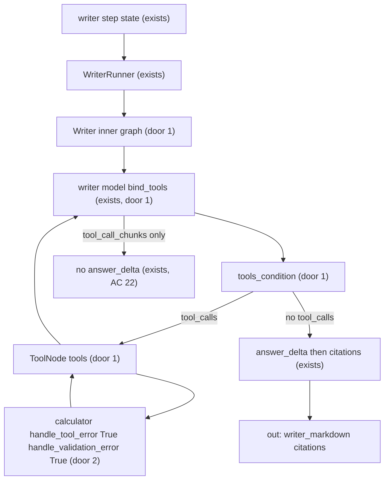

# Writer calculator

Sources:

- conversation 2026-09-20 (this chat) - calculator on the Writer, not a planner-scheduled step; planner sees the capability via abilities, not the tool name; derived arithmetic cites operand `[n]` and is not a new source; inner loop is writer → `ToolNode` → writer via `tools_condition`; LangChain `handle_tool_error` and `handle_validation_error` enabled; `ToolNode(handle_tool_errors=True)`
- `.specs/project/STATE.md` AD-022 (Writer one-shot, `answer_delta` + `citations`, no Writer eval/retry), AD-029 (AG-UI consume path, `web/` HTTP-only)
- AGENTS.md invariants 2 (registry + `planner_prompt_abilities()`), 5 (English internals), 6 (grounding / Writer one-shot), 9 (production consume is `astream` custom+updates, not `astream_events`)
- `src/plan_based_researcher/agents/registry.py` PAT-02 - planner prompt is built from plan-agent abilities; `tools` names are not currently bound on search/retrieve
- Installed LangGraph `ToolNode` (`langgraph.prebuilt`): `handle_tool_errors=True` catches execution errors as `ToolMessage`; default handler only catches `ToolInvocationError`. Installed LangChain `BaseTool`: `handle_tool_error` and `handle_validation_error` default `False`. `tools_condition` returns `"tools"` or `"__end__"`.

## Problem

The Writer answers from packed `[n]` chunks and from the model's own arithmetic. Papers report FLOPs, ratios, table totals, and percentages. The model often mis-multiplies those figures, and the student reads a grounded citation next to a wrong derived number. There is no way for the Writer to obtain an exact result from operands that are already in the pack.

The planner cannot help: it emits `{agent, task, reasoning}` and never sees the packed numbers. Search and retrieve already formulate their own queries; the planner does not choreograph `arxiv_search`. A calculator scheduled as a plan step would be the wrong layer, and today `PLAN_AGENTS` cannot name one.

Evidence in the source: none quantified. The brief is the missing capability (Writer calls a calculator for operations).

When this ships, the Writer can evaluate arithmetic on numbers from the pack during its one graph step, the student still sees only markdown deltas plus citations, and the planner still emits search / retrieve / writer.

## Out of scope

| Excluded | Why |
| --- | --- |
| Planner step or `PLAN_AGENTS` member named `calculator` | conversation: planner plans agents, not tool calls; same lock as search query formulation |
| `ToolNode` / `tools_condition` on the product graph (`graph/build.py`) | that graph is gate → plan → dispatch → search\|execute → eval; execute also runs retrieve; mixing LLM tool routing there is the wrong layer |
| LangChain `create_agent`, `astream_events` | user pinned `ToolNode` + `tools_condition`; invariant 9 consume path stays on the research graph |
| Desk UI, transcript `tool_call` kinds, new SSE event names | AD-022/AD-029 wire is `answer_delta` + `citations`; chat-state-transcript already excluded `tool_call` kinds |
| `sympy`, units, currency, `sin`/`log`/other callables | brief is operations; extra grammar is a later slice |
| Python `eval` / `exec` of the expression | arbitrary code; not needed for arithmetic |
| Writer graph eval or retry | AD-022 one-shot stays; the tool loop is inside `WriterRunner` |
| New `ports/` Protocol or Voyage/arXiv I/O | calculator is local |
| Binding `arxiv_search` / `arxiv_load` as LLM tools | search/retrieve keep structured formulate + PaperPort |
| Changing citation `[n]` packing, retrieve, or search ranking | Writer-only |
| Auth, HITL, web search | AGENTS.md out of v1 |

## Assumptions

| Assumption | Chosen default | Rationale | Confirmed? |
| --- | --- | --- | --- |
| Planner vs tool | Planner sees a Writer *ability* (may compute arithmetic on packed numbers). It does not name the tool or emit a calculator step | conversation 2026-09-20; matches search/retrieve formulate lock | y |
| Student-visible wire | No new SSE name; tool args and results never become `answer_delta` | AD-022 lock: deltas concatenate to `writer_markdown`; desk has no tool-trace UI | n |
| Expression grammar | Numbers (int/float/`1e6`), `+` `-` `*` `/` `**`, unary minus, parentheses. No names, attributes, subscripts, or calls | brief is operations; `ast` parse beats a four-tool split | n |
| Result spelling | Exact integer values emit without a trailing `.0` (`14` not `14.0`); otherwise the shortest decimal that equals the float | student markdown should not look like Python floats | n |
| Caps | `Policy.writer_calculator_rounds=8`; `Policy.writer_calculator_expression_max=200` | PAT-10 named knobs; 8 matches `max_steps`; 200 stops prompt-stuffed expressions | n |
| Failed expression / tool failure | Error becomes a `ToolMessage` back to the Writer model; the Writer run does not become `outcome=error` from that string | student still needs markdown; `handle_tool_error` / `handle_validation_error` / `handle_tool_errors` exist for this | y |
| Inner graph | Writer subgraph: writer model node → `tools_condition` → `ToolNode` (name `tools`) → writer. Product graph unchanged. Subgraph `checkpointer=None` | conversation 2026-09-20; `tools_condition` is the stock ReAct edge; parent checkpoint must not store tool messages | y |
| Error handles | Calculator `handle_tool_error=True` and `handle_validation_error=True`. `ToolNode(..., handle_tool_errors=True)` | user required both LangChain handles; ToolNode default re-raises execution errors, so `True` is required to catch them | y |
| Registry `tools` | `REGISTRY["writer"].tools == ("calculator",)`; Writer binds that name. Search/retrieve tuples stay documentation of PaperPort names | PAT-02 already stores tool names; do not pretend ToolRegistry (PaperPort) can return a calculator | n |
| tlc-spec-lean profile | `light` (AGENTS.md has no profile pin) | project default; Independent Tests must drive a mocked tool-call loop, because `light` will not catch a green abilities-only test that never binds the tool | n |

**Open questions:** none - all resolved or logged above.

## Criteria

### S1: Planner sees a capability, not a tool (P1)

**Acceptance Criteria**

1. The system SHALL set `REGISTRY["writer"].tools` equal to `("calculator",)`
2. The system SHALL include in `planner_prompt_abilities()` the substring that the writer may compute arithmetic on numbers present in packed chunks
3. The system SHALL NOT put the substring `calculator` in `planner_prompt_abilities()`
4. The system SHALL keep `PLAN_AGENTS` equal to `frozenset({"search", "retrieve", "writer"})`
5. WHEN `PlannerRunner._complete` is given a plan whose first step `agent` is `calculator` THEN it SHALL raise `ValueError` whose message contains `invalid agent name`

**Independent test:** unittest on `REGISTRY` / `planner_prompt_abilities()` / `PlannerRunner._complete` with a stubbed `ResearchPlan` (no live OpenAI).

### S2: Writer owns the tool loop; the graph does not (P1)

**Acceptance Criteria**

6. WHEN `WriterRunner.run` receives a model response whose `tool_calls` has one `calculator` call with expression `2+3*4` and a later response with visible text `The total is 14 [1]` THEN the runner SHALL invoke the calculator once with `2+3*4` and SHALL set `writer_markdown` to `The total is 14 [1]`
7. WHEN the model streams only visible text and no `tool_calls` THEN `WriterRunner` SHALL still emit `answer_start`, then `answer_delta` chunks whose concatenated `text` equals `writer_markdown`, then `citations` (existing no-tool path)
8. The system SHALL NOT add a node named `calculator` or `tools` to the product graph compiled in `graph/build.py`
9. WHEN the calculator returns an error string THEN `WriterRunner` SHALL append that string as the tool result and SHALL NOT set `outcome` to `error` from that string
10. IF the model requests a tool name other than `calculator` THEN `WriterRunner` SHALL return a tool-result error string and SHALL NOT raise
11. WHEN `WriterRunner` has already finished `Policy.writer_calculator_rounds` calculator invocations in that run THEN the next model call SHALL NOT expose the calculator tool

**Independent test:** unittest `WriterRunner.run` with a mocked `ChatOpenAI` that yields `tool_calls` then text; assert invoke count, markdown, `outcome` absent/`error` not set; assert `graph/build.py` `add_node` names stay gate/planner/dispatch/search/execute/evaluate/replan/finalize.

### S3: Calculator evaluates or rejects (P1)

**Acceptance Criteria**

12. WHEN the calculator is given `2+3*4` THEN it SHALL return the string `14`
13. WHEN the calculator is given `10/4` THEN it SHALL return the string `2.5`
14. WHEN the calculator is given `2**10` THEN it SHALL return the string `1024`
15. WHEN the calculator is given `1e3+1` THEN it SHALL return the string `1001`
16. WHEN the calculator is given `-(2+3)` THEN it SHALL return the string `-5`
17. IF the expression is `""` or only whitespace THEN the calculator SHALL return a string containing `error` and SHALL NOT raise
18. IF the expression contains a name such as `os` THEN the calculator SHALL return a string containing `error` and SHALL NOT raise
19. IF the expression is `1/0` THEN the calculator SHALL return a string containing `error` and SHALL NOT raise
20. IF the expression length is greater than `Policy.writer_calculator_expression_max` THEN the calculator SHALL return a string containing `error` and SHALL NOT raise
21. The system SHALL NOT call Python `eval` or `exec` from the calculator implementation

**Independent test:** unittest the calculator function with those literals; `inspect.getsource` (or AST walk of the module) asserts no `eval(` / `exec(` call.

### S4: Student stream stays markdown (P1)

**Acceptance Criteria**

22. WHEN the model streams a chunk that has `tool_call_chunks` and no visible text THEN `WriterRunner` SHALL NOT emit `answer_delta` for that chunk
23. WHEN a calculator round is followed by streamed markdown `Hello [1]` THEN concatenating `answer_delta` `text` values in order SHALL equal `writer_markdown` and SHALL equal `Hello [1]`
24. The system SHALL NOT emit from `WriterRunner` a custom SSE `event` other than `answer_start`, `answer_delta`, or `citations`
25. The system SHALL list in citations only `[n]` that exist in `evidence_chunks` (unknown n omitted; run still succeeds)

**Independent test:** extend `tests/test_writer_stream.py` with a tool-call-then-text mock; assert event names and concatenation.

### S5: Grounding carve-out is Policy text (P1)

**Acceptance Criteria**

26. The system SHALL state in `Policy.GROUNDING_RULE` that a number obtained by arithmetic on operands that each have a real `[n]` is a derived result: cite the operands; do not invent a citation for the result; do not treat the result as a new source
27. The system SHALL include `Policy.GROUNDING_RULE` in the Writer system prompt
28. The system SHALL mention computing arithmetic on packed-chunk numbers in `REGISTRY["writer"].abilities`
29. The system SHALL NOT mention the tool name `calculator` in `REGISTRY["writer"].abilities`

**Independent test:** unittest string membership on `Policy.GROUNDING_RULE`, `writer._system_prompt()`, and `REGISTRY["writer"].abilities`.

### S6: Writer subgraph is ToolNode + tools_condition (P1)

**Acceptance Criteria**

30. The Writer inner graph SHALL route the writer model node with `tools_condition` so `tool_calls` go to the tools node and the absence of `tool_calls` ends the inner graph
31. The Writer inner graph SHALL execute tool calls with `ToolNode`
32. The calculator tool SHALL set `handle_tool_error` to `True`
33. The calculator tool SHALL set `handle_validation_error` to `True`
34. The Writer `ToolNode` SHALL be constructed with `handle_tool_errors` equal to `True`
35. WHEN the model emits a `calculator` tool call whose arguments fail schema validation THEN `WriterRunner` SHALL NOT raise and SHALL feed a tool message containing `error` into the next writer model call
36. WHEN the calculator raises `ToolException` THEN `WriterRunner` SHALL NOT raise and SHALL feed a tool message containing `error` into the next writer model call

**Independent test:** unittest inspects the calculator tool flags and the `ToolNode` constructor kwargs; drives `WriterRunner.run` with invalid args and with a `ToolException`; assert no raise and a follow-up model call.

## Traceability

| ID | Slice | Criteria | Status |
| --- | --- | --- | --- |
| CALC-01 | S1 | 1–5 | Done |
| CALC-02 | S2 | 6–11 | Done |
| CALC-03 | S3 | 12–21 | Done |
| CALC-04 | S4 | 22–25 | Done |
| CALC-05 | S5 | 26–29 | Done |
| CALC-06 | S6 | 30–36 | Done |

## Observable

| Surface | Decision | Landing |
| --- | --- | --- |
| document planner abilities | structure (name + abilities, no tool roster) | AC 2, 3, 4 |
| document planner abilities | tone/depth | AC 2 - capability sentence, English internals unchanged |
| document writer system prompt | grounding copy | AC 26, 27 |
| document writer abilities | capability vs tool name | AC 28, 29 |
| tool `calculator` | empty state | AC 17 - empty expression returns `error` string |
| tool `calculator` | error state | AC 9, 17, 18, 19, 20, 35, 36 - error / validation / `ToolException` become tool messages, no run crash |
| tool `calculator` | unauthorised / who may call | AC 1, 10, 11 - Writer-bound only; unknown names get a tool error |
| tool `calculator` | versioning | n/a - not a public HTTP contract |
| tool `calculator` | rate limit | AC 11, 20 - round cap and expression length, no network throttle |
| API `POST /agent` | response / error shape | existing - AD-022 `answer_delta` + `citations`; AC 24 forbids new event names |
| API `POST /agent` | versioning | n/a - no new route |
| API `POST /agent` | who may call / rate limit | n/a - unchanged FastAPI surface |
| screen desk | empty / loading / error / destructive | n/a - no desk change |

## Flow

Reuses `WriterRunner` (exists), `ChatOpenAI` (exists), `get_stream_writer` custom events (exists), `planner_prompt_abilities()` (exists), and `PLAN_AGENTS` validation (exists). Adds a Writer-only inner graph (door 1): writer model → `tools_condition` → `ToolNode` → writer. The product graph in `graph/build.py` (exists) is unchanged.

Execute (exists) still calls `factory.create("writer")`. Planner (exists) still emits writer tasks from abilities (door 3 copy only).

## Relations

None - no stored-data shape change

## Surface

| Route | In | Out | Status |
| --- | --- | --- | --- |
| `calculator` tool | `expression` | result string · `error` string | `200`, `400` |

`POST /agent` SSE names stay `answer_start` / `answer_delta` / `citations` for the Writer (no new status on the HTTP route).

## Landing

| One-way door | Literal shape | Alternative rejected |
| --- | --- | --- |
| Tool loop lives in a Writer subgraph | Inner `StateGraph`: writer model node → `tools_condition` → `ToolNode` (node name `tools`, `handle_tool_errors=True`) → writer. Calculator tool: `handle_tool_error=True`, `handle_validation_error=True`. Subgraph compiled with `checkpointer=None`. Product `graph/build.py` nodes stay gate, planner, dispatch, search, execute, evaluate, replan, finalize. Cap `Policy.writer_calculator_rounds`. No `create_agent` | Manual `tool.invoke` loop in `WriterRunner` - would skip `tools_condition` / `ToolNode` error handling the user required. `ToolNode` on the product graph - execute also runs retrieve; research edges are not LLM tool routing. `create_agent` - hides the edge the user named |
| Calculator contract | Tool name `calculator`. Single argument `expression` (string). Grammar: int/float/`1eN` literals, `+ - * / **`, unary minus, parentheses. No names/calls/attributes. Result: integer-valued → decimal digits without `.0`; else shortest decimal. Invalid / overflow length / div-zero → string containing `error`, no raise. Parse via `ast`, never `eval`/`exec` | Four separate tools (`add`/`mul`/…) - more schema, same need to compose. `numexpr` / `llm-math` / `sympy` - new dependency for a closed grammar. `eval` - executes names |
| Planner-facing copy | Writer *abilities* say the writer may compute arithmetic on numbers in packed chunks. Abilities and `planner_prompt_abilities()` omit the substring `calculator`. `REGISTRY["writer"].tools == ("calculator",)` | Put `calculator` in abilities - planner might emit a fake agent. Omit the ability - planner cannot task the Writer to compute |
| Grounding | `Policy.GROUNDING_RULE` gains: a number obtained by arithmetic on operands that each have a real `[n]` is a derived result; cite the operands; do not invent a citation for the result; do not treat the result as a new source. Writer prompt still interpolates that string | Treat the result as a new `[n]` - no chunk exists. Exempt all numbers from grounding - hole fill returns. Leave GROUNDING_RULE unchanged - model has a tool and a conflicting “every claim needs `[n]`” with no derived carve-out |

- Nothing else in this change is hard to reverse. Module path for the calculator function, whether bind reads `REGISTRY["writer"].tools` vs a local tuple, and exact error phrasing stay in the diff.

After plan approval, append AD-032 in `.specs/project/STATE.md`: Writer may run an inner `ToolNode` + `tools_condition` loop; planner abilities name the capability not the tool; the product graph stays without a calculator/tools node; derived arithmetic cites operand `[n]` and is not a new source. Amends invariant 6 / AD-022 only by that carve-out. Writer remains one-shot at the research graph (no Writer eval/retry).

## Impact

| Front | What changes |
| --- | --- |
| domain | new term: `calculator` - Writer LLM tool, argument `expression`, local arithmetic. Lives on `REGISTRY["writer"].tools` and the Writer inner `ToolNode`. Not a `PLAN_AGENTS` name, not a product-graph node |
| domain | existing term: `GROUNDING_RULE` still requires `[n]` for paper claims; it now also defines derived arithmetic. Callers: `agents/writer.py` system prompt (interpolates the string); unittest locks on the text |
| domain | existing term: Writer one-shot still means no research-graph eval/retry (AD-022). It does not forbid an inner writer → tools → writer loop. Callers: `graph/nodes/evaluate.py` auto-pass on `last_agent=writer`; `WriterRunner.run` |
| domain | existing term: `REGISTRY[].tools` stays documentation for search/retrieve (`arxiv_search` / `arxiv_load` are PaperPort names). For writer it becomes a name that the Writer `ToolNode` binds. Callers: `agents/registry.py`; do not change `ToolRegistry.get` to return a calculator |
| stored data | nothing to migrate; tool messages are not product transcript items |
| policy | new `writer_calculator_rounds=8`, `writer_calculator_expression_max=200`; `GROUNDING_RULE` text grows as in Landing |
| decisions | after plan approval, AD-032 as in Landing |
