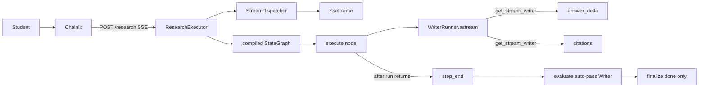
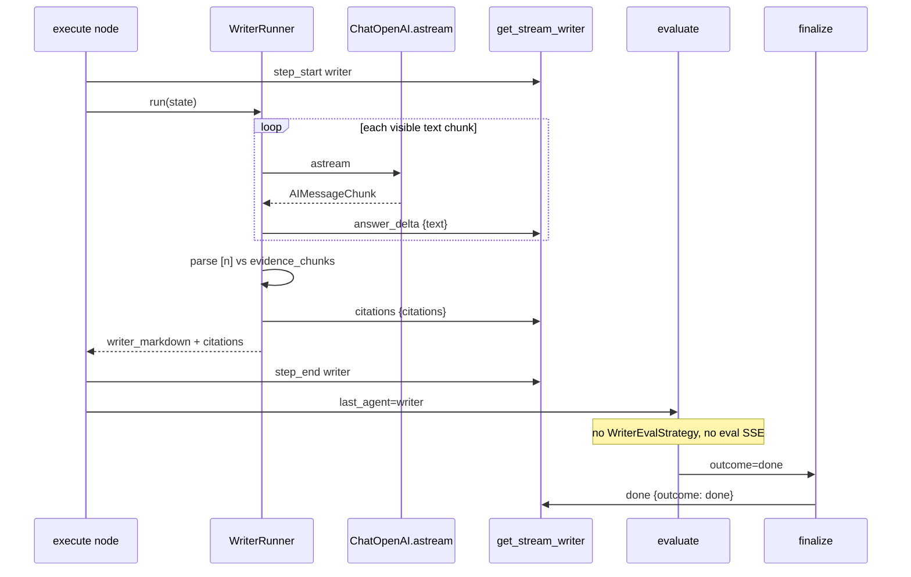
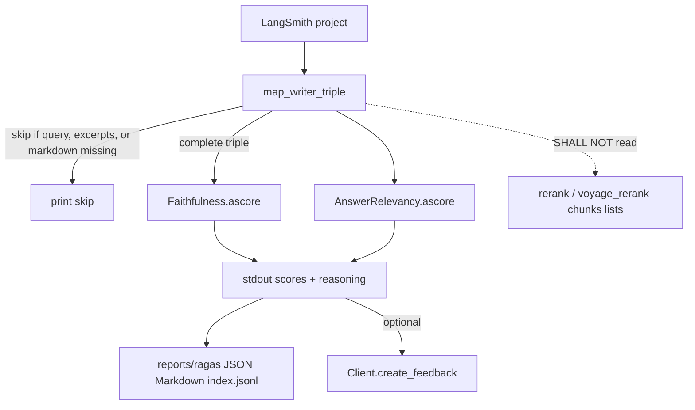

# Writer Stream + RAGAS Report Design

**Spec**: `.specs/features/writer-stream-ragas/spec.md`  
**Parent designs**: `.specs/features/sse-agent-dispatcher/design.md` (consume path, `get_stream_writer` unwrap) · `.specs/features/orchestrator-eval-replan/design.md` (evaluate routing; Writer Strategy **removed** here) · `.specs/features/admission-retrieve-per-topic/design.md` (WRITE-02 prompt hole rule stays)  
**Architecture constraints**: `.specs/features/arxiv-grounded-research/context.md` (PAT-01, PAT-02, PAT-07, PAT-08, PAT-11 consume path as amended by sse-agent-dispatcher, PAT-12)  
**Status**: Verified T1–T10 2026-09-08 (code; unittest discover 88/88). Live Independent Tests remain UAT.

This feature does **not** change Gate, plan vocabulary, admission, retrieve cut, `[n]` prompt format, search/retrieve eval, Voyage embeddings, or the HTTP body `{ query, thread_id }`. It changes **when** Writer markdown is visible, **which SSE names** carry it, and **where** faithfulness is measured.

Locked in specify (not reopened here): stream always; no Writer quality → `insufficient` / retry; names `gate` … `answer_delta` … `citations` … `error` with **no** `answer_complete`; `answer_delta` `{ "text" }` concat equals `writer_markdown`; `citations` has `citations[]` and **no** markdown; order `step_start` (writer) → deltas → one `citations` → `step_end` (writer) → later `done`; channel is `get_stream_writer` (dispatcher custom / `on_chain_stream` unwrap); drop `with_structured_output(WriterOutput)`; parse `[n]` after full text; unknown `[n]` omitted, run still `done`; no `WriterEvalStrategy` / Writer `eval` / Writer retry; Chainlit typewriter + existing `side_panel_texts`; RAGAS collections `Faithfulness` + `AnswerRelevancy` `ascore` from LangSmith traces; contexts = Writer-facing `evidence_chunks` excerpts; no context_* ; no score-threshold exit; no Voyage embeddings for the metric.

---

## Architecture Overview

The HTTP consume path stays the sse-agent-dispatcher facade: `ResearchExecutor` iterates `astream_events` v2 with `include_types=("chain",)` and `stream_mode="custom"`. `StreamDispatcher.default()` already builds handlers from `SSE_EVENTS`; this slice only changes that frozenset. Chat-model callbacks stay off the wire (STRM-10). Writer tokens never use `on_chat_model_stream` as an SSE `event:` name.

`WriterRunner` drops structured output and calls `ChatOpenAI.astream`. For each **non-empty visible text** piece it emits `{ "event": "answer_delta", "data": { "text": <chunk> } }` via `get_stream_writer()`. After the stream ends it parses used `[n]`, builds `citations[]` with the same `Citation` fields as today, emits one `{ "event": "citations", "data": { "citations": [...] } }`, and returns `writer_markdown` / `citations` / `last_agent` as graph state. `make_execute_node` is unchanged: it already wraps `factory.create(agent).run` with `step_start` then `step_end`, which yields the locked order.

The graph topology stays `execute → evaluate → finalize`. Evaluate **auto-passes** a Writer execute (append `passed_steps`, `writer_just_passed` → `outcome=done`) and **does not** call a Strategy or emit `eval`. Finalize on `done` emits **only** `done` (no second copy of the markdown). Chainlit typewriters `answer_delta` onto one `cl.Message` and attaches side-panel `cl.Text` when `citations` arrives.

Offline quality moves to `scripts/ragas_writer_report.py`: LangSmith `Client.list_runs` → map to `(user_input, retrieved_contexts, response)` → collections `ascore` → print scores and judge reasoning, save JSON/Markdown under `reports/ragas/` (optional LangSmith feedback). Not a graph node. Not CI.







**Research notes (verification chain):**

- **Codebase:** `WriterRunner.run` uses `ChatOpenAI.with_structured_output(WriterOutput)` then `_used_citation_ns` / `_citations_from_chunks` (structured `citation_ns` is already ignored). `make_execute_node` emits `step_start` → `run` → `step_end` and only catches `KeyError`. `make_evaluate_node` takes `WriterEvalStrategy` and for `last_agent=="writer"` calls `strategy.evaluate` then `_emit_eval`. Finalize on `done` emits `answer_complete` `{ markdown, citations }` then `done`. `SSE_EVENTS` includes `answer_complete` and not `answer_delta` / `citations`. `StreamDispatcher.default()` maps every `SSE_EVENTS` name; `tests/test_stream_dispatcher.py` currently **asserts** there is no `answer_delta` handler. Chainlit `_handle_event` builds the student message only on `answer_complete` via `side_panel_texts`. Retrieve writes Writer-facing `evidence_chunks` **after** `cut_reranked` / `pack_hits` / `expand_hits`; the LangSmith child `rerank` span stores first-stage `chunks` and `chunks_scored` — the RAGAS mapper must not use those lists. `Settings()` requires `DATABASE_URL` + `VOYAGE_API_KEY`; the RAGAS script must not construct `Settings()`.
- **Project docs:** AD-022 / WSTR-01–07. PAT-11 consume API remains `astream_events` v2 + custom StreamWriter (sse-agent-dispatcher). PAT-05’s runtime Writer Strategy is **removed** for this product slice; search/retrieve Strategies stay. WRITE-02 remains prompt-only (`Policy.HOLE_RULE` + `living_and_missing` in the Writer user prompt). SSE dispatcher STRM-11 / “no `answer_delta`” is superseded by this spec.
- **LangGraph (installed `get_stream_writer`, docs.langchain.com streaming, 2026-09-08):** Custom payloads require `stream_mode="custom"` (already on the facade). `get_stream_writer()` reads the runnable config; **outside a node it raises `RuntimeError`**. Writer emit therefore wraps that call. Official “LLM tokens” mode (`stream_mode="messages"` / chat-model events) is **out of scope** — we copy token text into custom `{event,data}` dicts, same pattern as the docs’ “arbitrary model” + StreamWriter example. Nested `ChatOpenAI.astream` still creates `chat_model` runs internally; they stay off SSE because `include_types` remains `("chain",)` (verified in sse-agent-dispatcher design on `langgraph==1.2.11`).
- **LangChain ChatOpenAI:** `async for chunk in llm.astream(messages)` yields `AIMessageChunk`. Visible answer text is string `content`, or `type=="text"` blocks when `content` is a list. **Reasoning / CoT blocks must not be emitted** as `answer_delta` (gpt-5 family). Concatenate exactly the emitted `text` fragments into `writer_markdown` (WSTR-01).
- **Chainlit (official autodocs):** `stream_token` initiates/appends; a final `send()` persists. Side panel: `cl.Text(..., display="side")` as today. Attach elements on `citations`, then `send()` once.
- **RAGAS collections (docs + v0.4 migration, Context7 `/vibrantlabsai/ragas`):** `from ragas.metrics.collections import Faithfulness, AnswerRelevancy`. `from ragas.llms import llm_factory`; `from ragas.embeddings.base import embedding_factory`. `AsyncOpenAI` client. `Faithfulness.ascore(user_input=, response=, retrieved_contexts=)` and `AnswerRelevancy.ascore(user_input=, response=)` return objects with `.value`. Official examples use `gpt-4o-mini` + `text-embedding-3-small`. Collections `Faithfulness` **raises** if `response` or `retrieved_contexts` is empty — treat those traces as skip, not score 0. Pin optional extra `ragas>=0.4`.
- **LangSmith:** `Client.list_runs(project_name=..., error=False)`. LangGraph child runs are named after nodes (`planner`, `search`, `execute`, `evaluate`, …) with `metadata.langgraph_node`. MCP `fetch_runs` previews of node inputs collapse to a short label (often `"dispatch"`); **do not trust that preview**. The Python SDK `run.inputs` / `run.outputs` are the source of truth. Mapper must unwrap one LangGraph nesting level (node name key vs flat update). Fallback: same-trace retrieve/execute `outputs.evidence_chunks` if writer execute inputs omit the list. **Never** `name=="rerank"` / `chunks_scored`. Optional `create_feedback`; newer docs want `session_id` (project UUID) — if the installed SDK rejects the call, print a warning and still exit 0.
- **Uncertain:** Exact `AIMessageChunk` shape for `gpt-5.6-luna` streaming (string vs content blocks vs `chunk.text`). Execute SHALL unit-test `_visible_text` with a list-of-blocks fixture (text kept, reasoning dropped) and verify live concat during UAT. Exact LangSmith `execute.inputs` blob for GraphState — Execute SHALL dump one real writer `execute` run in a fixture if the unwrap guesses wrong; skip incomplete rather than inventing contexts from rerank.

---

## Code Reuse Analysis

### Existing Components to Leverage

| Component | Location | How to Use |
| --------- | -------- | ---------- |
| `_used_citation_ns` / `_citations_from_chunks` / `_format_chunks` / prompts / `living_and_missing` | `agents/writer.py` | Keep. Drop only `with_structured_output` + `WriterOutput` as the LLM schema. |
| `Citation` | `api/schemas.py` | Same fields on the `citations` event. |
| `make_execute_node` | `graph/nodes/execute.py` | **Reuse as-is** (step_start / run / step_end). |
| Evaluate routing `_apply_route` `writer_just_passed` | `graph/nodes/evaluate.py` | Keep the pass → finalize/`done` path; stop calling a Writer Strategy and `_emit_eval`. |
| Search / retrieve Strategies | `eval/strategies.py` | Unchanged. Delete `WriterEvalStrategy` and Writer-only helpers. |
| `SSE_EVENTS` + `SseFrame` + `StreamDispatcher.default()` | `api/sse.py`, `stream_dispatcher.py` | Add `answer_delta` + `citations`; remove `answer_complete`. Handlers follow the frozenset. |
| Facade filters | `StreamDispatcher.include_types` | Keep `("chain",)` — do **not** add `chat_model` / `llm` / `tool`. |
| `iter_sse_frames` / `side_panel_texts` | `ui/sse_map.py` | Parser already drops names not in `SSE_EVENTS` (covers leftover `answer_complete`). Reuse `side_panel_texts` on `citations`. |
| Retrieve `evidence_chunks` | `agents/retrieve.py` `_append_numbered` after cut/pack/expand | RAGAS `retrieved_contexts` = those `excerpt` strings (Writer input), not rerank span lists. |
| Tiny graph + `get_stream_writer` test | `tests/test_stream_dispatcher.py` | Same pattern for `answer_delta` / `citations` unwrap. |
| `load_dotenv` | `python-dotenv` | RAGAS script reads `LANGSMITH_*` / `OPENAI_API_KEY` without `Settings()`. |

### Integration Points

| System | Integration Method |
| ------ | ------------------ |
| FastAPI `StreamingResponse` | Unchanged; new names are just more `SseFrame`s from the same dispatcher. |
| LangGraph checkpointer | `writer_markdown` and `citations` remain GraphState keys (already declared). |
| Chainlit HTTP client | Same `POST /research`; new branches in `_handle_event` only. |
| LangSmith | Tracing already on via env. Report script is a **reader** (`list_runs`), optional feedback writer. |
| RAGAS | Optional extra; not imported by `main.py` / graph / UI. |

### Concerns / fragile areas

`.specs/codebase/CONCERNS.md` does not exist. Relevant STATE lessons:

| Concern | How this design mitigates |
| ------- | ------------------------- |
| `ChatOpenAI` needs `api_key` on construct | WriterRunner already passes `api_key`; streaming path keeps that. |
| Windows asyncio for scripts | RAGAS script sets `WindowsSelectorEventLoopPolicy` before `asyncio.run`. |
| Unittest modules disappearing while `.pyc` remains | Keep new tests as real `.py` files; discover must see mapper + SSE name tests. |
| LangGraph last-value / undeclared keys | No new state keys. |
| PAT-05 Writer judge retrying grounded answers (quick 013) | Runtime judge is gone; RAGAS may still score a cited-but-awkward answer — that is intended. |

---

## Components

### `SSE_EVENTS` (allowlist)

- **Purpose**: Student-visible SSE names; `SseFrame` and Chainlit parser share this set.
- **Location**: `src/plan_based_researcher/api/sse.py`
- **Interfaces**:
  - `SSE_EVENTS` contains `gate`, `plan`, `step_start`, `step_end`, `eval`, `answer_delta`, `citations`, `done`, `insufficient`, `error`.
  - SHALL NOT contain `answer_complete`.
- **Dependencies**: none
- **Reuses**: `SseFrame.encode` unchanged (unknown name still `ValueError`)

### `WriterRunner` (streaming execute)

- **Purpose**: One-shot grounded markdown; stream visible tokens; emit citations once; persist the same strings on state.
- **Location**: `src/plan_based_researcher/agents/writer.py`
- **Interfaces**:
  - `WriterRunner.__init__(api_key: str | None = None)` — `ChatOpenAI(model=REGISTRY["writer"].model, api_key=...)` **without** `with_structured_output`.
  - `async run(self, state: GraphState) -> dict` — same return keys as today: `writer_markdown`, `citations`, `last_agent="writer"`.
  - `_visible_text(chunk: object) -> str` — extract student-visible markdown fragment; skip empty; skip reasoning blocks.
  - `_emit_custom(event: str, data: object) -> None` — `get_stream_writer()({"event": event, "data": data})`; on `RuntimeError` (no graph context) no-op.
  - Keep `_used_citation_ns`, `_citations_from_chunks`, `_format_chunks`, `_system_prompt`, `_user_prompt`, `living_and_missing`.
  - Delete `WriterOutput` (only existed for structured output).
- **Dependencies**: `ChatOpenAI.astream`, `langgraph.config.get_stream_writer`, `Citation`, `Policy.GROUNDING_RULE` / `HOLE_RULE`
- **Reuses**: GROUND-01 formatting; GROUND-02 membership rules; WRITE-02 coverage block in the user prompt

**Emit rules inside `run`:**

1. For each astream chunk: `text = _visible_text(chunk)`; if `text` then append to an accumulator and `_emit_custom("answer_delta", {"text": text})`.
2. `markdown = "".join(accumulator)` (must equal the concatenation of emitted `text` values).
3. `used_ns = _used_citation_ns(markdown, chunks)`; unknown `[n]` omitted.
4. `_emit_custom("citations", {"citations": _citations_from_chunks(...)})` **always** after a **completed** stream, even if markdown is empty (`citations` may be `[]`).
5. If `astream` raises, do **not** emit `citations`; let the exception propagate (execute will not emit `step_end`; facade `error`). Already-emitted deltas stay on the wire.

### Evaluate node (Writer one-shot)

- **Purpose**: Search/retrieve eval unchanged; Writer execute that returned is a pass without a judge.
- **Location**: `src/plan_based_researcher/graph/nodes/evaluate.py`
- **Interfaces**:
  - `make_evaluate_node(search_eval, retrieve_eval)` — **drop** `writer_eval` parameter.
  - When `agent == "writer"`: do **not** call a Strategy; do **not** `_emit_eval`; append `step_index` to `passed_steps`; set `writer_just_passed=True`; reuse `_apply_route` / `_apply_max_steps`.
  - Search wave and retrieve `_evaluate_step` unchanged (`eval` SSE still emitted).
- **Dependencies**: `SearchEvalStrategy`, `RetrieveEvalStrategy` only
- **Reuses**: existing pass → finalize/`done` routing

Do **not** add `execute → finalize` for Writer. Topology stays `execute → evaluate` so max-steps and `eval_next` stay in one node.

### Finalize node

- **Purpose**: Terminal SSE without a second markdown payload.
- **Location**: `src/plan_based_researcher/graph/nodes/finalize.py`
- **Interfaces**:
  - `outcome == "done"` → emit `done` `{ "outcome": "done" }` only. SHALL NOT emit `answer_complete`.
  - `refused` / `insufficient` / `error` unchanged. Those paths still have no `answer_delta` / `citations` (Writer never ran, or execute failed before citations).
- **Dependencies**: `get_stream_writer`
- **Reuses**: today’s halt payloads

### `GraphDeps` + lifespan

- **Purpose**: Compile-once graph without a Writer Strategy (PAT-07).
- **Location**: `graph/build.py`, `main.py`, `scripts/draw_graph.py`, `tests/test_research_graph.py`
- **Interfaces**:
  - `GraphDeps(factory, search_eval, retrieve_eval)` — remove `writer_eval`.
  - `make_evaluate_node(deps.search_eval, deps.retrieve_eval)`.
- **Dependencies**: unchanged factory / search / retrieve judges
- **Reuses**: `ResearchGraph` wrapper; `ResearchExecutor` + `StreamDispatcher.default()`

### Chainlit typewriter

- **Purpose**: Student sees growing markdown; `[n]` panel still works (WSTR-05).
- **Location**: `src/plan_based_researcher/ui/app.py`
- **Interfaces**:
  - Hold one `cl.Message | None` for the answer across `_handle_event` calls (same lifetime as `open_steps`).
  - `answer_delta`: ignore empty `text`; `stream_token(text)` on that message (create `cl.Message(content="")` on first token).
  - `citations`: `elements` from `side_panel_texts`; assign `message.elements`; `await message.send()` to finalize. If there were zero deltas, `send()` an empty-content message with elements.
  - Remove the `answer_complete` branch. Parser drop covers old proxies.
  - `done` / `gate` / `insufficient` / `error` unchanged. On `error` after partial deltas, `send()` the partial message if not yet finalized.
- **Dependencies**: `side_panel_texts`, `iter_sse_frames`
- **Reuses**: existing Step handling for plan/eval/search/retrieve

Do **not** introduce a Chainlit Strategy dict in this slice (still deferred from sse-agent-dispatcher). Two extra `if` branches are enough.

### RAGAS mapper + report script

- **Purpose**: Offline Faithfulness + AnswerRelevancy on real Writer triples (WSTR-06, WSTR-07).
- **Location**:
  - `src/plan_based_researcher/eval/ragas_map.py` — pure mapping (unit-testable, no ragas import)
  - `scripts/ragas_writer_report.py` — CLI, LangSmith + ragas I/O
- **Interfaces** (`ragas_map.py`):
  - `WriterTriple` — `user_input: str`, `retrieved_contexts: list[str]`, `response: str`, `run_id: str | None`
  - `unwrap_node_payload(payload: object) -> dict` — if `payload` is a dict with GraphState-like keys, return it; if it has a single nested dict under `execute` / `retrieve` / similar, unwrap one level.
  - `excerpts_from_evidence_chunks(chunks: object) -> list[str] | None` — `None` if the field is missing or not a list; otherwise `[excerpt]` in list order (Writer prompt order).
  - `map_execute_run(run: object, *, retrieve_chunks_by_trace: dict[str, list[str]] | None = None) -> WriterTriple | None` — require writer markdown on **outputs**; query from inputs (or messages[0].content); contexts from inputs.evidence_chunks excerpts, else same-trace retrieve fallback. Return `None` to skip.
  - SHALL NOT read keys `chunks`, `chunks_scored`, or runs named `rerank` / `voyage_rerank`.
- **Interfaces** (`ragas_writer_report.py`):
  - argparse: `--project` (default `LANGSMITH_PROJECT` or `plan-based-researcher`), `--limit`, `--run-id`, `--write-feedback` (default off), `--no-save`, `--out-dir` (default `reports/ragas/`).
  - `langsmith.Client().list_runs(...)`; collect retrieve `evidence_chunks` per `trace_id` from retrieve/execute outputs **before** scoring writers.
  - For each mapped triple: logged `Faithfulness.ascore` + `AnswerRelevancy.ascore` (keep NLI statements and generated questions; collections drop them); print `.value`, judge reasoning, and `run_id`. Skip (print reason) on mapper `None` or collections `ValueError` (empty response/contexts).
  - Default: write `{timestamp}_{run_id}.json`, `.md`, and append `index.jsonl` under `reports/ragas/` so evals can be committed over time.
  - Judge: `AsyncOpenAI()` + `llm_factory(os.environ.get("RAGAS_LLM_MODEL", "gpt-4o-mini"), client=...)` + `embedding_factory("openai", model="text-embedding-3-small", client=...)`. SHALL NOT use Voyage.
  - Process exit: `0` after a finished report even if every score is 0.0. Non-zero only for missing `OPENAI_API_KEY` / LangSmith auth / import errors / unexpected crashes.
  - Do not construct `Settings()`. `load_dotenv()`. On Windows, set `WindowsSelectorEventLoopPolicy`.
- **Dependencies**: optional extra `ragas>=0.4`; `langsmith` (already transitive); `openai.AsyncOpenAI`
- **Reuses**: none of the runtime graph

`pyproject.toml`: add `[project.optional-dependencies] ragas = ["ragas>=0.4"]`. Runtime API extra stays empty of ragas.

---

## Data Models

### SSE `answer_delta`

```python
{"text": str}  # non-empty fragment; concat in order == GraphState.writer_markdown
```

### SSE `citations`

```python
{"citations": list[Citation]}  # Citation: n, arxiv_id, title, year, url, excerpt, chunk_id
# no markdown key
```

**Relationships**: `citations[].n` ⊆ `evidence_chunks[].n` actually present in the markdown. GraphState `citations` is the same list (checkpoint / LangSmith).

### GraphState (unchanged keys)

`writer_markdown: str`, `citations: list[dict]`, `evidence_chunks: list[EvidenceChunk]` stay. No new channels.

### `WriterTriple` (report only)

```python
class WriterTriple(TypedDict):
    user_input: str
    retrieved_contexts: list[str]
    response: str
    run_id: str | None
```

**Relationships**: `retrieved_contexts[i]` is `evidence_chunks[i]["excerpt"]` after rerank cut/pack/expand (the list `_format_chunks` would print). Not first-stage hybrid hits.

### Deleted

- `WriterOutput` (agents)
- `AnswerCompleteData` in `api/schemas.py` if still unused at the HTTP boundary (it is unused by routes today — delete with the SSE name)
- `WriterEvalStrategy`

---

## Error Handling Strategy

| Error scenario | Handling | User impact |
| -------------- | -------- | ----------- |
| Gate refuse / insufficient / error **before** Writer | No Writer `run`; no `answer_delta` / `citations` | Same halt events as today |
| Writer `astream` raises mid-token | Deltas already sent stay; no `citations`; node exception → facade `error` | Partial typewriter + error message |
| Empty markdown but stream completed | `citations` `[]` (or used `[n]` if any); evaluate auto-pass; `done` | Empty answer, no retry |
| Unknown `[n]` / extra non-arXiv URL / WRITE-02 hole fill | Omit bad indices from `citations[]`; still `done`; RAGAS may score low | Student sees the text |
| Dispatcher sees `answer_complete` from a buggy node | `UnknownStreamKindError` → `error` (server must not emit it) | Loud fail in tests |
| Client / proxy replays old `answer_complete` | Not in `SSE_EVENTS` → parser returns `None` | Ignored |
| RAGAS trace missing query, Writer chunks, or markdown | Skip; print reason; not score 0 | Report continues |
| RAGAS `ascore` ValueError (empty response/contexts) | Skip that trace | Report continues |
| RAGAS `create_feedback` fails | Warn; still print scores; exit 0 | Maintainer still has stdout |
| RAGAS report file write fails | Warn; still print scores and reasoning; exit 0 | Repo archive missing that run |
| `get_stream_writer` outside graph (unit test) | `_emit_custom` no-op | Parse helpers still testable |

---

## Tech Decisions (only non-obvious ones)

| Decision | Choice | Rationale |
| -------- | ------ | --------- |
| Where to emit deltas/citations | `WriterRunner.run` via `get_stream_writer` | Must happen **before** execute’s `step_end`; execute stays agent-agnostic |
| Stream API | `ChatOpenAI.astream` + copy text into custom events | Spec forbids LC callback **names** on the wire; dispatcher already unwraps StreamWriter |
| `include_types` | Stay `("chain",)` | Adding `chat_model` would leak `on_chat_model_stream` (STRM-10) |
| Writer eval wiring | Keep `execute → evaluate`; auto-pass without Strategy | Smallest graph change; `_apply_route` / max-steps already live there |
| Delete `WriterEvalStrategy` | Yes, not a stub that always passes | Spec: SHALL NOT run; a fake `eval` frame is explicitly out of scope |
| Chainlit Strategy dict | No | Still deferred; two branches on existing `_handle_event` |
| RAGAS in main deps | Optional extra `ragas` | Report-only; API boot must not import ragas |
| RAGAS judge model | Docs default `gpt-4o-mini` + `text-embedding-3-small`; override `RAGAS_LLM_MODEL` | Spec: follow collections docs for judge LLM/embeddings; not Voyage |
| Mapper source | Writer `execute` outputs + inputs, with retrieve `evidence_chunks` fallback | Node input previews in LangSmith UI/MCP are not trustworthy; skip if still incomplete |
| Empty RAGAS inputs | Skip (collections raise) | Not score 0; matches “incomplete → skip” |
| `WriterOutput` | Delete | Streaming path cannot use structured output; `[n]` already parsed from markdown |

---

## Testing (Execute preview)

No `.specs/codebase/TESTING.md`. Follow existing `unittest` style.

| Check | How |
| ----- | --- |
| WSTR-01 | Tiny graph: fake LLM astream yields two chunks; dispatcher yields two `answer_delta` then `citations`; concat == returned `writer_markdown`. `include_types` still excludes `chat_model`. `_visible_text` drops reasoning blocks. |
| WSTR-02 | `SSE_EVENTS` has `answer_delta` + `citations`, not `answer_complete`. `SseFrame("citations", {"citations": []})` round-trips. Invert `test_no_answer_delta_handler`. `SseFrame("answer_complete", ...)` raises `ValueError`. |
| WSTR-03 | Evaluate unit: writer `last_agent` → `eval_next=finalize`, `outcome=done`, no `eval` payload emitted (spy `get_stream_writer` or inspect update keys). `WriterEvalStrategy` gone from `eval/strategies.py` / `GraphDeps` / lifespan / `draw_graph`. |
| WSTR-04 | Finalize source: `done` branch has no `answer_complete`. Halt outcomes unchanged. |
| WSTR-05 | Review / thin test: `app.py` handles `answer_delta` / `citations`; no `answer_complete` branch. `side_panel_texts` still used. |
| WSTR-06 / WSTR-07 | Fixture: complete triple maps; missing field → `None`; payload with rerank `chunks_scored` is not used as contexts; retrieve-output fallback used only when execute inputs lack `evidence_chunks`. Do **not** call live RAGAS in unittest discover. |

Manual UAT (after Tasks): in-domain `POST /research` until `done` — `answer_delta` during writer, one `citations`, no `answer_complete`, no Writer `eval`, no `on_chat_model_*`. Concat deltas == checkpoint `writer_markdown`. Chainlit typewriter + `[n]` panel. Follow-up retrieve→writer same contract. RAGAS script on one real mapped trace prints two numbers; a stripped fixture/trace skips.

---

## Requirement mapping

| ID | Design coverage |
| -- | --------------- |
| WSTR-01 | `WriterRunner` `astream` + `_emit_custom("answer_delta")`; concat = state; `include_types` unchanged |
| WSTR-02 | `SSE_EVENTS` + one `_emit_custom("citations")` after last delta; no markdown field; no `answer_complete` |
| WSTR-03 | Evaluate auto-pass; delete `WriterEvalStrategy`; search/retrieve eval kept |
| WSTR-04 | Finalize `done` only; pre-Writer halt unchanged |
| WSTR-05 | Chainlit `stream_token` + `side_panel_texts` on `citations` |
| WSTR-06 | `scripts/ragas_writer_report.py` + skip + no threshold exit |
| WSTR-07 | `ragas_map.excerpts_from_evidence_chunks`; forbid rerank span lists |

---

## PAT notes (amendments, not new patterns)

- **PAT-02:** Writer factory still returns `WriterRunner`; `run(state) -> dict` Protocol unchanged.
- **PAT-05:** Runtime Writer Strategy removed. Search/retrieve keep `EvalResult` + `eval` SSE.
- **PAT-08 / PAT-11:** No FastAPI/Chainlit adapter classes. Student-visible tokens are custom StreamWriter payloads, not LC callback event names.
- **PAT-12:** Lifespan drops `WriterEvalStrategy(...)` construction.
