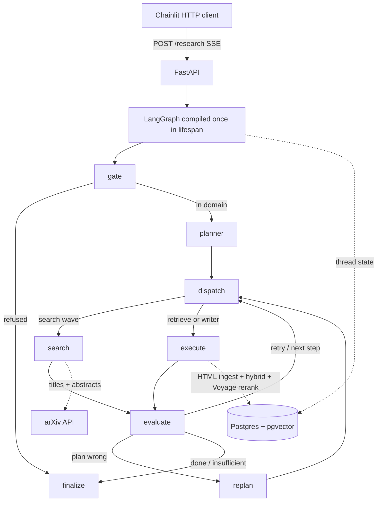

# arXiv Researcher

**A plan-based multi-agent researcher that answers AI/ML questions from arXiv only — with a gated loop, per-step evaluation, and citations you can open.**

Most “RAG chatbots” retrieve a few chunks and let the model talk. This system **plans**, **searches**, **admits papers fairly**, **retrieves with hybrid + rerank**, **evaluates each step**, and **refuses to invent** when evidence is missing. The student sees the plan, the eval verdicts, a streamed answer, and the exact excerpts behind every `[n]`.

---

## Why this is not a basic RAG demo

This is the part recruiters should not skim.

| Typical tutorial RAG                       | This project                                                                                                                                            |
| ------------------------------------------ | ------------------------------------------------------------------------------------------------------------------------------------------------------- |
| One retrieve → one generate                | LangGraph **loop**: gate → planner → dispatch → search/execute → **semantic eval** → retry or **remaining-suffix replan**                               |
| “Cite sources” in the prompt               | **Grounded generation:** every technical claim needs a real `[n]` from packed chunks. Missing topics are **announced**, never filled from model weights |
| Global `top-k` over a mixed corpus         | **One usable paper per search topic**; hybrid retrieve **per paper** so a compare query does not starve a method                                        |
| Naive PDF `RecursiveCharacterTextSplitter` | **arXiv HTML ingest**: heading-aware prose (512/50 tokens), **tables and display equations stay atomic**                                                |
| Dense search only                          | **RRF hybrid** (vector 0.7 / BM25 0.3) → Voyage `**rerank-3`** → **adaptive cut\*\* (`margin` / `floor` / `top_n`)                                      |
| Chat UI owns the graph                     | **FastAPI SSE** is the product API. **Chainlit is an HTTP client** — it never imports LangGraph                                                         |
| “Looks good in the screenshot”             | Offline **RAGAS** (faithfulness + answer relevancy on Writer traces) **and** E2E **writer-pack Recall@k** on the **production graph** (Writer halted)   |

Other product locks that usually never make it into a portfolio repo:

- **Domain gate** — out-of-scope questions are refused before planning.
- **Insufficient evidence** is a first-class outcome, not a hedged paragraph.
- **English internals** (plan, eval, search/retrieve/rerank queries) even when the student asks in Portuguese; the **Writer follows the query language**.
- **Agent registry + factory** — planner prompt and dispatch share one source of truth; models/tools are bound by name, not `if/elif`.
- **Named `Policy`** — allowlist, caps, recency, splitter, grounding and hole rules live in one object, not copied across prompts.
- **Outbound ports** for arXiv and pgvector; same Postgres for **pgvector chunks** and LangGraph `**AsyncPostgresSaver`\*\*.
- **Shared arXiv client + request lock** so parallel `Send("search")` does not 429 `export.arxiv.org`.
- Spec-driven work under `.specs/` (feature spec → design → tasks → execute), not a single dump of notebooks.

---

## What a student actually sees

1. Ask an AI/ML question in Chainlit (or `POST /research`).
2. Gate accepts or refuses.
3. Planner emits a structured plan (`search` × N → `retrieve` → `writer`; follow-ups can skip search).
4. Consecutive search steps **fan out in parallel** (`LangGraph Send`), then a **wave judge** ranks titles+abstracts (no HTML yet).
5. Retrieve walks each ranking, **ingests HTML on cache miss** `(arxiv_id, version)`, hybrid-overfetches, reranks against the **retrieve task**, packs `[n]`, expands table/equation bodies into excerpts.
6. Writer streams markdown (`answer_delta`); citations arrive once for the side panel.
7. Weak evidence → `insufficient`. Caps: 8 steps, 1 retry per step, 1 replan per run, 8 papers, ~2 min timeout.

Evidence is **arXiv only**, categories `cs.AI` · `cs.LG` · `cs.CL` · `cs.CV` · `cs.NE` · `cs.RO` · `stat.ML`. Prefer papers from the last 5 years unless the planner marks a historical step.

---

## Architecture



Retrieve path (the unusual part):

```text
HTML parse → dual text (embedding_text vs BM25 content)
  → first-stage hybrid k=40 per paper
  → Voyage rerank-3 on the English retrieve task
  → adaptive cut (top_n / margin=0.20 / floor=0.30)
  → pack_hits → expand table/equation atoms into Writer excerpts
```

---

## Stack

| Layer          | Choice                                                                 |
| -------------- | ---------------------------------------------------------------------- |
| Language       | Python ≥ 3.12                                                          |
| API            | FastAPI, `StreamingResponse` SSE (`astream_events` v2 dispatcher)      |
| UI             | Chainlit (host process, port 8000)                                     |
| Agents         | LangGraph 1.x + LangChain                                              |
| LLMs           | OpenAI (`gpt-5.x` planner/writer vs mini on gate/search/retrieve/eval) |
| Embed / rerank | Voyage `voyage-4-large` (1024-d) + `rerank-3`                          |
| Store          | PostgreSQL 16 + pgvector (Docker)                                      |
| Tracing        | LangSmith                                                              |

---

## Evaluation (not just “it answered”)

Two complementary harnesses — generation quality vs evidence delivery:

| What                                       | How                                                                                                                                  | Where                                               |
| ------------------------------------------ | ------------------------------------------------------------------------------------------------------------------------------------ | --------------------------------------------------- |
| **Faithfulness / answer relevancy**        | RAGAS on LangSmith Writer traces; contexts = Writer `evidence_chunks`                                                                | `scripts/ragas_writer_report.py` → `reports/ragas/` |
| **Did the right chunks reach the Writer?** | Golden student queries with a pinned arXiv id; **production graph** through retrieve; **Writer does not run** (`halt_before_writer`) | `reports/retrieve/`                                 |

Example from a live writer-pack run on `2609.11929v1`: **Recall@5 macro 0.944 / micro 0.926** (tables/equations count as hits when their body was **inlined** into a packed excerpt, not only when the atomic `chunk_id` sat in a packer slot).

Unit gate: `python -m unittest discover -s tests` (130+ tests covering SSE frames, dispatch, rerank cut, HTML parse, recall scoring, Chainlit writer mapping).

---

## Run locally

**Needs:** Docker, `[uv](https://docs.astral.sh/uv/)`, `OPENAI_API_KEY`, `VOYAGE_API_KEY`.

```bash
cp .env.example .env   # fill keys
docker compose up -d
uv sync

# API — http://127.0.0.1:8001
uv run uvicorn plan_based_researcher.main:app --host 127.0.0.1 --port 8001

# UI — http://127.0.0.1:8000  (separate terminal; do not share DATABASE_URL with Chainlit)
uv run chainlit run src/plan_based_researcher/ui/app.py --port 8000
```

Health: `GET http://127.0.0.1:8001/health`

Research:

```http
POST /research
Content-Type: application/json

{ "query": "How does multi-head attention work in the Transformer?", "thread_id": "<uuid>" }
```

`thread_id` is required (400 if missing). Follow-ups reuse the same id so the checkpointer keeps papers and plan.

**Operator notes**

- If 5432 is already taken, map Compose to a free host port and update `DATABASE_URL`.
- Changing embedding width: `uv run python scripts/wipe_paper_chunks.py --yes` then restart (schema is CREATE-only).
- Cached UAT without hitting arXiv: set `MOCK_ARXIV_ID` (see `.env.example`).
- Draw the compiled graph (no LLM/DB): `uv run python scripts/draw_graph.py`.

---

## Repository map

```text
src/plan_based_researcher/
  graph/          StateGraph, nodes (gate, planner, dispatch, search, execute, evaluate, replan)
  agents/         registry, factory, search / retrieve / writer / gate / planner
  eval/           search & retrieve strategies, admission, RAGAS map, writer-pack recall
  ingest/         HTML parse, chunk build, pack, expand, Voyage rerank cut
  adapters/       arXiv, hybrid retrieve, Voyage embeddings
  ports/          outbound contracts
  repo/           pgvector chunk store
  api/            SSE headers, stream dispatcher, ResearchExecutor
  ui/             Chainlit + SSE mapper (no graph import)
.specs/           product specs, designs, tasks (how the system was built)
eval/retrieve/    golden queries + qrels
reports/          RAGAS and recall reports
```

---

## Scope (honest)

**In:** didactic, inspectable AI/ML answers from arXiv; streaming research steps; current-chat resume via Postgres.

**Out of v1:** auth, multi-user history, web search, HITL plan approval, Dockerized API/UI (Postgres only in Compose).

---

## License / status

Personal research product (`0.1.0`). Built to show **control-loop agents, grounded generation, and measured retrieval** — not another wrapped chat completion.
